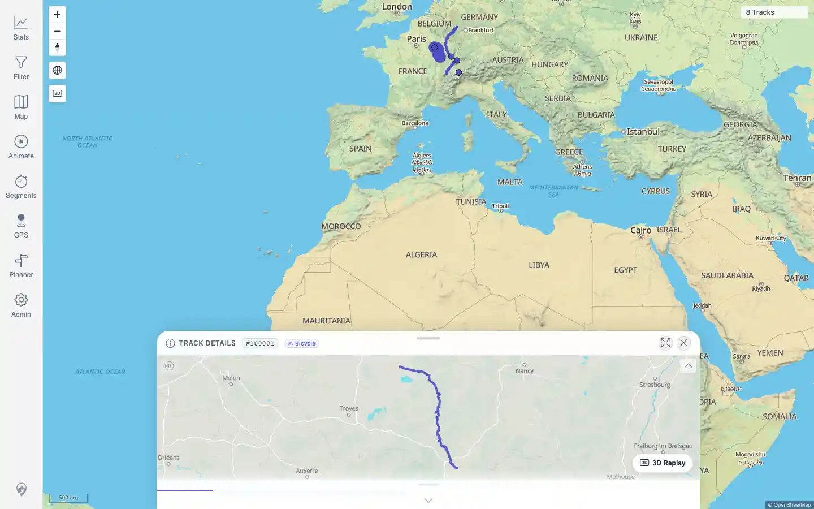
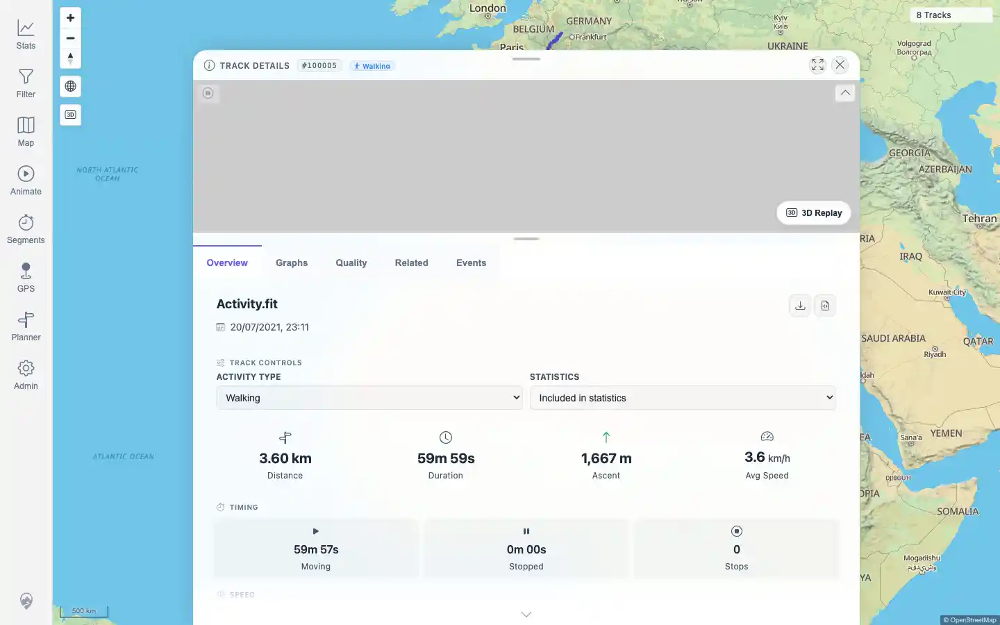

# Packet: TRD_01

## Scope

- Coverage source: `documentation/testing/frontend-regression-test-plan.md`
- Coverage ID or run packet: TRD_01
- In scope: Open one GPX-backed and one FIT-backed track from user-facing navigation and record IDs/source filenames.
- Out of scope: Full detail-tab verification; covered by TRD_02 onward.

## Prerequisites

- Required previous coverage IDs or run packets: IMP_07, FIT_02.
- Required app/data state: GPX-backed `Vitry-le-Francois_Langres.gpx` and FIT-backed `Activity.fit` imported and indexed.
- Required browser context: authenticated desktop browser.

## Allowed Mutations

- Allowed: navigate map, open Stats > Tracks, search, open track details.
- Not allowed: edit track data or persistent settings.

## Actions And Results

| Coverage ID | Action | Expected result | Actual result | Status | Evidence |
|---|---|---|---|---|---|
| TRD_01 | Opened the Vitry GPX-backed track from a map overlap selection, then opened the FIT-backed track through Stats > Tracks search for `Activity.fit`. | At least one GPX-backed and one FIT-backed track open from user-facing navigation, with track IDs and source filenames recorded. | PASS: map selection opened GPX track `100001` from `Vitry-le-Francois_Langres.gpx`; Stats > Tracks search opened FIT track `100005` from `Activity.fit`. | PASS | [assets/TRD_01-gpx-from-map.webp](../assets/TRD_01-gpx-from-map.webp); [assets/TRD_01-fit-from-stats.webp](../assets/TRD_01-fit-from-stats.webp); [assets/TRD_01-open-gpx-fit.txt](../assets/TRD_01-open-gpx-fit.txt) |

## Issues

| ID | Severity | Summary | Reproduction | Expected | Actual | Evidence | Release impact |
|---|---|---|---|---|---|---|---|

## Evidence Files

| File | Purpose |
|---|---|
| [assets/TRD_01-gpx-from-map.webp](../assets/TRD_01-gpx-from-map.webp) | GPX-backed Track `100001` opened from map selection. |
| [assets/TRD_01-fit-from-stats.webp](../assets/TRD_01-fit-from-stats.webp) | FIT-backed Track `100005` opened from Stats > Tracks search. |
| [assets/TRD_01-open-gpx-fit.txt](../assets/TRD_01-open-gpx-fit.txt) | Navigation paths, IDs, source filenames, URLs, and text checks. |

## Screenshot Evidence

## Timings

| Step | Timing |
|---|---:|
| GPX and FIT open paths | ~23 seconds |

## Handoff Notes

- Completed: TRD_01 is terminal.
- Remaining unfinished coverage: TRD_02 onward.
- Blocked or not applicable: none.
- State left for the next packet: no data or persistent setting mutations.
