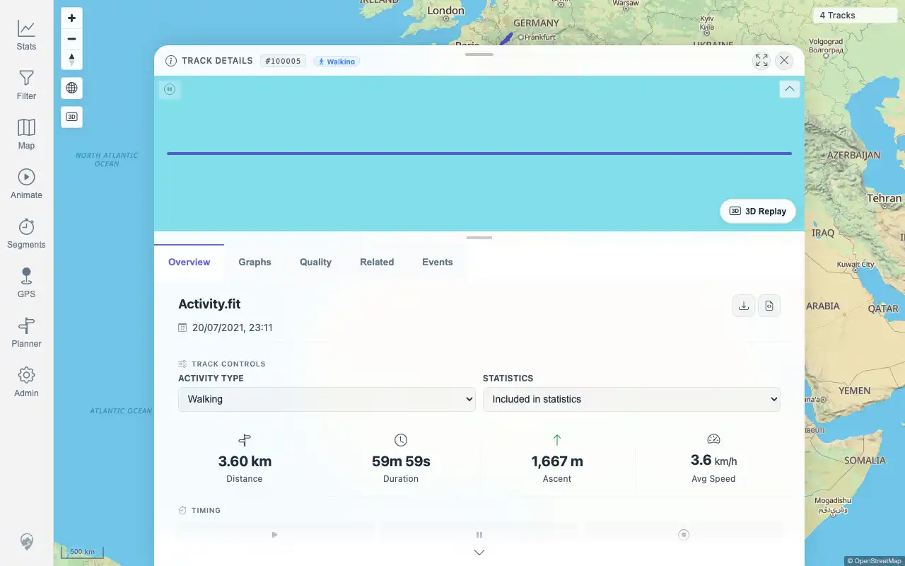
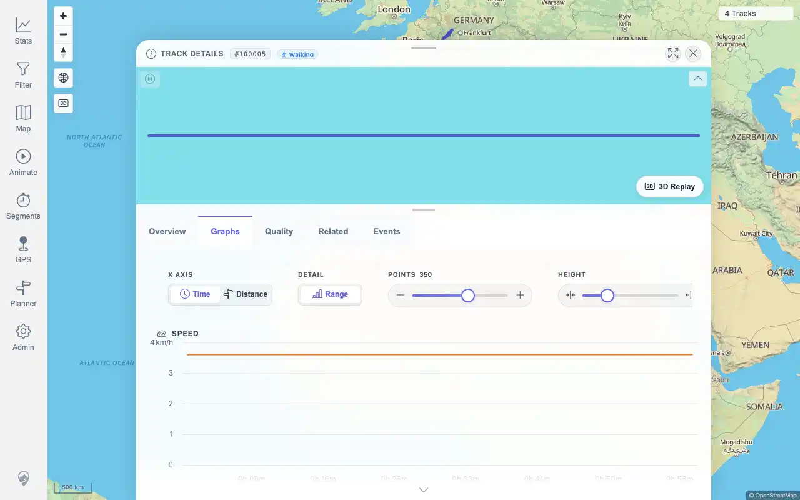
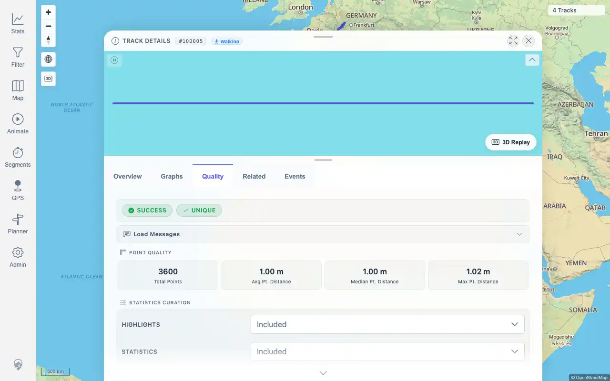
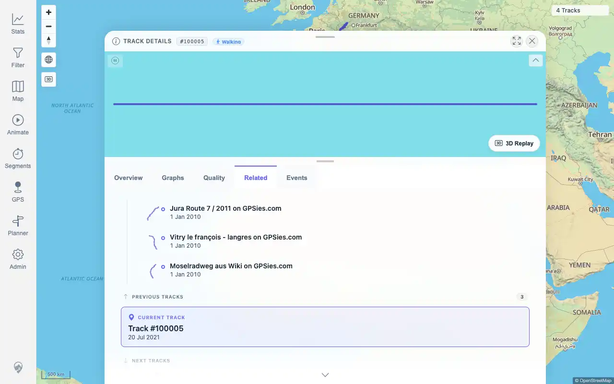
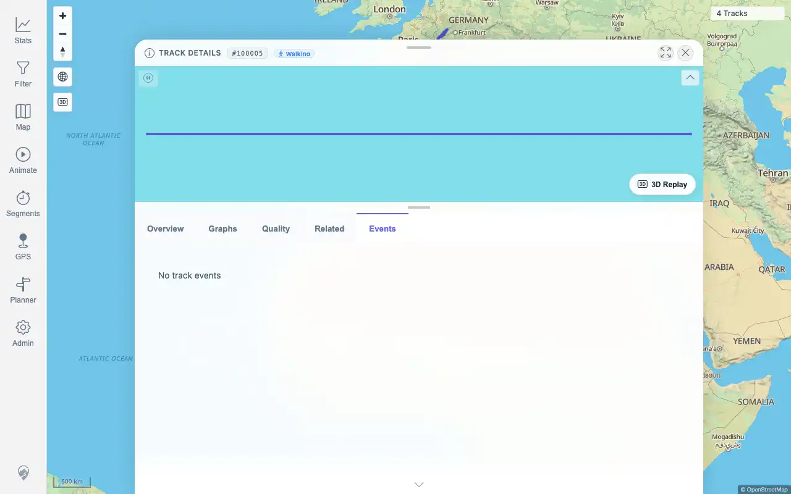

# Packet: TRD_02

## Scope

- Coverage source: `documentation/testing/frontend-regression-test-plan.md`
- Coverage ID or run packet: TRD_02
- In scope: Verify a track detail page loads overview, charts, related tracks, events, mini-map, and quality info.
- Out of scope: graph-control interactions; covered by TRD_05.

## Prerequisites

- Required previous coverage IDs or run packets: TRD_01 and FIT_03.
- Required app/data state: FIT-backed Track `100005` available.
- Required browser context: authenticated desktop browser.

## Allowed Mutations

- Allowed: reuse completed detail-surface evidence.
- Not allowed: edit track data.

## Actions And Results

| Coverage ID | Action | Expected result | Actual result | Status | Evidence |
|---|---|---|---|---|---|
| TRD_02 | Cross-checked TRD_01/FIT_03 evidence for Track `100005` detail surfaces. | Opening a track loads overview, charts, related-tracks list, event list, mini-map, and quality info. | PASS: FIT-backed Track `100005` loaded Overview, Graphs, Quality, Related, Events, and mini-map surfaces; Events loaded cleanly with no events. | PASS | [assets/TRD_02-detail-surfaces.txt](../assets/TRD_02-detail-surfaces.txt); [assets/FIT_03-overview.webp](../assets/FIT_03-overview.webp); [assets/FIT_03-graphs.webp](../assets/FIT_03-graphs.webp); [assets/FIT_03-quality.webp](../assets/FIT_03-quality.webp); [assets/FIT_03-related.webp](../assets/FIT_03-related.webp); [assets/FIT_03-events.webp](../assets/FIT_03-events.webp) |

## Issues

| ID | Severity | Summary | Reproduction | Expected | Actual | Evidence | Release impact |
|---|---|---|---|---|---|---|---|

## Evidence Files

| File | Purpose |
|---|---|
| [assets/TRD_02-detail-surfaces.txt](../assets/TRD_02-detail-surfaces.txt) | Surface-by-surface evidence cross-check. |
| [assets/FIT_03-overview.webp](../assets/FIT_03-overview.webp) | Overview and detail mini-map loaded. |
| [assets/FIT_03-graphs.webp](../assets/FIT_03-graphs.webp) | Charts loaded. |
| [assets/FIT_03-quality.webp](../assets/FIT_03-quality.webp) | Quality info loaded. |
| [assets/FIT_03-related.webp](../assets/FIT_03-related.webp) | Related-tracks list loaded. |
| [assets/FIT_03-events.webp](../assets/FIT_03-events.webp) | Events tab loaded. |

## Screenshot Evidence

## Timings

| Step | Timing |
|---|---:|
| Evidence cross-check | ~2 minutes |

## Handoff Notes

- Completed: TRD_02 is terminal.
- Remaining unfinished coverage: TRD_03 onward.
- Blocked or not applicable: none.
- State left for the next packet: no mutations.
