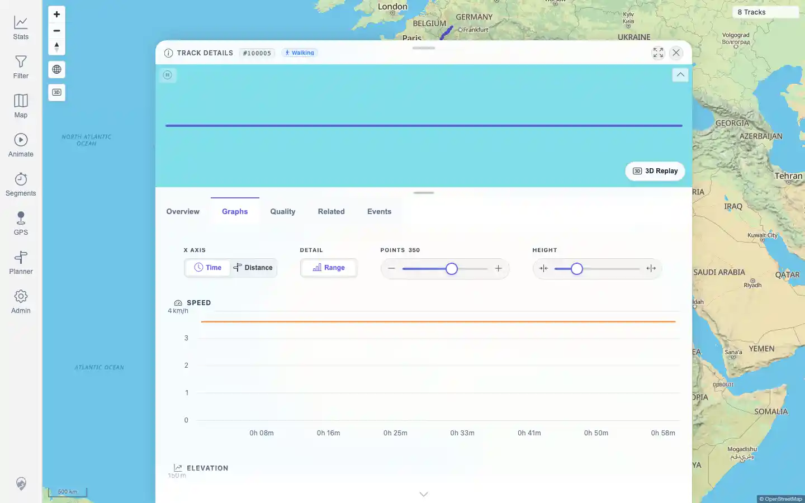
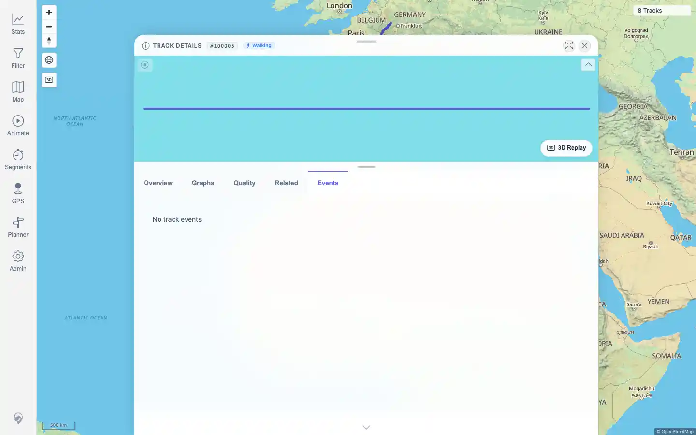

# Packet: TRD_03

## Scope

- Coverage source: `documentation/testing/frontend-regression-test-plan.md`
- Coverage ID or run packet: TRD_03
- In scope: Switch between Track Details tabs and check for blank panels, state loss, or request loops.
- Out of scope: detailed graph-control behavior; covered by TRD_05.

## Prerequisites

- Required previous coverage IDs or run packets: TRD_02.
- Required app/data state: FIT-backed Track `100005` available.
- Required browser context: authenticated desktop browser.

## Allowed Mutations

- Allowed: open Track `100005` and switch tabs.
- Not allowed: edit track data.

## Actions And Results

| Coverage ID | Action | Expected result | Actual result | Status | Evidence |
|---|---|---|---|---|---|
| TRD_03 | Opened Track `100005`, switched Overview -> Graphs -> Quality -> Related -> Events twice, monitored track-related API requests, and waited 4 seconds after the final switch. | Tabs do not refetch in a loop, lose state, or show blank panels. | PASS: all tab content loaded, Events showed the valid `No track events` empty state, no track-related requests occurred during tab switching, and request count stayed stable during the idle wait. | PASS | [assets/TRD_03-tab-switching.txt](../assets/TRD_03-tab-switching.txt); [assets/TRD_03-graphs.webp](../assets/TRD_03-graphs.webp); [assets/TRD_03-events.webp](../assets/TRD_03-events.webp) |

## Issues

| ID | Severity | Summary | Reproduction | Expected | Actual | Evidence | Release impact |
|---|---|---|---|---|---|---|---|

## Evidence Files

| File | Purpose |
|---|---|
| [assets/TRD_03-tab-switching.txt](../assets/TRD_03-tab-switching.txt) | Tab sequence, loaded-state checks, and request-loop counts. |
| [assets/TRD_03-graphs.webp](../assets/TRD_03-graphs.webp) | Graphs tab loaded during switch sequence. |
| [assets/TRD_03-events.webp](../assets/TRD_03-events.webp) | Events tab loaded with empty state. |

## Screenshot Evidence

## Timings

| Step | Timing |
|---|---:|
| Tab switch and idle-loop check | ~22 seconds |

## Handoff Notes

- Completed: TRD_03 is terminal.
- Remaining unfinished coverage: TRD_04 onward.
- Blocked or not applicable: none.
- State left for the next packet: no mutations.
