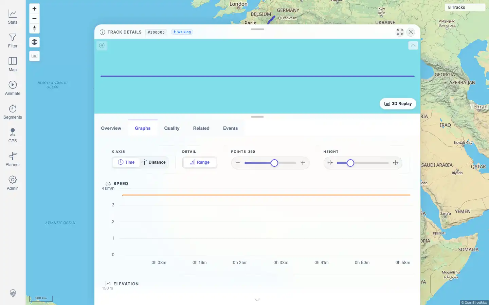
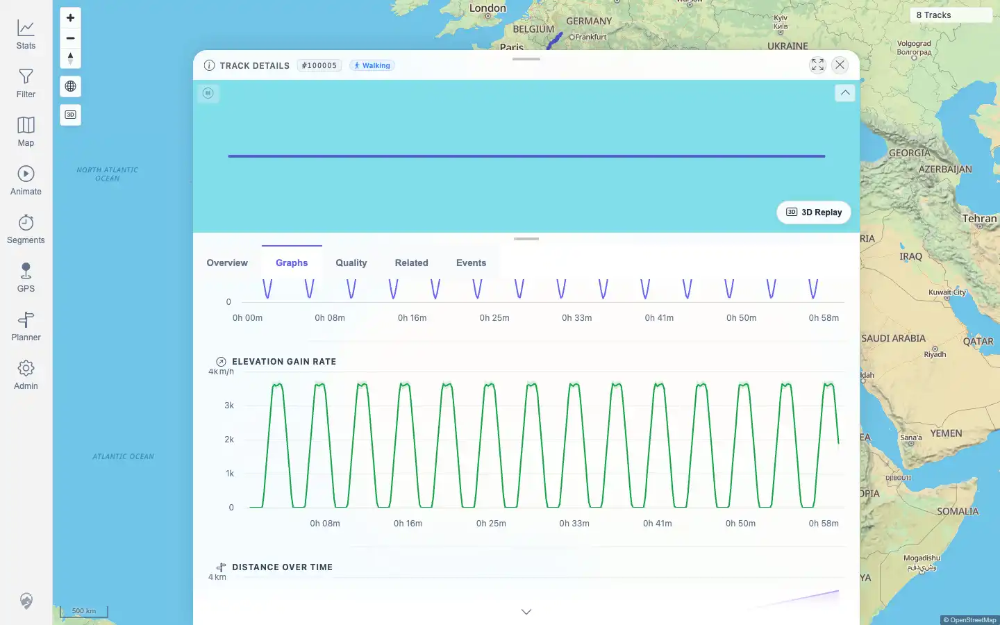
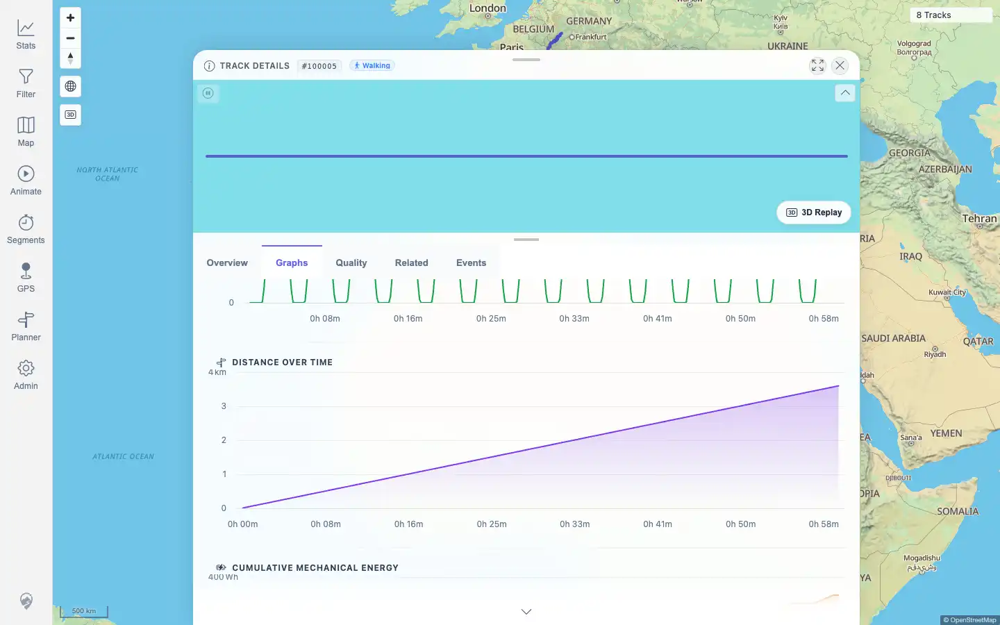

# Packet: TRD_04

## Scope

- Coverage source: `documentation/testing/frontend-regression-test-plan.md`
- Coverage ID or run packet: TRD_04
- In scope: Track detail graph readability for elevation, speed, distance, and elevation gain.
- Out of scope: Graph controls and hover synchronization; those are covered by TRD_05 and TRD_06.

## Prerequisites

- Required previous coverage IDs or run packets: TRD_01, TRD_02, TRD_03
- Required app/data state: Track 100005 (`Activity.fit`) exists and opens in the detail panel.
- Required browser context: Authenticated desktop browser context.

## Allowed Mutations

- Allowed: Navigate track details, switch to the Graphs tab, scroll the graph panel.
- Not allowed: Import, delete, or edit track data.

## Actions And Results

| Coverage ID | Action | Expected result | Actual result | Status | Evidence |
|---|---|---|---|---|---|
| TRD_04 | Opened `/mtl/track/100005`, selected the Graphs tab, inspected the chart cards and chart SVG labels, then scrolled through the graph panel. | Elevation, speed, distance, and gain charts render with readable labels, axis values, and units. | Six chart cards rendered. Required charts were present: Speed (`km/h`, 0-4 axis), Elevation (`m`, 0-150 axis), Elevation Gain Rate (`m/h`, 0-4k axis), and Distance over Time (`km`, 0-4 axis). No page errors occurred. | PASS | [assets/TRD_04-graphs-top.webp](../assets/TRD_04-graphs-top.webp); [assets/TRD_04-graphs-gain.webp](../assets/TRD_04-graphs-gain.webp); [assets/TRD_04-graphs-distance-gain.webp](../assets/TRD_04-graphs-distance-gain.webp); [assets/TRD_04-chart-readability.txt](../assets/TRD_04-chart-readability.txt) |

## Issues

| ID | Severity | Summary | Reproduction | Expected | Actual | Evidence | Release impact |
|---|---|---|---|---|---|---|---|
| None |  |  |  |  |  |  |  |

## Evidence Files

| File | Purpose |
|---|---|
| [assets/TRD_04-graphs-top.webp](../assets/TRD_04-graphs-top.webp) | Top of Graphs tab showing Speed and Elevation chart readability. |
| [assets/TRD_04-graphs-gain.webp](../assets/TRD_04-graphs-gain.webp) | Focused graph panel view showing Elevation Gain Rate and Distance over Time headings. |
| [assets/TRD_04-graphs-distance-gain.webp](../assets/TRD_04-graphs-distance-gain.webp) | Lower graph panel view showing Distance over Time values and the surrounding gain/energy context. |
| [assets/TRD_04-chart-readability.txt](../assets/TRD_04-chart-readability.txt) | DOM/SVG text evidence for required chart labels, units, axis values, and errors. |

## Screenshot Evidence

## Timings

| Step | Timing |
|---|---:|
| Open track detail and Graphs tab | < 10 s |
| Scroll and capture required graph evidence | < 15 s |

## Handoff Notes

- Completed: TRD_04 passed with direct graph UI and DOM/SVG evidence.
- Remaining unfinished coverage: TRD_05 onward.
- Blocked or not applicable: None for this packet.
- State left for the next packet: Authenticated desktop state saved; current app data unchanged at 8 tracks.
