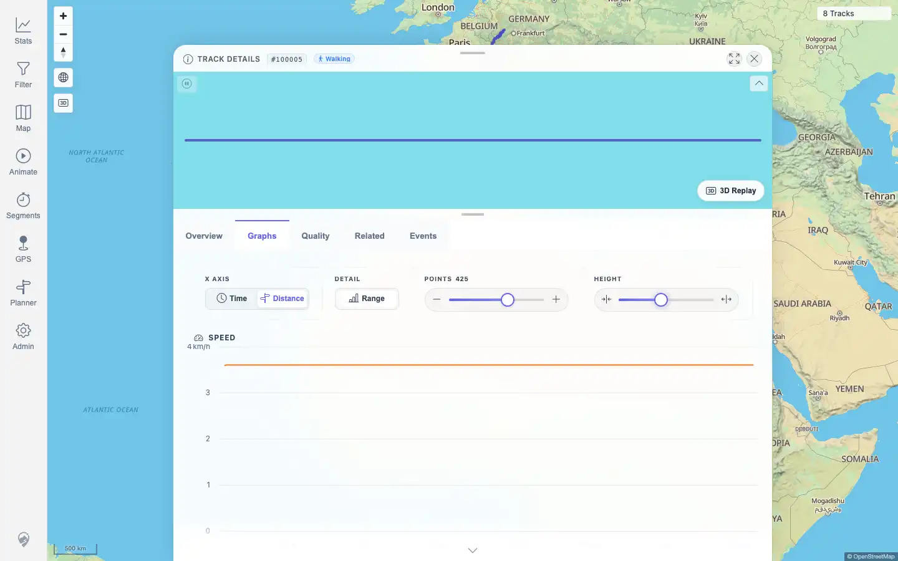

# Packet: TRD_05

## Scope

- Coverage source: `documentation/testing/frontend-regression-test-plan.md`
- Coverage ID or run packet: TRD_05
- In scope: Graphs tab controls for x-axis mode, range bands, chart point count, and graph height.
- Out of scope: Chart hover and mini-map hover synchronization; covered by TRD_06.

## Prerequisites

- Required previous coverage IDs or run packets: TRD_01 through TRD_04
- Required app/data state: Track 100005 (`Activity.fit`) exists and opens in the detail panel.
- Required browser context: Authenticated desktop browser context.

## Allowed Mutations

- Allowed: Change browser-local track-detail graph preferences during the test.
- Not allowed: Import, delete, or edit track data.

## Actions And Results

| Coverage ID | Action | Expected result | Actual result | Status | Evidence |
|---|---|---|---|---|---|
| TRD_05 | Reset graph preferences to defaults, opened `/mtl/track/100005`, selected Graphs, toggled x-axis from Time to Distance, toggled Range off, used the point-count slider, and used the graph-height slider. | Each graph control updates charts without layout breakage. | Distance mode became active, x labels changed to km labels, and the time-only Distance over Time chart was removed. Range changed to inactive/`aria-pressed=false`. Point count changed from 350 to 425 and fetched `chart-series?x=DISTANCE&maxBuckets=425`. Graph height changed from 240px to 340px. No chart error, page error, overlap, or horizontal overflow was detected. Preferences were reset to defaults afterward. | PASS | [assets/TRD_05-controls-updated.webp](../assets/TRD_05-controls-updated.webp); [assets/TRD_05-graph-controls.txt](../assets/TRD_05-graph-controls.txt) |

## Issues

| ID | Severity | Summary | Reproduction | Expected | Actual | Evidence | Release impact |
|---|---|---|---|---|---|---|---|
| None |  |  |  |  |  |  |  |

## Evidence Files

| File | Purpose |
|---|---|
| [assets/TRD_05-controls-updated.webp](../assets/TRD_05-controls-updated.webp) | Final graph-control state after Distance, Range, point-count, and height changes. |
| [assets/TRD_05-graph-controls.txt](../assets/TRD_05-graph-controls.txt) | Snapshot and request evidence for each graph-control update. |

## Screenshot Evidence

## Timings

| Step | Timing |
|---|---:|
| Open track detail and Graphs tab | < 10 s |
| Exercise all graph controls and capture evidence | < 25 s |

## Handoff Notes

- Completed: TRD_05 passed with direct UI, DOM, and request evidence.
- Remaining unfinished coverage: TRD_06 onward.
- Blocked or not applicable: None for this packet.
- State left for the next packet: Track data unchanged; graph preferences reset in browser storage to `graphHeightPx=240`, `showRangeBand=true`, `chartPointCount=350`.
