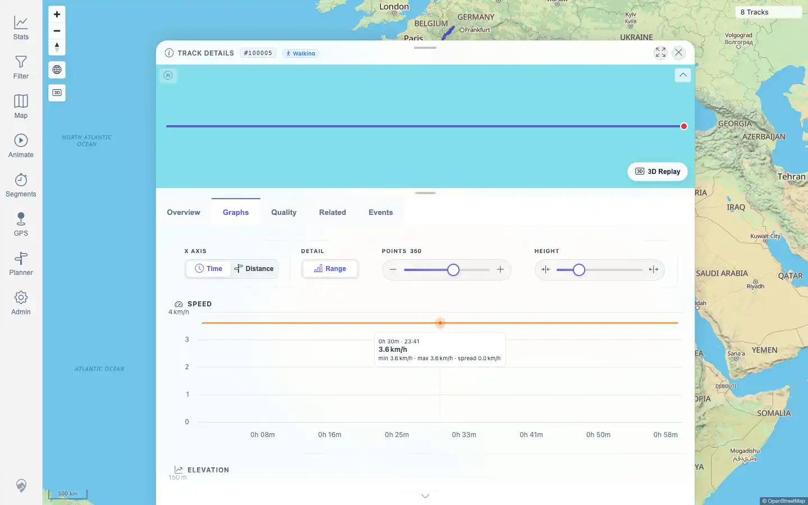

# Packet: TRD_06

## Scope

- Coverage source: `documentation/testing/frontend-regression-test-plan.md`
- Coverage ID or run packet: TRD_06
- In scope: Bidirectional hover synchronization between the Graphs tab charts and the track detail mini-map.
- Out of scope: Point popup click behavior; covered by MAP_11 and FIT_03.

## Prerequisites

- Required previous coverage IDs or run packets: TRD_01 through TRD_05
- Required app/data state: Track 100005 (`Activity.fit`) exists and opens in the detail panel.
- Required browser context: Authenticated desktop browser context with default graph preferences.

## Allowed Mutations

- Allowed: Pointer hover over the Speed chart and mini-map.
- Not allowed: Pinning points, opening point popups, importing, deleting, or editing track data.

## Actions And Results

| Coverage ID | Action | Expected result | Actual result | Status | Evidence |
|---|---|---|---|---|---|
| TRD_06 | Opened `/mtl/track/100005`, selected Graphs, hovered the rendered Speed chart tracker path, moved away, then hovered the mini-map at the marker coordinate produced by chart hover and moved away. | Chart hover highlights the matching point on the mini-map; mini-map hover highlights the chart; leaving either surface clears stale cursors. | Chart hover created one visible mini-map marker plus chart crosshair/tooltip artifacts. Leaving the chart cleared marker, crosshair, tooltip, and hover classes. Mini-map hover at that same track coordinate recreated one marker and chart crosshair/tooltip artifacts. Leaving the mini-map cleared marker and chart artifacts again. No page errors occurred. | PASS | [assets/TRD_06-chart-hover-marker.webp](../assets/TRD_06-chart-hover-marker.webp); [assets/TRD_06-map-hover-chart.webp](../assets/TRD_06-map-hover-chart.webp); [assets/TRD_06-hover-sync.txt](../assets/TRD_06-hover-sync.txt) |

## Issues

| ID | Severity | Summary | Reproduction | Expected | Actual | Evidence | Release impact |
|---|---|---|---|---|---|---|---|
| None |  |  |  |  |  |  |  |

## Evidence Files

| File | Purpose |
|---|---|
| [assets/TRD_06-chart-hover-marker.webp](../assets/TRD_06-chart-hover-marker.webp) | Chart hover showing synchronized mini-map marker and chart tooltip/crosshair. |
| [assets/TRD_06-map-hover-chart.webp](../assets/TRD_06-map-hover-chart.webp) | Mini-map hover showing synchronized chart tooltip/crosshair. |
| [assets/TRD_06-hover-sync.txt](../assets/TRD_06-hover-sync.txt) | DOM state counts for marker, crosshair, tooltip, hover class, and leave cleanup checks. |

## Screenshot Evidence

## Timings

| Step | Timing |
|---|---:|
| Open track detail and Graphs tab | < 10 s |
| Exercise chart-to-map and map-to-chart hover sync | < 20 s |

## Handoff Notes

- Completed: TRD_06 passed with bidirectional hover and cleanup evidence.
- Remaining unfinished coverage: TRD_07 onward.
- Blocked or not applicable: None for this packet.
- State left for the next packet: Track data unchanged; no pinned point left behind; graph preferences reset to defaults.
