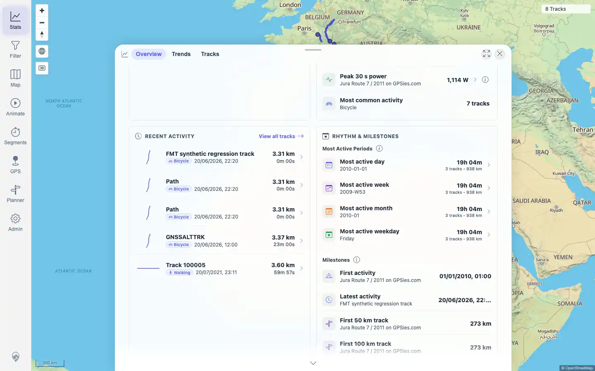
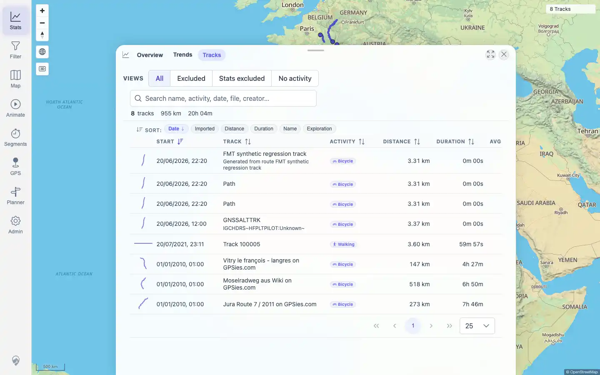
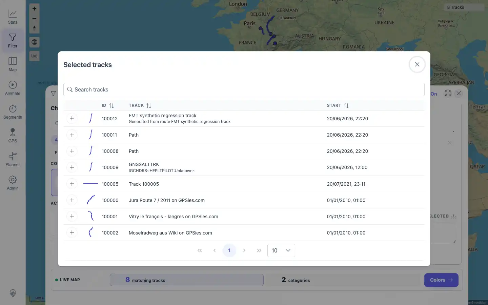
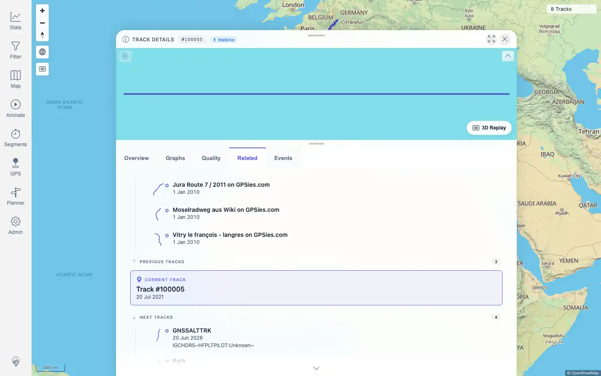
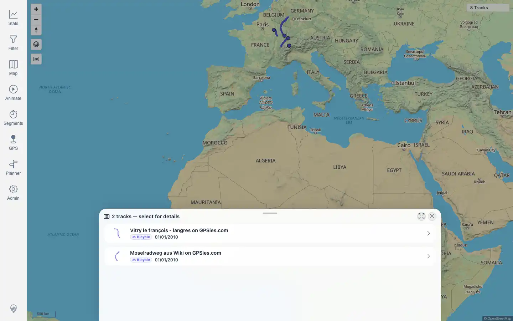

# Packet: TRD_07

## Scope

- Coverage source: `documentation/testing/frontend-regression-test-plan.md`
- Coverage ID or run packet: TRD_07
- In scope: Track shape preview thumbnails in track browser, filters, statistics, related tracks, and map selection lists.
- Out of scope: Opening tracks from those previews; navigation is covered by TRD_01, TRD_13, and map selection packets.

## Prerequisites

- Required previous coverage IDs or run packets: TRD_01 through TRD_06
- Required app/data state: Current imported track set is available and geometry cache can serve track shapes.
- Required browser context: Authenticated desktop browser context.

## Allowed Mutations

- Allowed: Navigate stats, filter, detail, and map surfaces; enable the filter workbench in the transient browser session.
- Not allowed: Add/remove track IDs, import, delete, or edit track data.

## Actions And Results

| Coverage ID | Action | Expected result | Actual result | Status | Evidence |
|---|---|---|---|---|---|
| TRD_07 | Inspected shape-preview SVG paths in Stats Overview recent tracks, Stats > Tracks browser table, Filter > Smart Base Filter > Choose tracks dialog, Track 100005 Related tab, and the map overlap selection list. | Small track-shape thumbnails are visible in browser, filters, stats, related tracks, and selection lists. | All required surfaces rendered visible `TrackShapePreview` SVG paths: stats overview 5/5, track browser 8/8, filter track picker 8/8, related tracks 5 visible paths, and map selection list 2/2. | PASS | [assets/TRD_07-stats-overview-previews.webp](../assets/TRD_07-stats-overview-previews.webp); [assets/TRD_07-track-browser-previews.webp](../assets/TRD_07-track-browser-previews.webp); [assets/TRD_07-filter-track-picker.webp](../assets/TRD_07-filter-track-picker.webp); [assets/TRD_07-related-previews.webp](../assets/TRD_07-related-previews.webp); [assets/TRD_07-selection-list-previews.webp](../assets/TRD_07-selection-list-previews.webp); [assets/TRD_07-shape-previews.txt](../assets/TRD_07-shape-previews.txt) |

## Issues

| ID | Severity | Summary | Reproduction | Expected | Actual | Evidence | Release impact |
|---|---|---|---|---|---|---|---|
| None |  |  |  |  |  |  |  |

## Evidence Files

| File | Purpose |
|---|---|
| [assets/TRD_07-stats-overview-previews.webp](../assets/TRD_07-stats-overview-previews.webp) | Statistics overview recent-activity preview thumbnails. |
| [assets/TRD_07-track-browser-previews.webp](../assets/TRD_07-track-browser-previews.webp) | Track browser table preview thumbnails. |
| [assets/TRD_07-filter-track-picker.webp](../assets/TRD_07-filter-track-picker.webp) | Filter track picker dialog preview thumbnails. |
| [assets/TRD_07-related-previews.webp](../assets/TRD_07-related-previews.webp) | Track detail Related tab preview thumbnails. |
| [assets/TRD_07-selection-list-previews.webp](../assets/TRD_07-selection-list-previews.webp) | Map selection list preview thumbnails. |
| [assets/TRD_07-shape-previews.txt](../assets/TRD_07-shape-previews.txt) | Selector counts, visible SVG path counts, and sample rows for each surface. |

## Screenshot Evidence

## Timings

| Step | Timing |
|---|---:|
| Inspect five shape-preview surfaces | < 90 s |

## Handoff Notes

- Completed: TRD_07 passed with direct SVG path evidence across browser, filters, stats, related tracks, and selection lists.
- Remaining unfinished coverage: TRD_08 onward.
- Blocked or not applicable: None for this packet.
- State left for the next packet: Track data unchanged; filter workbench was enabled only in the transient browser context and storage state was not persisted.
