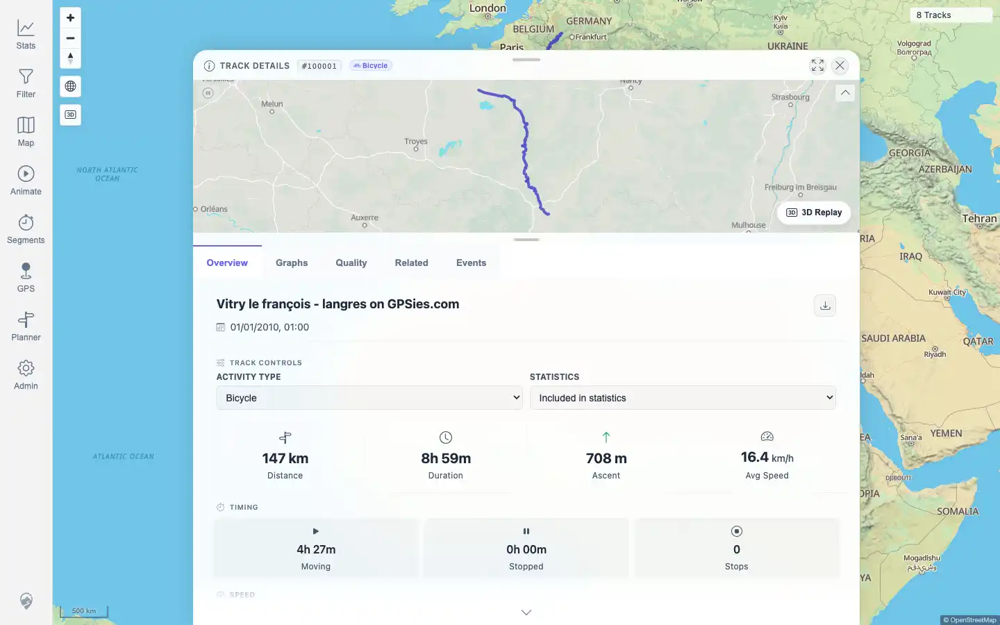

# Packet: TRD_08

## Scope

- Coverage source: `documentation/testing/frontend-regression-test-plan.md`
- Coverage ID or run packet: TRD_08
- In scope: Download original indexed source files from track details and verify they match uploaded public-source files.
- Out of scope: Download-as-GPX conversion; covered by TRD_09 and FIT_05.

## Prerequisites

- Required previous coverage IDs or run packets: DAT_03, TRD_01
- Required app/data state: GPX track 100001 and FIT track 100005 exist.
- Required browser context: Authenticated desktop browser context with downloads enabled.

## Allowed Mutations

- Allowed: Save browser downloads to `/tmp/mtl-playwright/downloads`.
- Not allowed: Import, delete, or edit track data.

## Actions And Results

| Coverage ID | Action | Expected result | Actual result | Status | Evidence |
|---|---|---|---|---|---|
| TRD_08 | Opened `/mtl/track/100001` and `/mtl/track/100005`; clicked `Download original`; saved each browser download; compared suggested filename, byte size, and SHA-256 with the DAT_03 source metadata. | Original source download matches the uploaded source file for GPX/FIT-backed tracks. | GPX track 100001 downloaded `Vitry-le-Francois_Langres.gpx`, size 238,349 bytes, SHA-256 `401218e3c1d1f366ee27ea8bc138d8422eff3bf6348a77183be83fef3e8d7d67`. FIT track 100005 downloaded `Activity.fit`, size 94,096 bytes, SHA-256 `949a238e1bb75c3684479785f76fa9a16888bb394518844248f488171d591387`, with `.FIT` marker. Both matched expected metadata. | PASS | [assets/TRD_08-original-downloads.txt](../assets/TRD_08-original-downloads.txt); [assets/TRD_08-download-controls.webp](../assets/TRD_08-download-controls.webp) |

## Issues

| ID | Severity | Summary | Reproduction | Expected | Actual | Evidence | Release impact |
|---|---|---|---|---|---|---|---|
| None |  |  |  |  |  |  |  |

## Evidence Files

| File | Purpose |
|---|---|
| [assets/TRD_08-original-downloads.txt](../assets/TRD_08-original-downloads.txt) | Filename, size, checksum, and format marker evidence for GPX and FIT original downloads. |
| [assets/TRD_08-download-controls.webp](../assets/TRD_08-download-controls.webp) | Track detail Overview showing the original-download control. |

## Screenshot Evidence

## Timings

| Step | Timing |
|---|---:|
| Download and verify GPX and FIT originals | < 15 s |

## Handoff Notes

- Completed: TRD_08 passed for GPX and FIT original-source downloads.
- Remaining unfinished coverage: TRD_09 onward.
- Blocked or not applicable: None for this packet.
- State left for the next packet: Track data unchanged; downloaded files saved only under `/tmp/mtl-playwright/downloads`.
