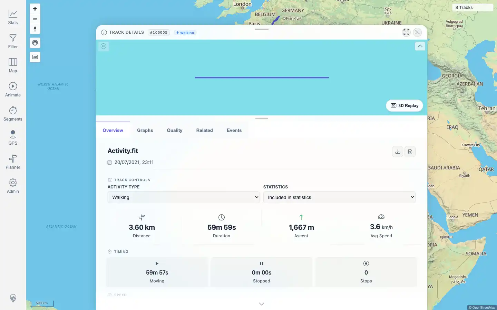

# Packet: TRD_09

## Scope

- Coverage source: `documentation/testing/frontend-regression-test-plan.md`
- Coverage ID or run packet: TRD_09
- In scope: Download-as-GPX from non-GPX source-backed track details.
- Out of scope: Original source download; covered by TRD_08.

## Prerequisites

- Required previous coverage IDs or run packets: FIT_02, FMT_02, TRD_08
- Required app/data state: FIT-backed track 100005 and IGC-backed synthetic track 100009 exist.
- Required browser context: Authenticated desktop browser context with downloads enabled.

## Allowed Mutations

- Allowed: Save browser downloads to `/tmp/mtl-playwright/downloads`.
- Not allowed: Import, delete, or edit track data.

## Actions And Results

| Coverage ID | Action | Expected result | Actual result | Status | Evidence |
|---|---|---|---|---|---|
| TRD_09 | Opened FIT-backed track 100005 and IGC-backed track 100009; clicked `Download GPX`; saved each browser download; parsed each file for GPX root, track, segment, and `trkpt` counts. | A valid GPX file downloads even if the original source was FIT or another non-GPX format. | FIT source downloaded `Activity.gpx` with GPX root, track, segment, and 3,601 `trkpt` elements. IGC source downloaded `fmt-synthetic.gpx` with GPX root, track, segment, and 24 `trkpt` elements. Both were not waypoint-only and had no page errors. | PASS | [assets/TRD_09-gpx-conversion-downloads.txt](../assets/TRD_09-gpx-conversion-downloads.txt); [assets/TRD_09-gpx-download-controls.webp](../assets/TRD_09-gpx-download-controls.webp) |

## Issues

| ID | Severity | Summary | Reproduction | Expected | Actual | Evidence | Release impact |
|---|---|---|---|---|---|---|---|
| None |  |  |  |  |  |  |  |

## Evidence Files

| File | Purpose |
|---|---|
| [assets/TRD_09-gpx-conversion-downloads.txt](../assets/TRD_09-gpx-conversion-downloads.txt) | Download filenames, checksums, GPX element counts, and validity checks for FIT and IGC source conversions. |
| [assets/TRD_09-gpx-download-controls.webp](../assets/TRD_09-gpx-download-controls.webp) | Track detail Overview showing the Download GPX control. |

## Screenshot Evidence

## Timings

| Step | Timing |
|---|---:|
| Download and parse two GPX conversions | < 15 s |

## Handoff Notes

- Completed: TRD_09 passed for FIT and IGC source-to-GPX downloads.
- Remaining unfinished coverage: TRD_10 onward.
- Blocked or not applicable: None for this packet.
- State left for the next packet: Track data unchanged; downloaded files saved only under `/tmp/mtl-playwright/downloads`.
