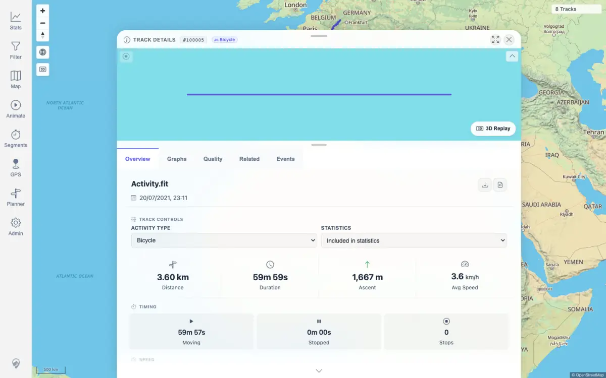
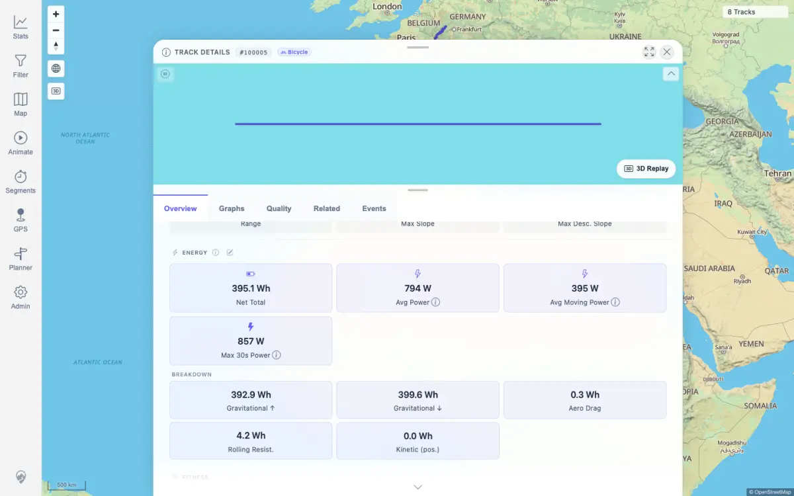

# Packet: TRD_10

## Scope

- Coverage source: `documentation/testing/frontend-regression-test-plan.md`
- Coverage ID or run packet: TRD_10
- In scope: Change a track activity type and verify the save recalculates energy and calorie-equivalent values.
- Out of scope: Energy what-if recalculation without saving; covered by TRD_11.

## Prerequisites

- Required previous coverage IDs or run packets: FIT_02, TRD_02
- Required app/data state: FIT-backed track 100005 exists and is initially set to Walking.
- Required browser context: Authenticated desktop browser context.

## Allowed Mutations

- Allowed: Temporarily change track 100005 activity type, then restore the original activity type.
- Not allowed: Leave track 100005 with a changed activity type or import/delete/edit other track data.

## Actions And Results

| Coverage ID | Action | Expected result | Actual result | Status | Evidence |
|---|---|---|---|---|---|
| TRD_10 | Opened track 100005 Overview, recorded Walking energy values, changed Activity Type to Bicycle, waited for `PATCH /api/tracks/100005/activity-type`, recorded recalculated energy/calorie values, then restored Activity Type to Walking through the same UI save path. | Activity type saves successfully and the visible energy/calorie values update automatically. | The activity type changed from Walking to Bicycle, the API returned `activityType: BICYCLE`, and energy changed from 346.7 Wh / 298 kcal to 395.1 Wh / 340 kcal. Restore back to Walking returned `activityType: WALKING` and 346.7 Wh. No page errors occurred. | PASS | [assets/TRD_10-activity-energy.txt](../assets/TRD_10-activity-energy.txt); [assets/TRD_10-activity-select-bicycle.webp](../assets/TRD_10-activity-select-bicycle.webp); [assets/TRD_10-energy-updated.webp](../assets/TRD_10-energy-updated.webp) |

## Issues

| ID | Severity | Summary | Reproduction | Expected | Actual | Evidence | Release impact |
|---|---|---|---|---|---|---|---|
| None |  |  |  |  |  |  |  |

## Evidence Files

| File | Purpose |
|---|---|
| [assets/TRD_10-activity-energy.txt](../assets/TRD_10-activity-energy.txt) | Before/change/restore activity and energy values, API response fields, and error summary. |
| [assets/TRD_10-activity-select-bicycle.webp](../assets/TRD_10-activity-select-bicycle.webp) | Track Overview after saving Bicycle activity type. |
| [assets/TRD_10-energy-updated.webp](../assets/TRD_10-energy-updated.webp) | Energy section after the Bicycle recalculation. |

## Screenshot Evidence

## Timings

| Step | Timing |
|---|---:|
| Browser save, recalculation verification, screenshots, and restore | < 15 s |

## Handoff Notes

- Completed: TRD_10 passed for saved activity-type change and automatic energy/calorie recalculation.
- Remaining unfinished coverage: TRD_11 onward.
- Blocked or not applicable: None for this packet.
- State left for the next packet: Track 100005 restored to Walking with energy values back to the pre-test range.
