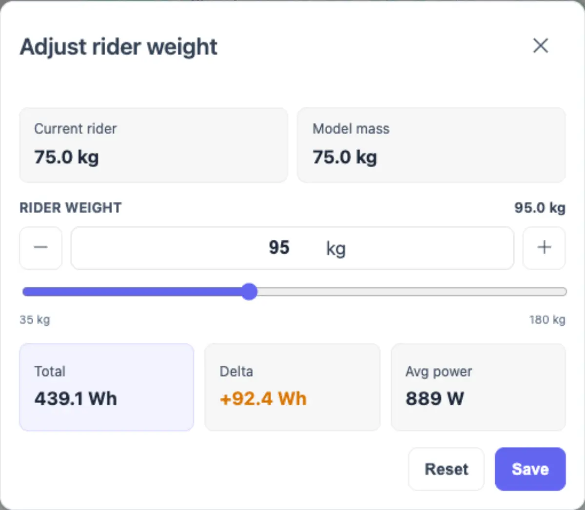
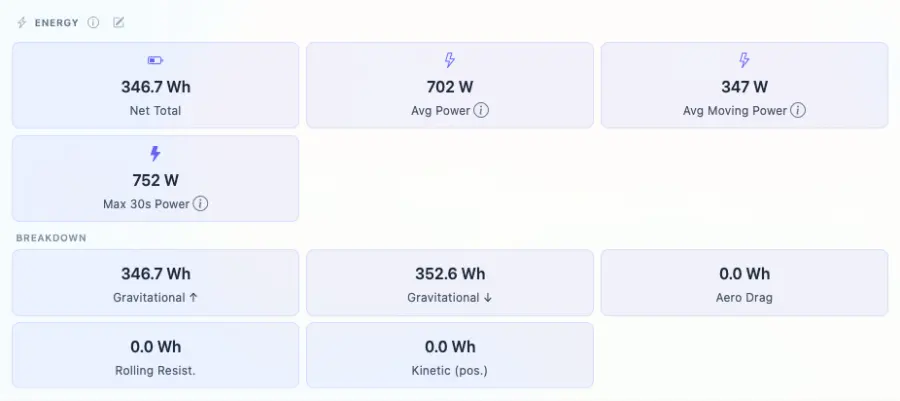

# Packet: TRD_11

## Scope

- Coverage source: `documentation/testing/frontend-regression-test-plan.md`
- Coverage ID or run packet: TRD_11
- In scope: Energy what-if recalculation with a custom rider weight, and verification that the preview is not permanently saved.
- Out of scope: Persisting rider weight with the Save button.

## Prerequisites

- Required previous coverage IDs or run packets: TRD_10
- Required app/data state: FIT-backed track 100005 exists, is set to Walking, and has calculated energy metrics.
- Required browser context: Authenticated desktop browser context.

## Allowed Mutations

- Allowed: Open the energy adjust dialog and change the temporary rider-weight preview value.
- Not allowed: Click Save, send `/api/energy/rider-weight/{gpsTrackId}`, or leave persisted rider-weight/energy changes.

## Actions And Results

| Coverage ID | Action | Expected result | Actual result | Status | Evidence |
|---|---|---|---|---|---|
| TRD_11 | Opened track 100005 Overview, opened Adjust rider weight, recorded the baseline 75 kg what-if result, changed the preview rider weight to 95 kg, waited for `GET /api/energy/what-if/100005?riderWeightKg=95`, then closed/reloaded without saving. | The dialog preview updates displayed values for the custom weight, and the track's persisted Overview values remain unchanged after reload. | Baseline preview showed 346.7 Wh / -0.0 Wh / 702 W. Custom 95 kg preview showed 439.1 Wh / +92.4 Wh / 889 W. No `/api/energy/rider-weight/100005` POST occurred. Direct reload still showed Walking with 346.7 Wh and 702 W. | PASS | [assets/TRD_11-what-if-recalc.txt](../assets/TRD_11-what-if-recalc.txt); [assets/TRD_11-overview-after-reload.txt](../assets/TRD_11-overview-after-reload.txt); [assets/TRD_11-what-if-custom-weight.webp](../assets/TRD_11-what-if-custom-weight.webp); [assets/TRD_11-overview-after-reload.webp](../assets/TRD_11-overview-after-reload.webp) |

## Issues

| ID | Severity | Summary | Reproduction | Expected | Actual | Evidence | Release impact |
|---|---|---|---|---|---|---|---|
| None |  |  |  |  |  |  |  |

## Evidence Files

| File | Purpose |
|---|---|
| [assets/TRD_11-what-if-recalc.txt](../assets/TRD_11-what-if-recalc.txt) | What-if request/response, before/custom values, no-save check, and error summary. |
| [assets/TRD_11-overview-after-reload.txt](../assets/TRD_11-overview-after-reload.txt) | Direct reload verification that Overview energy/activity remained unchanged. |
| [assets/TRD_11-what-if-custom-weight.webp](../assets/TRD_11-what-if-custom-weight.webp) | Adjust rider weight dialog after custom 95 kg preview recalculation. |
| [assets/TRD_11-overview-after-reload.webp](../assets/TRD_11-overview-after-reload.webp) | Energy section after direct reload, showing unchanged persisted values. |

## Screenshot Evidence

## Timings

| Step | Timing |
|---|---:|
| Dialog what-if preview, no-save check, direct reload verification | < 60 s |

## Handoff Notes

- Completed: TRD_11 passed for temporary rider-weight recalculation without persistence.
- Remaining unfinished coverage: TRD_12 onward.
- Blocked or not applicable: None for this packet.
- State left for the next packet: Track 100005 remains Walking with persisted Overview energy values unchanged.
