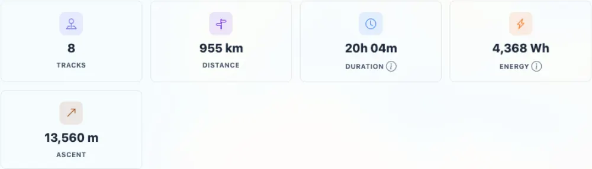
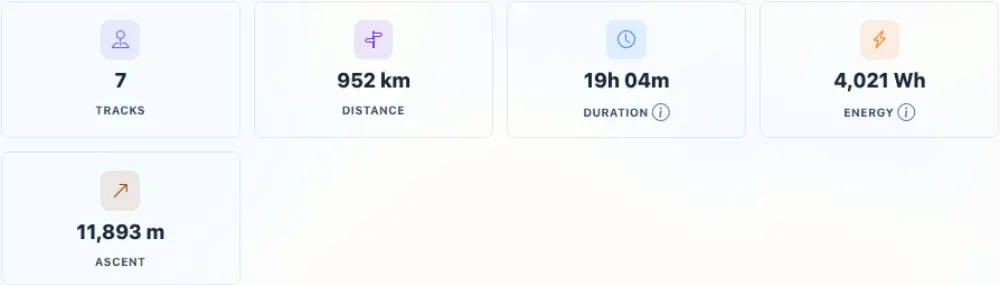

# Packet: TRD_12

## Scope

- Coverage source: `documentation/testing/frontend-regression-test-plan.md`
- Coverage ID or run packet: TRD_12
- In scope: Exclude one track from statistics and verify Stats Overview changes, then re-include it and verify the overview returns.
- Out of scope: Highlight-only exclusions and Track Quality curation flows.

## Prerequisites

- Required previous coverage IDs or run packets: TRD_10, TRD_11
- Required app/data state: Track 100005 exists and is initially included in statistics.
- Required browser context: Authenticated desktop browser context.

## Allowed Mutations

- Allowed: Temporarily set track 100005 Statistics to `Exclude: wrong activity`, then restore it to `Included in statistics`.
- Not allowed: Leave track 100005 excluded or alter other tracks.

## Actions And Results

| Coverage ID | Action | Expected result | Actual result | Status | Evidence |
|---|---|---|---|---|---|
| TRD_12 | Captured Stats Overview baseline, changed track 100005 Statistics select to `Exclude: wrong activity`, captured Stats Overview again, then changed the select back to `Included in statistics` and captured the restored overview. | The excluded track stops counting in Stats Overview; re-including brings the count and totals back. | Stats Overview changed from 8 tracks / 955 km to 7 tracks / 952 km after exclusion, with API `statisticsExcludedTrackCount` changing 0 to 1 and distance dropping 3,598.8 m. Re-including restored 8 tracks / 955 km, API distance `955195.08`, and `statisticsExcludedTrackCount: 0`. | PASS | [assets/TRD_12-statistics-exclusion.txt](../assets/TRD_12-statistics-exclusion.txt); [assets/TRD_12-stats-before.webp](../assets/TRD_12-stats-before.webp); [assets/TRD_12-stats-excluded.webp](../assets/TRD_12-stats-excluded.webp); [assets/TRD_12-stats-restored.webp](../assets/TRD_12-stats-restored.webp) |

## Issues

| ID | Severity | Summary | Reproduction | Expected | Actual | Evidence | Release impact |
|---|---|---|---|---|---|---|---|
| None |  |  |  |  |  |  |  |

## Evidence Files

| File | Purpose |
|---|---|
| [assets/TRD_12-statistics-exclusion.txt](../assets/TRD_12-statistics-exclusion.txt) | UI/API before-exclude-restore counts, distances, PATCH responses, and cleanup state. |
| [assets/TRD_12-stats-before.webp](../assets/TRD_12-stats-before.webp) | Stats Overview before excluding track 100005. |
| [assets/TRD_12-stats-excluded.webp](../assets/TRD_12-stats-excluded.webp) | Stats Overview after excluding track 100005. |
| [assets/TRD_12-stats-restored.webp](../assets/TRD_12-stats-restored.webp) | Stats Overview after restoring track 100005 to included. |

## Screenshot Evidence

## Timings

| Step | Timing |
|---|---:|
| Exclude, verify Stats Overview, restore, verify again | < 75 s |

## Handoff Notes

- Completed: TRD_12 passed for statistics exclusion and re-inclusion.
- Remaining unfinished coverage: TRD_13 onward.
- Blocked or not applicable: None for this packet.
- State left for the next packet: Track 100005 restored to `Included in statistics`; Stats Overview back to 8 tracks / 955 km.
