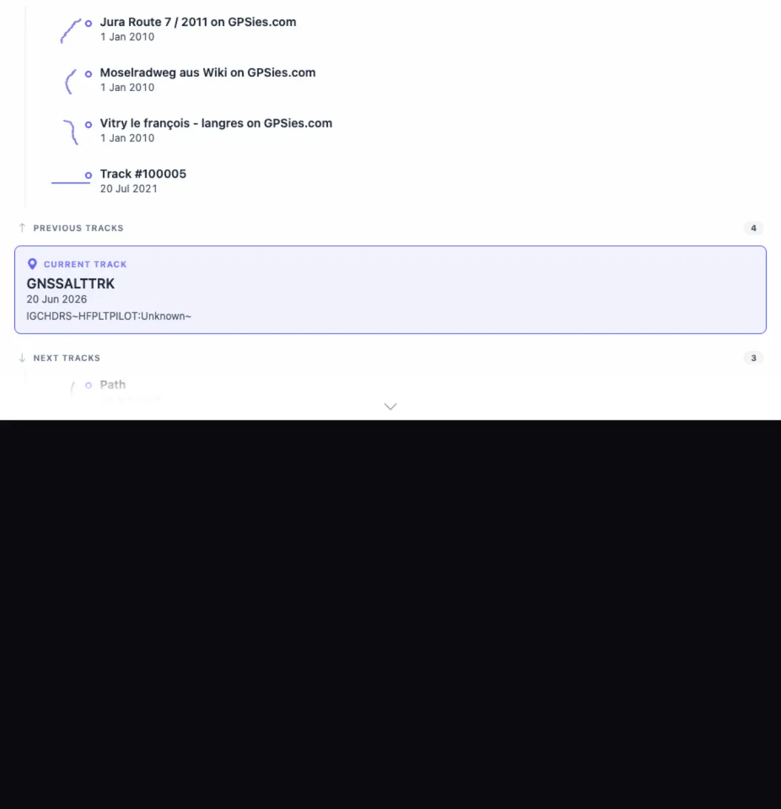
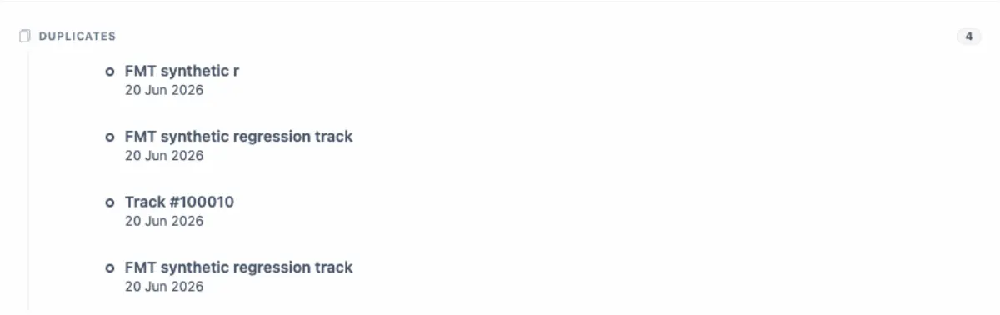
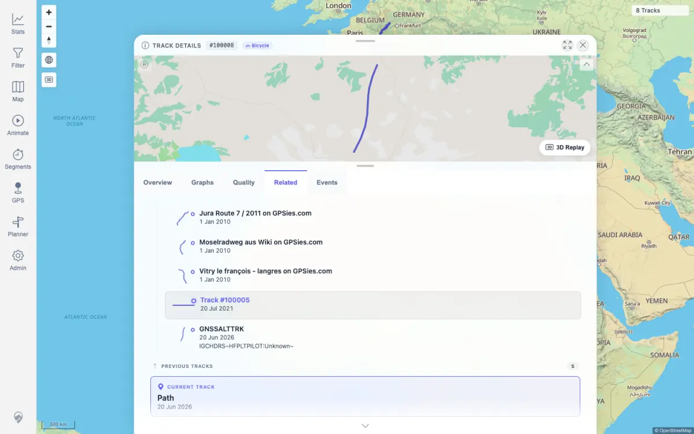

# Packet: TRD_13

## Scope

- Coverage source: `documentation/testing/frontend-regression-test-plan.md`
- Coverage ID or run packet: TRD_13
- In scope: Related tab previous/next/duplicate sections and related-row navigation.
- Out of scope: Derived segment sibling behavior; not required by this coverage ID.

## Prerequisites

- Required previous coverage IDs or run packets: FMT_02, TRD_07
- Required app/data state: Track 100009 exists and has related-track data with previous, next, and duplicate rows.
- Required browser context: Authenticated desktop browser context.

## Allowed Mutations

- Allowed: Navigate within track details by clicking a related row.
- Not allowed: Import, delete, or edit track data.

## Actions And Results

| Coverage ID | Action | Expected result | Actual result | Status | Evidence |
|---|---|---|---|---|---|
| TRD_13 | Opened track 100009, selected the Related tab, compared API related data with rendered Previous, Next, and Duplicates sections, then clicked the first Next track row. | Related tracks show duplicates and previous/next tracks; clicking one navigates to it. | Track 100009 showed Previous Tracks 4, Next Tracks 3, and Duplicates 4 in the UI, matching `/api/tracks/related/100009`. Clicking the first Next row (`100008`, `Path`) changed the visible detail header to `#100008` and the current-track card to `Path`. | PASS | [assets/TRD_13-related-tracks.txt](../assets/TRD_13-related-tracks.txt); [assets/TRD_13-related-prev-next.webp](../assets/TRD_13-related-prev-next.webp); [assets/TRD_13-related-duplicates.webp](../assets/TRD_13-related-duplicates.webp); [assets/TRD_13-related-navigation.webp](../assets/TRD_13-related-navigation.webp) |

## Issues

| ID | Severity | Summary | Reproduction | Expected | Actual | Evidence | Release impact |
|---|---|---|---|---|---|---|---|
| None |  |  |  |  |  |  |  |

## Evidence Files

| File | Purpose |
|---|---|
| [assets/TRD_13-related-tracks.txt](../assets/TRD_13-related-tracks.txt) | API IDs, DOM section counts, clicked target, and post-click header/current-track state. |
| [assets/TRD_13-related-prev-next.webp](../assets/TRD_13-related-prev-next.webp) | Related tab top section with previous/current/next rows for track 100009. |
| [assets/TRD_13-related-duplicates.webp](../assets/TRD_13-related-duplicates.webp) | Duplicates section showing four duplicate rows. |
| [assets/TRD_13-related-navigation.webp](../assets/TRD_13-related-navigation.webp) | Detail sheet after clicking related row 100008. |

## Screenshot Evidence

## Timings

| Step | Timing |
|---|---:|
| Related tab load, section checks, click navigation | < 15 s |

## Handoff Notes

- Completed: TRD_13 passed for previous/next/duplicate related tracks and row navigation.
- Remaining unfinished coverage: TRD_14 onward.
- Blocked or not applicable: None for this packet.
- State left for the next packet: No data mutations; current browser detail view may be on track 100008.
