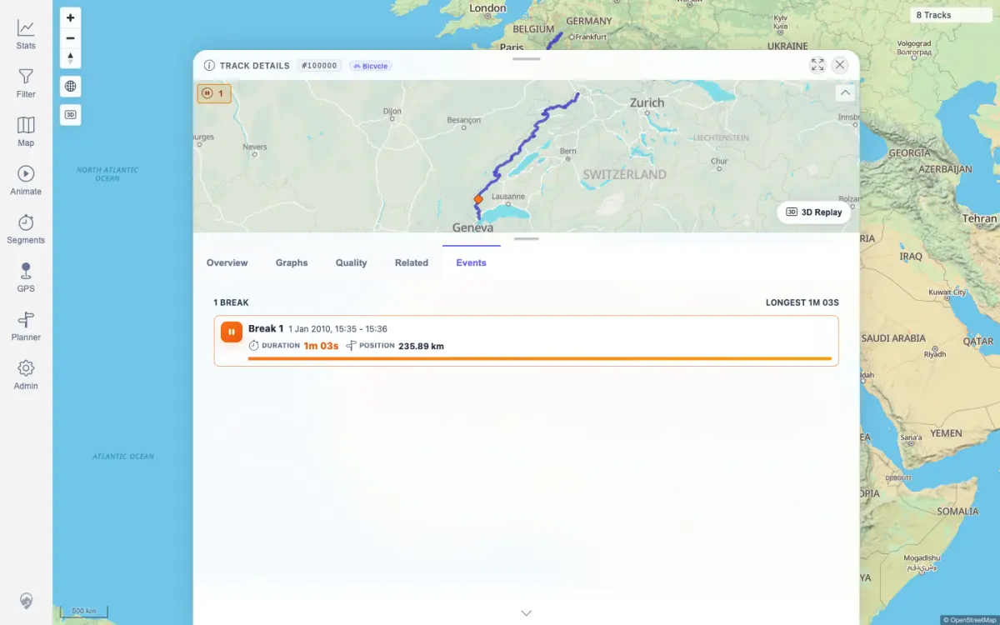
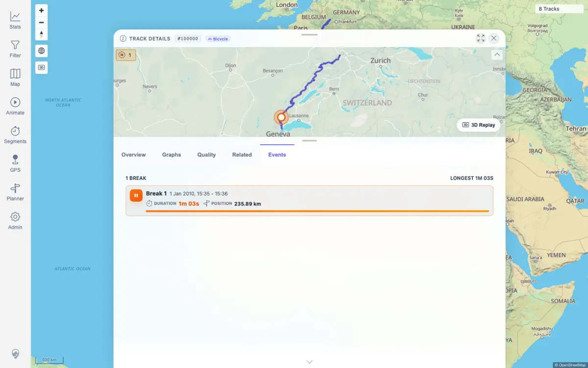

# Packet: TRD_14

## Scope

- Coverage source: `documentation/testing/frontend-regression-test-plan.md`
- Coverage ID or run packet: TRD_14
- In scope: Events tab stop/gap rendering, event selection highlighting on the mini-map, and clean deselection.
- Out of scope: Creating or editing manual events.

## Prerequisites

- Required previous coverage IDs or run packets: IMP_04, TRD_02
- Required app/data state: Track 100000 exists and has a persisted detected stop event.
- Required browser context: Authenticated desktop browser context.

## Allowed Mutations

- Allowed: Select and deselect an event row in the UI.
- Not allowed: Persist event or track changes.

## Actions And Results

| Coverage ID | Action | Expected result | Actual result | Status | Evidence |
|---|---|---|---|---|---|
| TRD_14 | Opened track 100000, selected the Events tab, verified the detected stop row, clicked the row once, then clicked it again to deselect. Compared selected and deselected mini-map captures. | Events tab shows detected stops/GPS gaps where present; selecting an event highlights the matching mini-map position and deselects cleanly. | The current dataset has no `GPS_GAP` events, but track 100000 has one detected `STOP`. The Events tab showed `Break 1` at 235.89 km with duration 1m 03s. First click set `aria-pressed=true`, applied `event-row--selected`, and changed the mini-map capture by 1,133 pixels. Second click cleared selected state and returned `aria-pressed=false`. | PASS | [assets/TRD_14-events-selection.txt](../assets/TRD_14-events-selection.txt); [assets/TRD_14-events-list.webp](../assets/TRD_14-events-list.webp); [assets/TRD_14-event-selected.webp](../assets/TRD_14-event-selected.webp); [assets/TRD_14-event-deselected.webp](../assets/TRD_14-event-deselected.webp) |

## Issues

| ID | Severity | Summary | Reproduction | Expected | Actual | Evidence | Release impact |
|---|---|---|---|---|---|---|---|
| None |  |  |  |  |  |  |  |

## Evidence Files

| File | Purpose |
|---|---|
| [assets/TRD_14-events-selection.txt](../assets/TRD_14-events-selection.txt) | API event details, DOM selected/deselected states, and mini-map screenshot diff. |
| [assets/TRD_14-events-list.webp](../assets/TRD_14-events-list.webp) | Events tab with detected stop before selection. |
| [assets/TRD_14-event-selected.webp](../assets/TRD_14-event-selected.webp) | Selected stop row and mini-map highlight. |
| [assets/TRD_14-event-deselected.webp](../assets/TRD_14-event-deselected.webp) | Event row after deselection. |

## Screenshot Evidence

## Timings

| Step | Timing |
|---|---:|
| Events tab render, select, mini-map comparison, deselect | < 15 s |

## Handoff Notes

- Completed: TRD_14 passed for detected-stop event display, mini-map highlight, and deselection.
- Remaining unfinished coverage: FLT_01 onward.
- Blocked or not applicable: No GPS gap event exists in the current dataset; detected stop coverage was exercised.
- State left for the next packet: No data mutations; event row deselected.
