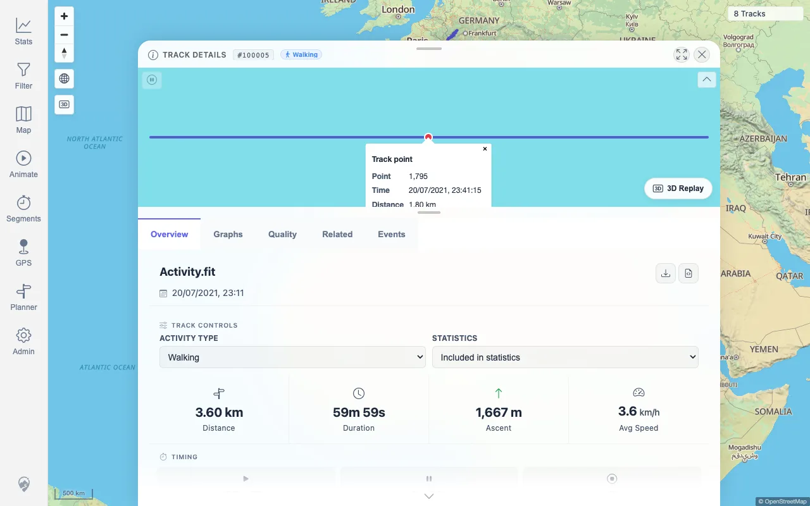
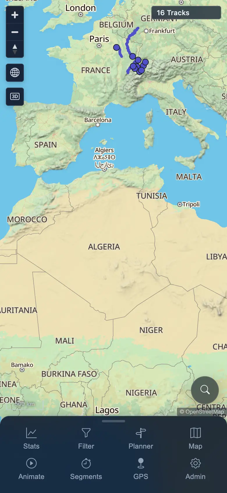

> **RESULT: BLOCKED - coverage completed, filter issues fixed locally, but cleanup is blocked.**

# MTL Explorer Full Regression Report

## Goal

Run the resumable full frontend regression against the beta image `wauwau0977/mytraillog:beta` on target `178.104.209.132`, one coverage ID per packet, then assemble packet-based results and verify cleanup.

## Scope And Environment

| Field | Value |
|---|---|
| Run folder | `documentation/testing/full-regression/test_runs/2026-06-20_2114-beta-178-full-regression/` |
| Target app | `http://178.104.209.132:18080/mtl/` |
| SSH user | `root` |
| Image override | `wauwau0977/mytraillog:beta` |
| Browser automation | Standalone Playwright with installed Chrome |
| Data policy | Public GPX/FIT plus synthetic anonymized uploads only; no private GPX tracks committed or derived |
| Finalization gate | PASS, 175 coverage IDs terminal |
| Cleanup | BLOCKED: SSH password and key-based access rejected after setup-time password rotation; app still responds HTTP 200 |

README facts recorded during setup: Docker Engine plus Docker Compose plugin are prerequisites; quick install downloads `docker-compose.yml` from GitHub main, runs `docker compose up -d`, serves `http://localhost:18080/mtl/`, imports tracks from `./data/gpx/`, and uses README login `mtl` / `change-me`.

## Setup And Install

- RUN_SETUP status from packet: `PASS`.
- Target initially lacked Docker. Docker Engine 29.6.0 and Docker Compose v5.1.4 were installed from Docker stable Debian packages.
- Disposable compose directory: `/root/mtl-full-regression-2026-06-20_2114-beta-178-full-regression`.
- Compose started app, PostGIS, BRouter, and location-search containers.
- App image: `wauwau0977/mytraillog:beta`; server startup reported image `1.305`.
- Remote login screen loaded at `http://178.104.209.132:18080/mtl/`.

## Result Summary

| Category | Count |
|---|---:|
| PASS coverage IDs | 153 |
| FIXED coverage IDs | 2 |
| FAIL coverage IDs | 0 |
| BLOCKED coverage IDs | 10 |
| NOT APPLICABLE coverage IDs | 10 |
| Coverage IDs total | 175 |
| RUN_SETUP | PASS |
| RUN_CLEANUP | BLOCKED |

The regression coverage queue is complete. FLT_04 and FLT_05 are fixed locally with focused test evidence; the remaining run-level blocker is remote cleanup, which could not be verified.

## Fixed Locally

| Coverage ID | Summary | Packet |
|---|---|---|
| FLT_04 | Date, text, and geo parameters all save and re-apply correctly after reload. | [packets/FLT_04.md](packets/FLT_04.md) |
| FLT_05 | **Geo drawing**: draw a circle, rectangle, and polygon; undo, cancel, finish, and clear all work; saved shapes reappear next time. | [packets/FLT_05.md](packets/FLT_05.md) |

### Original Failure Evidence And Local Fix

FLT_04 proved that date/text filter values persisted, but drawn Circle geo parameters did not persist to `mtl.filter.client-config` and did not reappear after reload. FLT_05 therefore also failed the saved-geo-shapes requirement.

Local fix evidence is recorded in [assets/FIXED-filter-planner-local-verification.txt](assets/FIXED-filter-planner-local-verification.txt). Full browser regression was not rerun after the code change.

## Issues

| ID | Severity | Coverage | Status | Summary | Packet |
|---|---|---|---|---|---|
| FIT-03-P2 | P2 | FIT_03 | REJECTED | FIT-backed detail mini-map point click does not open a point popup. | [FIT_03.md](packets/FIT_03.md) |
| MAP-06-P3 | P3 | MAP_06 | REJECTED | Fast pan/zoom triggers repeated remote tile 404 responses. | [MAP_06.md](packets/MAP_06.md) |
| FLT-04-P2 | P2 | FLT_04 | FIXED | Geo circle parameter is not persisted or re-applied after reload. | [FLT_04.md](packets/FLT_04.md) |
| PLN-09-P3 | P3 | PLN_09 | FIXED | Clearing a failed planner route leaves the stale segment-downloading notice visible. | [PLN_09.md](packets/PLN_09.md) |

## Blocked And Not Applicable Areas

Blocked coverage IDs are terminal with packet-level rationale and unblock paths. They did not leave the queue open.

| Coverage ID | Reason | Packet |
|---|---|---|
| MAP_07 | Direction arrows appear on tracks at high zoom when Track Points & Direction is enabled. Use a track whose current high-zoom rendered shape has visible in-viewport point vertices. A sparse two-point or straight synthetic track whose endpoints are outside the viewport is not valid evidence: the line may cross the screen while no arrow marker is expected at the visible midpoint. | [packets/MAP_07.md](packets/MAP_07.md) |
| MAP_11 | Clicking a rendered track-point marker shows a popup with the expected metrics (time, speed, elevation, etc.). Click an actual direction-arrow/point marker, not only the connecting track line. | [packets/MAP_11.md](packets/MAP_11.md) |
| FLT_01 | Open the filter panel → previously saved filter is still active and shown as a chip. | [packets/FLT_01.md](packets/FLT_01.md) |
| PLN_03 | Insert a waypoint on an existing leg by dragging the route. | [packets/PLN_03.md](packets/PLN_03.md) |
| MED_01 | Toggle the media layer → photo pins appear in the map view. | [packets/MED_01.md](packets/MED_01.md) |
| MED_02 | Pan/zoom → media is loaded for the current viewport (not the whole world at once). | [packets/MED_02.md](packets/MED_02.md) |
| MED_03 | Click a pin → photo preview opens; next/previous navigation works. | [packets/MED_03.md](packets/MED_03.md) |
| MED_04 | HEIC photos display correctly (converted server-side). | [packets/MED_04.md](packets/MED_04.md) |
| MED_05 | A missing/broken photo shows a recoverable error, not a blank sheet. | [packets/MED_05.md](packets/MED_05.md) |
| MOB_04 | Planner waypoints can be tapped, dragged, and inserted with touch. | [packets/MOB_04.md](packets/MOB_04.md) |
| RUN_CLEANUP | SSH password and key-based authentication are rejected after setup-time password rotation; stack shutdown and directory removal are not verified. | [packets/RUN_CLEANUP.md](packets/RUN_CLEANUP.md) |

Not applicable rows include demo mode inactive, unavailable FIT conversion path not triggered, remote plain-HTTP GPS permission/follow-me paths, local-vector map mode not being remote-raster mode, and installed-PWA-only offline/service-worker checks in a normal browser-tab run.

## Timings

| Area | Timing | Source |
|---|---:|---|
| SSH password rotation during setup | < 1 min | RUN_SETUP |
| Docker prerequisite install | 12 s | RUN_SETUP |
| Quick-install compose pull/create/start | 28 s | RUN_SETUP |
| App HTTP readiness after compose start | 31 s | RUN_SETUP |
| Five-GPX import index/job settle | 0 s observed at first poll; post-import status capture ~7 s | IMP_03, IMP_04 |
| Deletion sync poll window | 165 s | DEL_02 |
| Deleted-surface verification | ~2 min | DEL_03 |
| Mobile core checks | MOB_01 ~5 s, MOB_02 ~11 s, MOB_03 ~14 s; MOB_04/MOB_05 packeted separately | MOB_01-MOB_05 |
| Offline/network checks | NET_01/NET_04 not applicable; NET_02 retry and NET_03 auth redirect simulated in browser contexts | NET_01-NET_04 |
| Finalization gate | < 1 s | RUN_CLEANUP |
| Evidence audit | < 1 s | RUN_CLEANUP |
| Cleanup SSH attempts and reachability recheck | ~8 s password attempts plus key/access and HTTP rechecks; blocked | RUN_CLEANUP |

## Evidence Overview

Key screenshots are embedded below; full evidence lives in `assets/` and every packet links its own evidence.

### Remote login after setup

### Stats totals after import

### Map after delete sync

### FIT detail point popup retest

### Filter circle before reload

### Filter circle missing after reload

### Planner segment-downloading notice

### Mobile map/nav context

### Network retry state

### Rapid switch final map

Additional cleanup evidence:

- [RUN_CLEANUP-evidence-audit.txt](assets/RUN_CLEANUP-evidence-audit.txt)
- [RUN_CLEANUP-remote-cleanup.txt](assets/RUN_CLEANUP-remote-cleanup.txt)
- [RUN_CLEANUP-remote-cleanup-recheck.txt](assets/RUN_CLEANUP-remote-cleanup-recheck.txt)
- [RUN_CLEANUP-key-ssh-recheck.txt](assets/RUN_CLEANUP-key-ssh-recheck.txt)
- [RUN_CLEANUP-app-reachability-recheck.txt](assets/RUN_CLEANUP-app-reachability-recheck.txt)

## Cleanup

Cleanup is not verified. The finalization gate and evidence audit passed, but SSH cleanup could not proceed because the target rejected the supplied setup access note with `Permission denied, please try again.` A password recheck on 2026-06-21 returned SSH exit code 5, key-based SSH returned exit code 255 with `Permission denied (publickey,password)`, and the app URL still returned HTTP 200, so the stack appears reachable and the disposable directory removal is unverified.

Required resume action: provide the current root SSH credential for `178.104.209.132`, then run `docker compose down --remove-orphans` from `/root/mtl-full-regression-2026-06-20_2114-beta-178-full-regression`, verify no compose-project containers remain, remove that directory, update RUN_CLEANUP, and revise this report.

## Coverage Matrix

| Coverage ID | Section | Status | Summary | Packet |
|---|---|---|---|---|
| ACC_01 | Coverage Accounting | PASS | Treat every checklist bullet as a required coverage item unless it is explicitly not applicable to the run. | [packets/ACC_01.md](packets/ACC_01.md) |
| ACC_02 | Coverage Accounting | PASS | Do not mark a section `PASS` when any bullet inside it was skipped, only spot-checked, or verified indirectly. Mark the section `PARTIAL`, `NOT COVERED`, `NOT APPLICABLE`, `BLOCKED`, or `FAIL` as appropriate. | [packets/ACC_02.md](packets/ACC_02.md) |
| ACC_03 | Coverage Accounting | PASS | In full-regression reports, include enough coverage detail to show which bullets were actually exercised and which were not. Broad section summaries are acceptable only when all child bullets have supporting evidence. | [packets/ACC_03.md](packets/ACC_03.md) |
| ACC_04 | Coverage Accounting | PASS | Capture compact screenshots for representative working user-facing functions as well as failures, so reports provide a visual overview and not only defect evidence. | [packets/ACC_04.md](packets/ACC_04.md) |
| ACC_05 | Coverage Accounting | PASS | If time, tooling, viewport, data, permissions, or environment constraints prevent a check, record that constraint explicitly instead of silently collapsing the check into a parent row. | [packets/ACC_05.md](packets/ACC_05.md) |
| DAT_01 | Required Data-Change Regression | PASS | Use at least **five public internet GPX files** with real track sequences (`trk` / `trkseg` / `trkpt`). Waypoint-only files (`wpt` without `trkpt`) are not valid positive import evidence. | [packets/DAT_01.md](packets/DAT_01.md) |
| DAT_02 | Required Data-Change Regression | PASS | Prefer GPX files with timestamped trackpoints so duration, speed, moving time, and period statistics can be verified. | [packets/DAT_02.md](packets/DAT_02.md) |
| DAT_03 | Required Data-Change Regression | PASS | Record for every source file: source URL, source page/license note, destination filename, SHA-256, byte size, `trkpt` count, timestamp count, imported track id(s), and imported track name(s). | [packets/DAT_03.md](packets/DAT_03.md) |
| DAT_04 | Required Data-Change Regression | PASS | Suggested verified GPX source: `https://github.com/gps-touring/sample-gpx` with raw files such as: - `https://raw.githubusercontent.com/gps-touring/sample-gpx/master/BrittanyJura/JuraRoute72011.gpx` - `https://raw.githubusercontent.com/gps-touring/sample-gpx/master/BrittanyJura/MoselradwegAusWiki.gpx` - `https://raw.githubusercontent.com/gps-touring/sample-gpx/master/BrittanyJura/Vitry-le-Francois_Langres.gpx` - `https://raw.githubusercontent.com/gps-touring/sample-gpx/master/BrittanyJura/VoieVerteHauteVosges.gpx` - `https://raw.githubusercontent.com/gps-touring/sample-gpx/master/RoscoffCoastal/Lannion_Plestin_parcours24.4RE.gpx` | [packets/DAT_04.md](packets/DAT_04.md) |
| DAT_05 | Required Data-Change Regression | PASS | Use at least **one public FIT activity file with GPS positions**. Suggested verified FIT source: Garmin's official FIT SDK examples, e.g. `https://raw.githubusercontent.com/garmin/fit-javascript-sdk/main/test/data/Activity.fit`. | [packets/DAT_05.md](packets/DAT_05.md) |
| DAT_06 | Required Data-Change Regression | PASS | Do not count non-GPS FIT files or waypoint-only GPX files as positive evidence. They are useful negative tests only: MTL Explorer should fail, ignore, or mark them clearly without adding map tracks, corrupting stats, or blanking the UI. | [packets/DAT_06.md](packets/DAT_06.md) |
| DAT_07 | Required Data-Change Regression | PASS | For measure / comparison / virtual-race checks, include at least one repeatable two-point segment with two or more tracks crossing the same two zones. Use public tracks or fully synthetic anonymized GPX data; do not use private local GPX files as fixtures or report evidence. | [packets/DAT_07.md](packets/DAT_07.md) |
| IMP_01 | Required Data-Change Regression | PASS | Capture baseline map count, track-browser count, statistics totals, data-freshness token, and GPS indexer status. | [packets/IMP_01.md](packets/IMP_01.md) |
| IMP_02 | Required Data-Change Regression | PASS | Import the five GPX files through the Admin upload UI or by placing them in the documented watched import folder. | [packets/IMP_02.md](packets/IMP_02.md) |
| IMP_03 | Required Data-Change Regression | PASS | Wait for indexing to finish. If live file watching does not react, trigger **Rescan GPS** from Admin and record that it was needed. | [packets/IMP_03.md](packets/IMP_03.md) |
| IMP_04 | Required Data-Change Regression | PASS | Confirm upload/index status: all five source files reach completed state, no unexpected GPS index failures appear, data freshness changes, and background jobs (Duplicate Finder, Exploration Score) settle. | [packets/IMP_04.md](packets/IMP_04.md) |
| IMP_05 | Required Data-Change Regression | PASS | Reload from the freshness banner or helper reload action → the map, track browser, filters, and statistics all show the new data. | [packets/IMP_05.md](packets/IMP_05.md) |
| IMP_06 | Required Data-Change Regression | PASS | Verify each imported file by name: it appears in track browser search, on the map, in statistics summaries, and in at least one filter result. | [packets/IMP_06.md](packets/IMP_06.md) |
| IMP_07 | Required Data-Change Regression | PASS | On the map, zoom to the imported tracks, click each track, verify selection/detail opening, point popups, visible line geometry, and no stale or duplicated lines. | [packets/IMP_07.md](packets/IMP_07.md) |
| IMP_08 | Required Data-Change Regression | PASS | In statistics, verify count increased by five unless a source file legitimately split into multiple tracks; if it split, record the source-to-track mapping and expected count. | [packets/IMP_08.md](packets/IMP_08.md) |
| IMP_09 | Required Data-Change Regression | PASS | Verify totals changed in the correct direction: total distance, duration, ascent/descent, activity breakdown, period charts, rankings, heatmap density, and track-browser summary row. | [packets/IMP_09.md](packets/IMP_09.md) |
| DEL_01 | Required Data-Change Regression | PASS | Delete two of the imported source files from the watched import/upload folder. If the test environment only exposes browser upload and not the watched folder, mark deletion sync `BLOCKED` and run this flow in the install/full-regression environment. | [packets/DEL_01.md](packets/DEL_01.md) |
| DEL_02 | Required Data-Change Regression | PASS | Wait for automatic delete processing or trigger **Rescan GPS**. | [packets/DEL_02.md](packets/DEL_02.md) |
| DEL_03 | Required Data-Change Regression | PASS | Verify the two deleted tracks disappear from the map, track browser, filter results, selection lists, heatmap, related-track lists, and statistics totals. | [packets/DEL_03.md](packets/DEL_03.md) |
| DEL_04 | Required Data-Change Regression | PASS | Verify the remaining imported tracks still display and open correctly. | [packets/DEL_04.md](packets/DEL_04.md) |
| DEL_05 | Required Data-Change Regression | PASS | Deleted-track API probes or stale deleted-track URLs are not pass/fail criteria for this deletion flow. The frontend regression requirement is that deleted tracks no longer appear in user-visible map, browser, filter, heatmap, related-track, detail, or statistics surfaces. | [packets/DEL_05.md](packets/DEL_05.md) |
| FIT_01 | Required Data-Change Regression | PASS | Import the FIT activity file with GPS positions. | [packets/FIT_01.md](packets/FIT_01.md) |
| FIT_02 | Required Data-Change Regression | PASS | Verify it is accepted by upload/import, indexed successfully, displayed on the map, searchable in the browser, and included in statistics. | [packets/FIT_02.md](packets/FIT_02.md) |
| FIT_03 | Required Data-Change Regression | PASS | Open the FIT-backed track details → overview, graphs, quality, events, related tracks, mini-map, and point popups render as they do for GPX-backed tracks. | [packets/FIT_03.md](packets/FIT_03.md) |
| FIT_04 | Required Data-Change Regression | PASS | **Download original source file** → the downloaded file remains FIT and matches the uploaded checksum. | [packets/FIT_04.md](packets/FIT_04.md) |
| FIT_05 | Required Data-Change Regression | PASS | **Download as GPX** → a valid GPX file downloads and contains real `trkpt` trackpoints, not only waypoints. | [packets/FIT_05.md](packets/FIT_05.md) |
| FIT_06 | Required Data-Change Regression | NOT APPLICABLE | If GPSBabel or FIT conversion is unavailable, the UI shows a clear conversion/indexing error and the failure is recorded as blocking for FIT support. | [packets/FIT_06.md](packets/FIT_06.md) |
| FMT_01 | Required Data-Change Regression | PASS | The server accepts `.gpx`, `.fit`, `.tcx`, `.kml`, `.kmz`, `.igc`, `.nmea`, `.geojson`, and `.gdb`. For a full release regression, test at least one GPS-bearing sample for each available format, or mark that format `NOT COVERED` with the reason. | [packets/FMT_01.md](packets/FMT_01.md) |
| FMT_02 | Required Data-Change Regression | PASS | For each non-GPX format tested, verify upload acceptance, GPSBabel conversion, map display, details/charts, statistics inclusion, **Download original source file**, and **Download as GPX**. | [packets/FMT_02.md](packets/FMT_02.md) |
| SGN_01 | 1. Sign-in And First Load | PASS | Open the app while signed out → you are redirected to the login screen. | [packets/SGN_01.md](packets/SGN_01.md) |
| SGN_02 | 1. Sign-in And First Load | PASS | Sign in with valid credentials → you reach the map. | [packets/SGN_02.md](packets/SGN_02.md) |
| SGN_03 | 1. Sign-in And First Load | PASS | Sign in with wrong credentials → a clear error appears and you stay on login. | [packets/SGN_03.md](packets/SGN_03.md) |
| SGN_04 | 1. Sign-in And First Load | NOT APPLICABLE | If demo mode is active, the login screen shows the demo credentials banner. | [packets/SGN_04.md](packets/SGN_04.md) |
| SGN_05 | 1. Sign-in And First Load | PASS | Sign out → you return to login; signing in again works. | [packets/SGN_05.md](packets/SGN_05.md) |
| SGN_06 | 1. Sign-in And First Load | PASS | The splash screen (logo, background, message) displays during startup and disappears once the map and tracks are loaded. | [packets/SGN_06.md](packets/SGN_06.md) |
| SGN_07 | 1. Sign-in And First Load | PASS | If startup fails (e.g. server down), a retry is offered instead of a frozen splash. | [packets/SGN_07.md](packets/SGN_07.md) |
| SGN_08 | 1. Sign-in And First Load | PASS | "MTL Explorer" branding appears in About / public-facing copy. | [packets/SGN_08.md](packets/SGN_08.md) |
| SGN_09 | 1. Sign-in And First Load | PASS | Browser back/forward navigation between views works without errors. | [packets/SGN_09.md](packets/SGN_09.md) |
| MAP_01 | 2. Map And Tracks | PASS | Base map and overlays load on first open. | [packets/MAP_01.md](packets/MAP_01.md) |
| MAP_02 | 2. Map And Tracks | PASS | All your tracks appear on the map; the total/visible count is correct. | [packets/MAP_02.md](packets/MAP_02.md) |
| MAP_03 | 2. Map And Tracks | PASS | Newly imported tracks from the required data-change flow appear without a full browser restart after accepting the freshness/reload prompt. | [packets/MAP_03.md](packets/MAP_03.md) |
| MAP_04 | 2. Map And Tracks | PASS | Deleted tracks from the required data-change flow disappear from all map sources, selection lists, and popups. | [packets/MAP_04.md](packets/MAP_04.md) |
| MAP_05 | 2. Map And Tracks | PASS | Zoom in on a track → detail/precision improves (no duplicate or broken lines). | [packets/MAP_05.md](packets/MAP_05.md) |
| MAP_06 | 2. Map And Tracks | PASS | Fast pan/zoom doesn't leave stale lines, missing tiles, or runaway loading spinners. | [packets/MAP_06.md](packets/MAP_06.md) |
| MAP_07 | 2. Map And Tracks | BLOCKED | Direction arrows appear on tracks at high zoom when Track Points & Direction is enabled. Use a track whose current high-zoom rendered shape has visible in-viewport point vertices. A sparse two-point or straight synthetic track whose endpoints are outside the viewport is not valid evidence: the line may cross the screen while no arrow marker is expected at the visible midpoint. | [packets/MAP_07.md](packets/MAP_07.md) |
| MAP_08 | 2. Map And Tracks | PASS | Click a single track → it highlights and details open. | [packets/MAP_08.md](packets/MAP_08.md) |
| MAP_09 | 2. Map And Tracks | PASS | Click an area where several tracks overlap → a selection list appears; picking one opens its details. | [packets/MAP_09.md](packets/MAP_09.md) |
| MAP_10 | 2. Map And Tracks | PASS | Deselect / close the selection → the map returns to its normal state. | [packets/MAP_10.md](packets/MAP_10.md) |
| MAP_11 | 2. Map And Tracks | BLOCKED | Clicking a rendered track-point marker shows a popup with the expected metrics (time, speed, elevation, etc.). Click an actual direction-arrow/point marker, not only the connecting track line. | [packets/MAP_11.md](packets/MAP_11.md) |
| MAP_12 | 2. Map And Tracks | PASS | Swiss Mobility routes popup (where applicable) shows nearby official routes and closes cleanly. | [packets/MAP_12.md](packets/MAP_12.md) |
| MAP_13 | 2. Map And Tracks | NOT APPLICABLE | Intentional remote raster mode: with `mtl.map-server.tile-mode=remote`, `/api/map/config` exposes `remoteRasterStyles` for `light`, `light-topo`, and `dark`, and does not expose legacy `remoteTileUrl`. Select OSM Light, OSM Topo Light, and OSM Dark; each loads map tiles from its configured provider URL, shows the matching attribution, keeps the map interactive, and makes no `/api/map-proxy` tile requests. | [packets/MAP_13.md](packets/MAP_13.md) |
| MAP_14 | 2. Map And Tracks | PASS | Remote raster fallback from local vector mode: when local vector PMTiles are not ready or fail at runtime, the map does not blank or freeze. It switches to the configured remote raster style for the selected map theme, uses the configured attribution, and continues to support pan, zoom, track display, and track selection. If the environment cannot safely simulate local tile unavailability, mark this row `BLOCKED` with the missing control. | [packets/MAP_14.md](packets/MAP_14.md) |
| MAP_15 | 2. Map And Tracks | PASS | Manual remote raster source override: in a local-vector deployment, open Maps and data, switch Map Source from Auto to Remote, and verify the base map reloads from the configured remote raster provider without `/api/map-proxy` tile requests. OSM raster themes remain selectable, Swiss vector themes are not offered in Remote mode, the setting persists after reload, and Reset restores Auto. | [packets/MAP_15.md](packets/MAP_15.md) |
| TRD_01 | 3. Track Details | PASS | Open at least one GPX-backed track and one FIT-backed track from user-facing navigation (map, browser, or stats) and record the track ids/source filenames. | [packets/TRD_01.md](packets/TRD_01.md) |
| TRD_02 | 3. Track Details | PASS | Opening a track loads its overview, charts, related-tracks list, event list, mini-map, and quality info. | [packets/TRD_02.md](packets/TRD_02.md) |
| TRD_03 | 3. Track Details | PASS | Switch between **Overview**, **Graphs**, **Quality**, **Related**, and **Events**; tabs do not refetch in a loop, lose state, or show blank panels. | [packets/TRD_03.md](packets/TRD_03.md) |
| TRD_04 | 3. Track Details | PASS | Elevation, speed, distance, and gain charts render with readable values. | [packets/TRD_04.md](packets/TRD_04.md) |
| TRD_05 | 3. Track Details | PASS | Graph controls work: time/distance x-axis toggle, range band toggle, point-count slider, and graph-height slider update charts without layout breakage. | [packets/TRD_05.md](packets/TRD_05.md) |
| TRD_06 | 3. Track Details | PASS | Hovering a chart highlights the matching point on the mini-map and hovering the mini-map highlights the chart. No stale cursors remain after leaving either surface. | [packets/TRD_06.md](packets/TRD_06.md) |
| TRD_07 | 3. Track Details | PASS | The track shape preview (small thumbnail) is visible in browser, filters, stats, related tracks, and selection lists. | [packets/TRD_07.md](packets/TRD_07.md) |
| TRD_08 | 3. Track Details | PASS | **Download original source file** (GPX/FIT/etc.) → file downloads and matches the uploaded one. | [packets/TRD_08.md](packets/TRD_08.md) |
| TRD_09 | 3. Track Details | PASS | **Download as GPX** → a valid GPX file downloads even if the source was FIT or another format. | [packets/TRD_09.md](packets/TRD_09.md) |
| TRD_10 | 3. Track Details | PASS | **Change activity type** (e.g. hiking → cycling) → saves successfully; energy/calorie values update automatically. | [packets/TRD_10.md](packets/TRD_10.md) |
| TRD_11 | 3. Track Details | PASS | **Energy "what-if" recalculation** (custom rider weight, etc.) → updates the displayed values without permanently saving. | [packets/TRD_11.md](packets/TRD_11.md) |
| TRD_12 | 3. Track Details | PASS | **Exclude from statistics** toggle → the track stops counting in stats overview; re-including it brings it back. | [packets/TRD_12.md](packets/TRD_12.md) |
| TRD_13 | 3. Track Details | PASS | **Related tracks** show duplicates and previous/next tracks; clicking one navigates to it. | [packets/TRD_13.md](packets/TRD_13.md) |
| TRD_14 | 3. Track Details | PASS | **Events tab** shows detected stops / GPS gaps where present; selecting an event highlights the matching mini-map position and deselects cleanly. | [packets/TRD_14.md](packets/TRD_14.md) |
| FLT_01 | 4. Filters | BLOCKED | Open the filter panel → previously saved filter is still active and shown as a chip. | [packets/FLT_01.md](packets/FLT_01.md) |
| FLT_02 | 4. Filters | PASS | Browse the filter catalog; search and grouping work. | [packets/FLT_02.md](packets/FLT_02.md) |
| FLT_03 | 4. Filters | PASS | Pick a filter → its parameters appear; parameter edits auto-apply immediately; clearing or removing parameters resets their effect; active chips, visible count, map, legend, and stats reflect the current state without stale pending UI. | [packets/FLT_03.md](packets/FLT_03.md) |
| FLT_04 | 4. Filters | FIXED | Date, text, and geo parameters all save and re-apply correctly after reload. | [packets/FLT_04.md](packets/FLT_04.md) |
| FLT_05 | 4. Filters | FIXED | **Geo drawing**: draw a circle, rectangle, and polygon; undo, cancel, finish, and clear all work; saved shapes reappear next time. | [packets/FLT_05.md](packets/FLT_05.md) |
| FLT_06 | 4. Filters | PASS | Applied filter updates: visible track count, map colors, legend, and stats — without a full page reload. | [packets/FLT_06.md](packets/FLT_06.md) |
| FLT_07 | 4. Filters | PASS | Legend reflects the active filter (categories or gradient); collapsing/hiding groups updates the map immediately. | [packets/FLT_07.md](packets/FLT_07.md) |
| FLT_08 | 4. Filters | PASS | Clearing the filter restores all tracks. | [packets/FLT_08.md](packets/FLT_08.md) |
| TBS_01 | 5. Track Browser And Statistics | PASS | Track browser lists all (or filtered) tracks with name, date, distance, duration, activity, etc. | [packets/TBS_01.md](packets/TBS_01.md) |
| TBS_02 | 5. Track Browser And Statistics | PASS | Search matches names, descriptions, dates, distances, durations, activity, and file paths. | [packets/TBS_02.md](packets/TBS_02.md) |
| TBS_03 | 5. Track Browser And Statistics | PASS | Sort by each column works; summary row reflects what is currently visible. | [packets/TBS_03.md](packets/TBS_03.md) |
| TBS_04 | 5. Track Browser And Statistics | PASS | Quick-view/preset buttons switch the browser subset correctly and preserve usable sorting/search behavior. | [packets/TBS_04.md](packets/TBS_04.md) |
| TBS_05 | 5. Track Browser And Statistics | PASS | Clicking a row opens the track's details. | [packets/TBS_05.md](packets/TBS_05.md) |
| TBS_06 | 5. Track Browser And Statistics | PASS | Statistics overview shows total distance, time, elevation, activity breakdown, rankings, milestones, and period charts. | [packets/TBS_06.md](packets/TBS_06.md) |
| TBS_07 | 5. Track Browser And Statistics | PASS | Stats are correct for: empty dataset, a single track, and many tracks. | [packets/TBS_07.md](packets/TBS_07.md) |
| TBS_08 | 5. Track Browser And Statistics | PASS | Stats update after the required five-GPX import and again after deleting two imported tracks; no stale deleted-track totals remain. | [packets/TBS_08.md](packets/TBS_08.md) |
| TBS_09 | 5. Track Browser And Statistics | PASS | Time-period charts (daily/weekly/monthly) render and switch correctly. | [packets/TBS_09.md](packets/TBS_09.md) |
| TBS_10 | 5. Track Browser And Statistics | PASS | Clicking a stats entry navigates / filters / highlights as expected. | [packets/TBS_10.md](packets/TBS_10.md) |
| TBS_11 | 5. Track Browser And Statistics | PASS | Highlight drilldowns open the expected track list, open a selected track, and expose excluded-highlight counts where applicable. | [packets/TBS_11.md](packets/TBS_11.md) |
| TBS_12 | 5. Track Browser And Statistics | PASS | Statistics use the same resolved track set as the active filter: apply a geo-drawn filter (circle, rectangle, or polygon) that changes the visible map count, then verify Stats Overview totals, Trends track totals, and the Stats Tracks tab all match the filtered map count. Repeat after a reload to confirm the fallback ID-resolution path still matches. | [packets/TBS_12.md](packets/TBS_12.md) |
| PLN_01 | 6. Planner | PASS | Open the planner; pick a routing profile (e.g. hike, bike). | [packets/PLN_01.md](packets/PLN_01.md) |
| PLN_02 | 6. Planner | PASS | Click on the map to add waypoints → a route is computed and drawn. | [packets/PLN_02.md](packets/PLN_02.md) |
| PLN_03 | 6. Planner | BLOCKED | Insert a waypoint on an existing leg by dragging the route. | [packets/PLN_03.md](packets/PLN_03.md) |
| PLN_04 | 6. Planner | PASS | Move and delete waypoints; clear, undo, and redo all work. | [packets/PLN_04.md](packets/PLN_04.md) |
| PLN_05 | 6. Planner | PASS | Live stats bar (distance, ascent, time) updates as you edit. | [packets/PLN_05.md](packets/PLN_05.md) |
| PLN_06 | 6. Planner | PASS | Elevation profile renders and hovering it highlights the matching map point. | [packets/PLN_06.md](packets/PLN_06.md) |
| PLN_07 | 6. Planner | PASS | **Save plan**, list saved plans, load a saved plan, delete a plan. | [packets/PLN_07.md](packets/PLN_07.md) |
| PLN_08 | 6. Planner | PASS | **Download plan as GPX** → file is valid and matches the planned route. | [packets/PLN_08.md](packets/PLN_08.md) |
| PLN_09 | 6. Planner | PASS | If the routing engine (BRouter) is missing data for an area, the UI shows a clear "segment downloading / unavailable" state instead of an unhandled error. | [packets/PLN_09.md](packets/PLN_09.md) |
| PLN_10 | 6. Planner | PASS | Existing planned routes still display even when the planner has trouble fetching new data. | [packets/PLN_10.md](packets/PLN_10.md) |
| PLN_11 | 6. Planner | PASS | Touch dragging on mobile works for placing and moving waypoints. | [packets/PLN_11.md](packets/PLN_11.md) |
| MCT_01 | 7. Measuring And Comparison Tools | PASS | Start the measure tool, pick start and end points → result list of crossing tracks appears with speed/time/distance. | [packets/MCT_01.md](packets/MCT_01.md) |
| MCT_02 | 7. Measuring And Comparison Tools | PASS | Clicking a result opens that track's details / segment view. | [packets/MCT_02.md](packets/MCT_02.md) |
| MCT_03 | 7. Measuring And Comparison Tools | PASS | Stop the measure tool → all temporary markers and listeners are cleaned up. | [packets/MCT_03.md](packets/MCT_03.md) |
| MCT_04 | 7. Measuring And Comparison Tools | PASS | Segment comparison: pick several tracks → comparison chart + map align them correctly even with missing data. | [packets/MCT_04.md](packets/MCT_04.md) |
| MCT_05 | 7. Measuring And Comparison Tools | PASS | Sub-track / segment extraction (between two points on a track) returns the expected slice. | [packets/MCT_05.md](packets/MCT_05.md) |
| MCT_06 | 7. Measuring And Comparison Tools | PASS | Segment geometry sanity: after selecting a measured segment, the comparison map line stays within the selected tracks' real local bounds. There must be no straight global line, jump to `[0,0]`, or off-continent segment such as a line toward South Africa. | [packets/MCT_06.md](packets/MCT_06.md) |
| AVR_01 | 8. Animation And Virtual Race | PASS | Start animation: tracks play back smoothly; pause, reset, and speed controls work. | [packets/AVR_01.md](packets/AVR_01.md) |
| AVR_02 | 8. Animation And Virtual Race | PASS | Virtual race: multiple racers move together; ranking and racer cards update in real time. | [packets/AVR_02.md](packets/AVR_02.md) |
| AVR_03 | 8. Animation And Virtual Race | PASS | Stopping or finishing animation/race leaves map gestures and tools usable (no stuck state). | [packets/AVR_03.md](packets/AVR_03.md) |
| AVR_04 | 8. Animation And Virtual Race | PASS | Virtual race GPS geometry regression: start a race from a measured segment with multiple racers and verify each racer marker and trail stays on the actual segment. The map must not zoom to world-scale bounds, draw a long straight line away from the route, or show a racer/trail near `[0,0]` or South Africa. | [packets/AVR_04.md](packets/AVR_04.md) |
| MED_01 | 9. Media (Photos) | BLOCKED | Toggle the media layer → photo pins appear in the map view. | [packets/MED_01.md](packets/MED_01.md) |
| MED_02 | 9. Media (Photos) | BLOCKED | Pan/zoom → media is loaded for the current viewport (not the whole world at once). | [packets/MED_02.md](packets/MED_02.md) |
| MED_03 | 9. Media (Photos) | BLOCKED | Click a pin → photo preview opens; next/previous navigation works. | [packets/MED_03.md](packets/MED_03.md) |
| MED_04 | 9. Media (Photos) | BLOCKED | HEIC photos display correctly (converted server-side). | [packets/MED_04.md](packets/MED_04.md) |
| MED_05 | 9. Media (Photos) | BLOCKED | A missing/broken photo shows a recoverable error, not a blank sheet. | [packets/MED_05.md](packets/MED_05.md) |
| HMO_01 | 10. Heatmap And Overlays | PASS | Toggle the heatmap → it draws over the map without hiding the tracks; respects opacity. | [packets/HMO_01.md](packets/HMO_01.md) |
| HMO_02 | 10. Heatmap And Overlays | PASS | Toggle each map overlay (Swiss / OSM / etc.) independently; opacity sliders work; ordering above/below tracks stays correct. | [packets/HMO_02.md](packets/HMO_02.md) |
| HMO_03 | 10. Heatmap And Overlays | PASS | After changing filters, the heatmap updates accordingly. | [packets/HMO_03.md](packets/HMO_03.md) |
| GPS_01 | 11. GPS Location | NOT APPLICABLE | Browser geolocation requires a secure origin. In quick-install runs opened from a remote plain-HTTP host, mark live GPS permission/marker checks `NOT APPLICABLE - expected browser limitation`; test those rows on `localhost` or HTTPS. | [packets/GPS_01.md](packets/GPS_01.md) |
| GPS_02 | 11. GPS Location | NOT APPLICABLE | Enable GPS → permission prompt; on accept, the locate marker appears. | [packets/GPS_02.md](packets/GPS_02.md) |
| GPS_03 | 11. GPS Location | NOT APPLICABLE | "Follow me" mode keeps the map centered until you pan away (drifted state). | [packets/GPS_03.md](packets/GPS_03.md) |
| GPS_04 | 11. GPS Location | NOT APPLICABLE | Permission denied / disabled state shows a clear message. | [packets/GPS_04.md](packets/GPS_04.md) |
| GPS_05 | 11. GPS Location | NOT APPLICABLE | Disabling GPS removes the marker and stops updates. | [packets/GPS_05.md](packets/GPS_05.md) |
| SRC_01 | 12. Location Search | PASS | Open the search → type a place name → results appear. | [packets/SRC_01.md](packets/SRC_01.md) |
| SRC_02 | 12. Location Search | PASS | Pick a result → map flies to it and a marker is placed. | [packets/SRC_02.md](packets/SRC_02.md) |
| SRC_03 | 12. Location Search | PASS | Clear search / pick a different tool → marker is removed cleanly. | [packets/SRC_03.md](packets/SRC_03.md) |
| SRC_04 | 12. Location Search | PASS | Empty / no-result queries show a clear message. | [packets/SRC_04.md](packets/SRC_04.md) |
| GLB_01 | 13. Globe Mode | PASS | Zoom out far enough → globe view engages automatically. | [packets/GLB_01.md](packets/GLB_01.md) |
| GLB_02 | 13. Globe Mode | PASS | Zoom in → map returns to flat view. | [packets/GLB_02.md](packets/GLB_02.md) |
| GLB_03 | 13. Globe Mode | PASS | Manual disable of globe is respected (does not auto-re-enable until you re-enable it). | [packets/GLB_03.md](packets/GLB_03.md) |
| GLB_04 | 13. Globe Mode | PASS | Zoom limits don't trap the map at edges. | [packets/GLB_04.md](packets/GLB_04.md) |
| ADM_01 | 14. Admin Tools | PASS | Open the admin dialog; the tab list is reachable and usable. | [packets/ADM_01.md](packets/ADM_01.md) |
| ADM_02 | 14. Admin Tools | PASS | **Track file upload**: drag or pick GPX/FIT/etc.; upload availability, accepted formats, progress, success, unsupported-format errors, and empty-file errors are clear. | [packets/ADM_02.md](packets/ADM_02.md) |
| ADM_03 | 14. Admin Tools | PASS | **Indexer status**: shows GPS and media pending/running/completed/failed/removed state; refresh updates over time. | [packets/ADM_03.md](packets/ADM_03.md) |
| ADM_04 | 14. Admin Tools | PASS | **Manual rescan**: **Rescan GPS** and **Rescan Media** show queued/already-running/not-ready states without breaking map interaction. | [packets/ADM_04.md](packets/ADM_04.md) |
| ADM_05 | 14. Admin Tools | PASS | **Background jobs**: Duplicate Finder and Exploration Score progress is visible and settles after imports. | [packets/ADM_05.md](packets/ADM_05.md) |
| ADM_06 | 14. Admin Tools | PASS | **Operational tasks**: vector map tiles, location search, and routing segment status show ready/downloading/unavailable/disabled states with useful detail. | [packets/ADM_06.md](packets/ADM_06.md) |
| ADM_07 | 14. Admin Tools | PASS | **Data freshness**: shows last-update timestamp and offers reload. | [packets/ADM_07.md](packets/ADM_07.md) |
| ADM_08 | 14. Admin Tools | PASS | **Server log**: log lines load and refresh. | [packets/ADM_08.md](packets/ADM_08.md) |
| ADM_09 | 14. Admin Tools | PASS | **Attribution**: shows expected map/data sources. | [packets/ADM_09.md](packets/ADM_09.md) |
| ADM_10 | 14. Admin Tools | PASS | **Garmin export tools** (if present): status of installed exporters; install/update actions report success or error. | [packets/ADM_10.md](packets/ADM_10.md) |
| ADM_11 | 14. Admin Tools | PASS | Closing/reopening the dialog doesn't lose state mid-action. | [packets/ADM_11.md](packets/ADM_11.md) |
| SYN_01 | 15. Data Updates And Sync | PASS | After server-side data changes (new import, re-index, or restart), a data-freshness banner appears. | [packets/SYN_01.md](packets/SYN_01.md) |
| SYN_02 | 15. Data Updates And Sync | PASS | Reloading from the banner refreshes cached tracks and stats. | [packets/SYN_02.md](packets/SYN_02.md) |
| SYN_03 | 15. Data Updates And Sync | PASS | The required five-GPX import and delete-two-track flow passes: indexer state, freshness banner, map, browser, stats, filters, heatmap, and details all reflect the new source-of-truth files. | [packets/SYN_03.md](packets/SYN_03.md) |
| SYN_04 | 15. Data Updates And Sync | PASS | FIT conversion import changes freshness and cache state the same way a native GPX import does. | [packets/SYN_04.md](packets/SYN_04.md) |
| SYN_05 | 15. Data Updates And Sync | PASS | Dismissing the banner snoozes it for five minutes; it stays hidden through the next freshness polling cycle even if the server token changes again, and may reappear after the snooze if the client is still out of sync. | [packets/SYN_05.md](packets/SYN_05.md) |
| SYN_06 | 15. Data Updates And Sync | PASS | Logging out and back in does not re-trigger an automatic data refresh repeatedly. | [packets/SYN_06.md](packets/SYN_06.md) |
| SYN_07 | 15. Data Updates And Sync | PASS | Indexer-running state surfaces as a badge but doesn't block map interaction. | [packets/SYN_07.md](packets/SYN_07.md) |
| APP_01 | 16. Appearance (Theme And Map Style) | PASS | Switch between **light** and **dark** mode → the whole UI re-themes immediately (text, panels, dialogs, sheets, dropdowns, tooltips, charts). | [packets/APP_01.md](packets/APP_01.md) |
| APP_02 | 16. Appearance (Theme And Map Style) | PASS | No text is unreadable (white-on-white or black-on-black) in either theme. | [packets/APP_02.md](packets/APP_02.md) |
| APP_03 | 16. Appearance (Theme And Map Style) | PASS | Charts re-color on theme switch without needing a reload. | [packets/APP_03.md](packets/APP_03.md) |
| APP_04 | 16. Appearance (Theme And Map Style) | PASS | Selected theme persists across reload and login. | [packets/APP_04.md](packets/APP_04.md) |
| APP_05 | 16. Appearance (Theme And Map Style) | PASS | Hard refresh in dark mode does not flash the light theme first. | [packets/APP_05.md](packets/APP_05.md) |
| APP_06 | 16. Appearance (Theme And Map Style) | PASS | Map theme is independent: each of the available map styles (light, dark, grayscale, light-topo, topo-contrast, swisstopo, swisstopo-color) can be selected with either UI theme. | [packets/APP_06.md](packets/APP_06.md) |
| APP_07 | 16. Appearance (Theme And Map Style) | PASS | Selected map style persists across reload. | [packets/APP_07.md](packets/APP_07.md) |
| APP_08 | 16. Appearance (Theme And Map Style) | PASS | Layer opacity sliders, basemap dimming, and reset-to-defaults all behave and persist. | [packets/APP_08.md](packets/APP_08.md) |
| LOC_01 | 17. Locale, Units, And Formatting | PASS | Numbers, distances, durations, and dates render in the expected locale format. | [packets/LOC_01.md](packets/LOC_01.md) |
| LOC_02 | 17. Locale, Units, And Formatting | PASS | Changing locale (if available) updates formatting across the app without reload artifacts. | [packets/LOC_02.md](packets/LOC_02.md) |
| LOC_03 | 17. Locale, Units, And Formatting | PASS | Locale persists across reload. | [packets/LOC_03.md](packets/LOC_03.md) |
| LOC_04 | 17. Locale, Units, And Formatting | PASS | Boundary values (zero, very large, negative gain, null elevation) render sensibly, not as "NaN" or blank. | [packets/LOC_04.md](packets/LOC_04.md) |
| MOB_01 | 18. Responsive / Mobile / Touch | PASS | Test at a narrow mobile width and with touch input enabled. | [packets/MOB_01.md](packets/MOB_01.md) |
| MOB_02 | 18. Responsive / Mobile / Touch | PASS | Bottom sheets and the navigation sheet drag, snap, and close correctly. | [packets/MOB_02.md](packets/MOB_02.md) |
| MOB_03 | 18. Responsive / Mobile / Touch | PASS | Tables, charts, and map controls stay usable; no text overflows. | [packets/MOB_03.md](packets/MOB_03.md) |
| MOB_04 | 18. Responsive / Mobile / Touch | BLOCKED | Planner waypoints can be tapped, dragged, and inserted with touch. | [packets/MOB_04.md](packets/MOB_04.md) |
| MOB_05 | 18. Responsive / Mobile / Touch | PASS | Map gestures (pinch, double-tap, drag) work after using each tool. | [packets/MOB_05.md](packets/MOB_05.md) |
| NET_01 | 19. Offline And Network Issues | NOT APPLICABLE | Installed PWA / installed web-app mode only: after installing MTL Explorer in the browser and loading once online, reload while offline → cached tracks and tiles still display. A normal browser tab is not expected to pass this offline reload check; mark that row `NOT APPLICABLE` or `NOT COVERED` unless the app is installed as a web app. | [packets/NET_01.md](packets/NET_01.md) |
| NET_02 | 19. Offline And Network Issues | PASS | A flaky connection shows recoverable error states, not a blank screen. | [packets/NET_02.md](packets/NET_02.md) |
| NET_03 | 19. Offline And Network Issues | PASS | 401 / 403 from the server redirects to login. | [packets/NET_03.md](packets/NET_03.md) |
| NET_04 | 19. Offline And Network Issues | NOT APPLICABLE | Service worker update: a "new version available" prompt appears after an update; accepting it reloads cleanly. | [packets/NET_04.md](packets/NET_04.md) |
| ERR_01 | 20. Error Recovery | PASS | Trigger or simulate: failed track load, failed map config, failed media, failed planner route, expired session. Each shows an actionable message (retry, re-login, dismiss) rather than freezing or going blank. | [packets/ERR_01.md](packets/ERR_01.md) |
| ERR_02 | 20. Error Recovery | PASS | Rapid switching between tools does not leave the previous tool's markers, listeners, or cursors behind. | [packets/ERR_02.md](packets/ERR_02.md) |

## Section Summary

| Section | PASS | FAIL | BLOCKED | NOT APPLICABLE | Other |
|---|---:|---:|---:|---:|---:|
| 1. Sign-in And First Load | 8 | 0 | 0 | 1 | 0 |
| 10. Heatmap And Overlays | 3 | 0 | 0 | 0 | 0 |
| 11. GPS Location | 0 | 0 | 0 | 5 | 0 |
| 12. Location Search | 4 | 0 | 0 | 0 | 0 |
| 13. Globe Mode | 4 | 0 | 0 | 0 | 0 |
| 14. Admin Tools | 11 | 0 | 0 | 0 | 0 |
| 15. Data Updates And Sync | 7 | 0 | 0 | 0 | 0 |
| 16. Appearance (Theme And Map Style) | 8 | 0 | 0 | 0 | 0 |
| 17. Locale, Units, And Formatting | 4 | 0 | 0 | 0 | 0 |
| 18. Responsive / Mobile / Touch | 4 | 0 | 1 | 0 | 0 |
| 19. Offline And Network Issues | 2 | 0 | 0 | 2 | 0 |
| 2. Map And Tracks | 12 | 0 | 2 | 1 | 0 |
| 20. Error Recovery | 2 | 0 | 0 | 0 | 0 |
| 3. Track Details | 14 | 0 | 0 | 0 | 0 |
| 4. Filters | 5 | 0 | 1 | 0 | 2 |
| 5. Track Browser And Statistics | 12 | 0 | 0 | 0 | 0 |
| 6. Planner | 10 | 0 | 1 | 0 | 0 |
| 7. Measuring And Comparison Tools | 6 | 0 | 0 | 0 | 0 |
| 8. Animation And Virtual Race | 4 | 0 | 0 | 0 | 0 |
| 9. Media (Photos) | 0 | 0 | 5 | 0 | 0 |
| Coverage Accounting | 5 | 0 | 0 | 0 | 0 |
| Required Data-Change Regression | 28 | 0 | 0 | 1 | 0 |

## Conclusion

MTL Explorer beta image `wauwau0977/mytraillog:beta` completed the required coverage queue with direct packet evidence and a passing finalization gate. The release is not clean for this run because spatial filter geo persistence failed and cleanup could not be verified without the current root SSH credential. The run remains resumable at RUN_CLEANUP.
