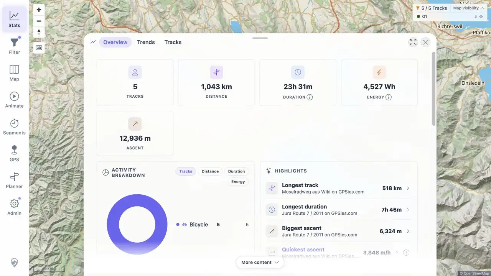
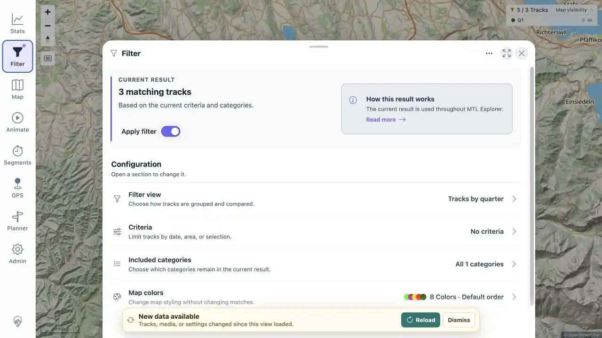
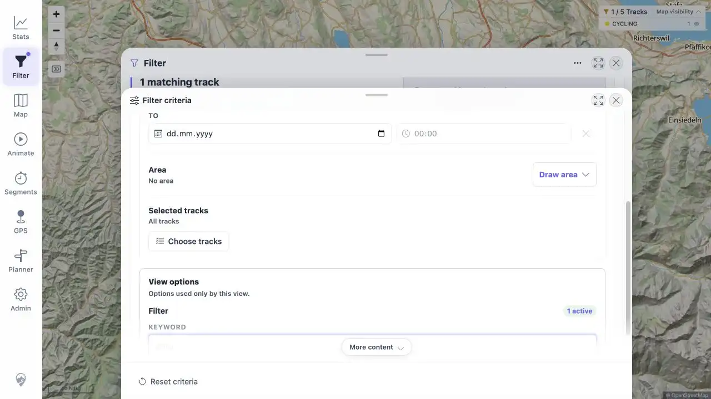
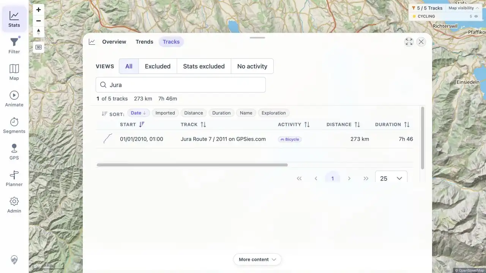
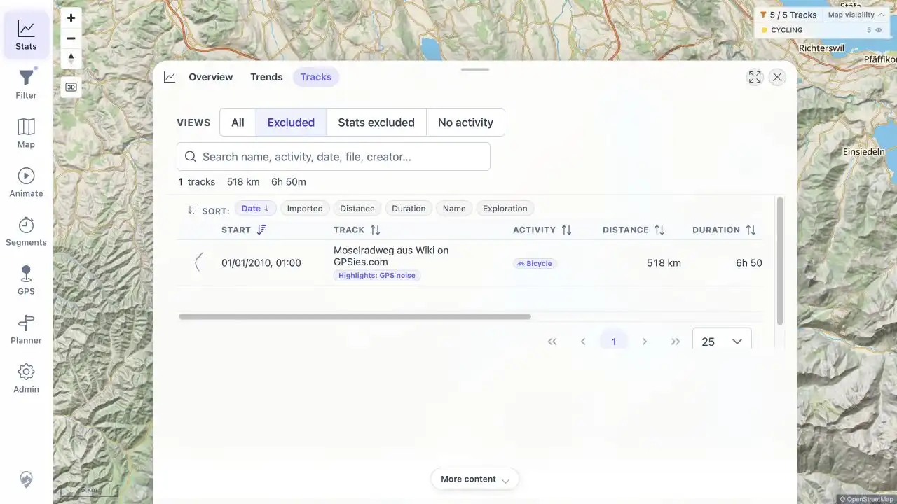
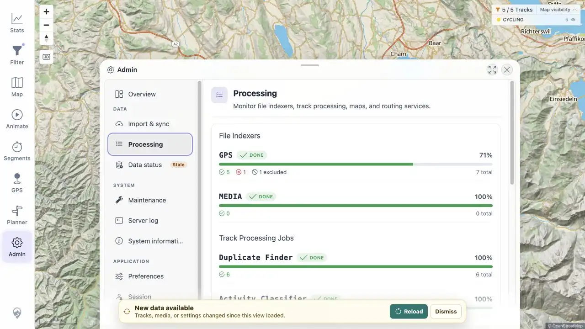
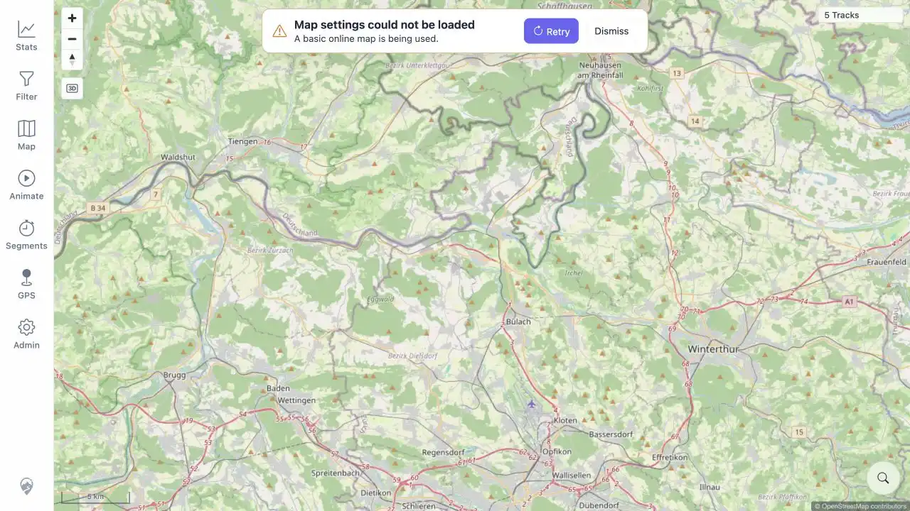

# Regression Fix Verification

All 11 findings from the 2026-08-13 beta regression are fixed in the workspace and verified on a combined candidate deployed to the original test host.

## Resolution Matrix

| Finding | Resolution | Evidence |
|---|---|---|
| IMP-05-P1 | Freshness Reload now refreshes the shared filter result before Filter and Statistics consume it. A browser primed at zero changed to five tracks after import without a page reload. | [Statistics after import](assets/FIX-fresh-import.webp) |
| DEL-03-P1 | Import/delete freshness invalidation uses the same shared refresh path. The existing browser changed from five to three matching tracks after two watched files were removed. | [Filter after delete](assets/FIX-fresh-delete.webp) |
| TRD-15-P2 | Statistics saves and restores the Tracks tab, quick view, and search query around Track Details navigation. | [Restored `Jura` result](assets/FIX-statistics-navigation.webp) |
| FLT-03-P2 | Criteria edits and resets apply through a debounced live update. The criteria sheet states that changes apply automatically and has no Apply action. | [Live keyword result](assets/FIX-live-filter.webp) |
| FLT-10-P2 | Liquibase 061 adds `ActivitiesByExactType`; the broad view is named `Activities by main group`. | [Exact activity view](assets/FIX-exact-activity.webp) |
| FLT-12-P2 | Selecting every currently available category normalizes to durable All categories, including future categories. | [All categories restored](assets/FIX-all-categories.webp) |
| FLT-16-P2 | Every applied global filter clears temporary map-only category hiding. The exercised map returned from 0/5 with one hidden group to 5/5 with no hidden group. | [Map visibility reset](assets/FIX-map-visibility-reset.webp) |
| TBS-11-P2 | Saving a highlight exclusion updates the Statistics track collection before opening Excluded. Moselradweg appeared immediately without reload. | [Immediate Excluded row](assets/FIX-highlight-exclusion.webp) |
| MCT-05-P1 | Crossing distance is calculated from chronological geometry, and reverse-indexed timed sections use a timestamp-ordered, rebased sub-track. The original public Lannion source returned 1,202.56 m, 7.87 km/h, and 33 ordered points. | [Exact live measurements](assets/FIX-live-measurements.txt) |
| ADM-03-P1 | A failed or empty GPX result now raises a no-rollback processing signal after its diagnostic track row is committed, so the file indexer records FAILED. | [Admin failed count](assets/FIX-admin-failed-import.webp), [exact status](assets/FIX-live-measurements.txt) |
| ERR-01-P2 | A map-config fetch failure now renders the basic online map with a persistent, opaque Retry/Dismiss notice. | [Forced 503 fallback](assets/FIX-map-config-fallback.webp) |

## Automated Verification

- Client Vitest: 106 files, 520 tests passed.
- Client type check: passed.
- Client ESLint: no errors; two unrelated existing unused-variable warnings remain.
- Focused server behavior suite: 20 tests passed.
- Exact-activity changelog/template suite: 4 tests passed.
- Combined production build: passed and produced the deployed Spring Boot image.
- `git diff --check`: passed.
- Full server suite reached 355 tests; two application-context tests require a local PostgreSQL instance and failed to connect. The focused changed behavior is green.
- Client format check still reports the existing `src/assets/bootstrap-icons-inline.css` formatting difference; touched files pass formatting.

## Live Environment

The combined candidate was built from this workspace and deployed as `mtl-explorer:regression-fix-20260814` on `91.99.12.14:18080`. Liquibase applied change 061 successfully. Five public GPX files from the original regression were used. No private local track was copied.

The temporary invalid import and forced-failure proxy were removed after verification. The five public tracks and regression-fix candidate remain available on the test host.

## Screenshot Overview

