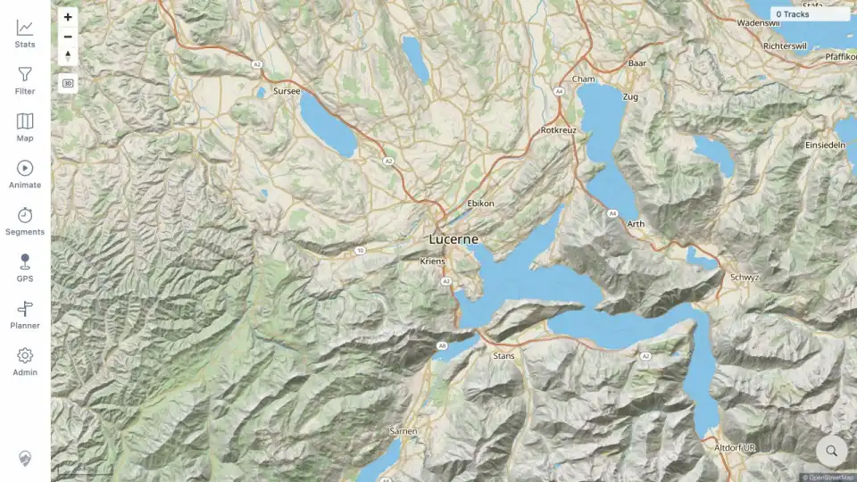

# Packet: ACC_04

## Scope

- Coverage source: [coverage-plan.md](../coverage-plan.md).
- Coverage ID or run packet: ACC_04.
- In scope: capture compact screenshots for representative working user-facing functions, including normal empty-state UI.
- Out of scope: screenshots for later imported-data surfaces and any later failures; those remain required in their own packets.

## Prerequisites

- Required previous coverage IDs or run packets: RUN_SETUP, ACC_01-ACC_03.
- Required app/data state: running empty quick-install instance.
- Required browser context: desktop in-app browser.

## Allowed Mutations

- Allowed: sign in with README credentials and save screenshots.
- Not allowed: import tracks or change server data.

## Actions And Results

| Coverage ID | Action | Expected result | Actual result | Status | Evidence |
|---|---|---|---|---|---|
| ACC_04 | Captured the working login screen, signed in with the README credentials, confirmed the empty map and primary navigation rendered, and saved both images as compact WebP files. | Working functions and failures receive compact visual evidence so the report is readable; screenshots remain at or below 85,000 bytes. | The login screenshot is 43,714 bytes. The signed-in empty-map screenshot is 64,276 bytes and shows the base map, `0 Tracks`, and Stats, Filter, Map, Animate, Segments, GPS, Planner, and Admin navigation. Later working/failing surfaces remain assigned to their exact coverage packets. | PASS | [assets/RUN_SETUP-login-screen.webp](../assets/RUN_SETUP-login-screen.webp); [assets/ACC_04-empty-map.webp](../assets/ACC_04-empty-map.webp) |

## Issues

| ID | Severity | Summary | Reproduction | Expected | Actual | Evidence | Release impact |
|---|---|---|---|---|---|---|---|

## Evidence Files

| File | Purpose |
|---|---|
| [assets/RUN_SETUP-login-screen.webp](../assets/RUN_SETUP-login-screen.webp) | Working signed-out login view. |
| [assets/ACC_04-empty-map.webp](../assets/ACC_04-empty-map.webp) | Working signed-in base map and empty-data state. |

## Screenshot Evidence

## Timings

| Step | Timing |
|---|---:|
| Sign-in and settled map | 3 s after navigation |
| Screenshot conversion/size audit | < 1 s each |

## Handoff Notes

- Completed: ACC_04 is terminal with compact working login and map evidence.
- Remaining unfinished coverage: ACC_05 onward; later packets must add representative working and failing screenshots where useful.
- Blocked or not applicable: none.
- State left for the next packet: desktop browser is signed in on the empty map.
