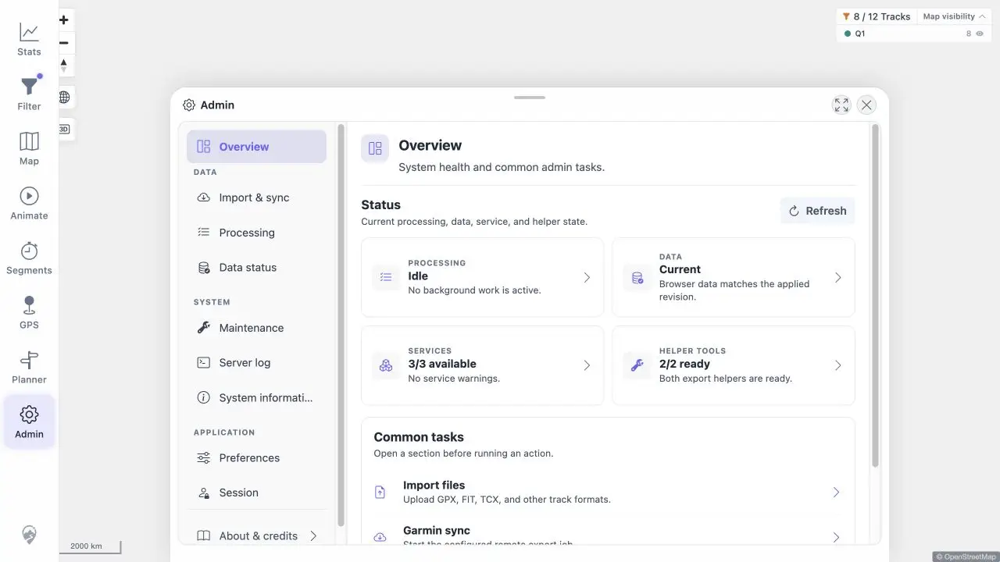
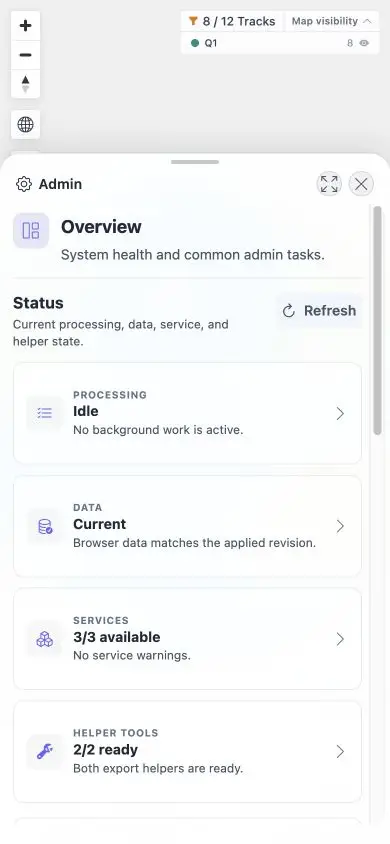

# Packet: ADM_01

## Scope

- Coverage source: [coverage-plan.md](../coverage-plan.md).
- Coverage ID or run packet: ADM_01.
- In scope: Admin overview and grouped navigation on desktop and mobile.

## Prerequisites

- Required previous coverage IDs or run packets: GLB_04.
- Required app/data state: signed-in application.
- Required browser context: desktop and 390 x 844 mobile viewport.

## Allowed Mutations

- Allowed: open and navigate Admin sections.
- Not allowed: run Admin mutations for this packet.

## Actions And Results

| Coverage ID | Action | Expected result | Actual result | Status | Evidence |
|---|---|---|---|---|---|
| ADM_01 | Opened Admin, inspected all three navigation groups on desktop and mobile, opened Data status on mobile, and returned to overview. | Overview and grouped section navigation are reachable and usable on both layouts. | The overview rendered at `/mtl/admin`; all nine grouped sections were present, mobile navigation changed to `/mtl/admin/data-status`, and Back returned to overview. | PASS | [desktop](../assets/ADM_01-desktop.webp), [mobile](../assets/ADM_01-mobile.webp), [navigation](../assets/ADM_01-navigation.txt) |

## Issues

No issue found.

## Evidence Files

| File | Purpose |
|---|---|
| [assets/ADM_01-desktop.webp](../assets/ADM_01-desktop.webp) | Desktop Admin overview. |
| [assets/ADM_01-mobile.webp](../assets/ADM_01-mobile.webp) | Mobile Admin overview. |
| [assets/ADM_01-navigation.txt](../assets/ADM_01-navigation.txt) | Route and section checks. |

## Screenshot Evidence

## Timings

| Step | Timing |
|---|---:|
| Open Admin | < 0.7 s |
| Switch section | < 0.4 s |

## Handoff Notes

- Completed: ADM_01 is terminal `PASS`.
- Remaining unfinished coverage: ADM_02 onward.
- Blocked or not applicable: none in this packet.
- State left for the next packet: Admin overview open at mobile viewport.

