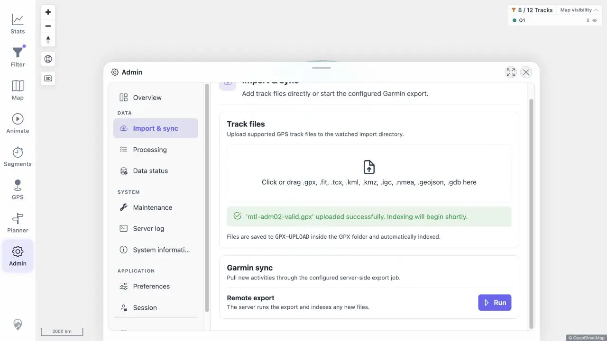
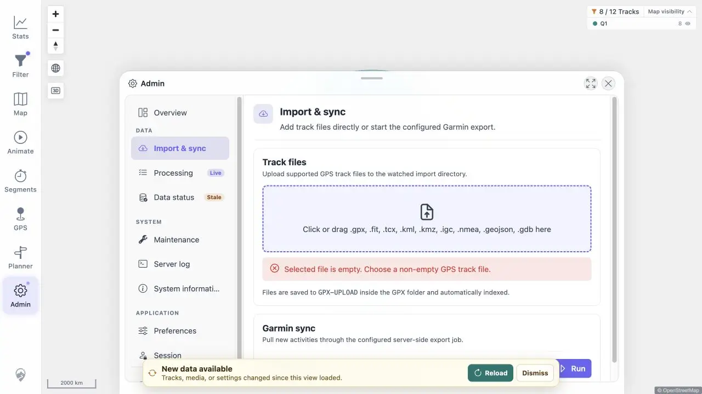

# Packet: ADM_02

## Scope

- Coverage source: [coverage-plan.md](../coverage-plan.md).
- Coverage ID or run packet: ADM_02.
- In scope: Track file upload availability, formats, progress/success, and validation errors.

## Prerequisites

- Required previous coverage IDs or run packets: ADM_01.
- Required app/data state: Admin Import & sync; disposable watched folder.
- Required browser context: desktop Admin.

## Allowed Mutations

- Allowed: upload one fully synthetic GPX and select invalid disposable files.
- Not allowed: upload private track data.

## Actions And Results

| Coverage ID | Action | Expected result | Actual result | Status | Evidence |
|---|---|---|---|---|---|
| ADM_02 | Used the click/drag target to select and upload a valid synthetic GPX, then selected unsupported and empty files. | Upload availability, accepted formats, progress/success, unsupported-format errors, and empty-file errors are clear. | The target listed all nine formats; the 513 B GPX showed an Upload action and a success/indexing message. Unsupported `.txt` and zero-byte `.gpx` produced specific errors, and Upload was disabled for the empty file. | PASS | [success](../assets/ADM_02-success.webp), [errors](../assets/ADM_02-errors.webp), [results](../assets/ADM_02-upload.txt) |

## Issues

No issue found.

## Evidence Files

| File | Purpose |
|---|---|
| [assets/ADM_02-success.webp](../assets/ADM_02-success.webp) | Successful synthetic GPX upload. |
| [assets/ADM_02-errors.webp](../assets/ADM_02-errors.webp) | Empty-file validation state. |
| [assets/ADM_02-upload.txt](../assets/ADM_02-upload.txt) | Format, success, and error strings. |

## Screenshot Evidence

## Timings

| Step | Timing |
|---|---:|
| Upload response | < 0.2 s |
| Validation response | < 0.4 s |

## Handoff Notes

- Completed: ADM_02 is terminal `PASS`.
- Remaining unfinished coverage: ADM_03 onward.
- Blocked or not applicable: none in this packet.
- State left for the next packet: synthetic upload indexed or indexing; data freshness banner visible.

