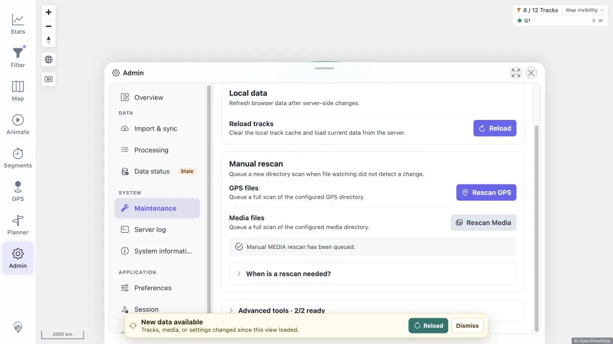

# Packet: ADM_04

## Scope

- Coverage source: [coverage-plan.md](../coverage-plan.md).
- Coverage ID or run packet: ADM_04.
- In scope: GPS/media manual-rescan feedback and post-action map usability.

## Prerequisites

- Required previous coverage IDs or run packets: ADM_03.
- Required app/data state: ready GPS and media indexers.
- Required browser context: Admin Maintenance and signed-in map.

## Allowed Mutations

- Allowed: queue rescans and restart the disposable app to seek the not-ready window.
- Not allowed: change source contents for this packet.

## Actions And Results

| Coverage ID | Action | Expected result | Actual result | Status | Evidence |
|---|---|---|---|---|---|
| ADM_04 | Queued GPS and media rescans, issued concurrent GPS requests to reach the overlap branch, attempted a controlled restart for not-ready, then closed Admin and zoomed the map. | Queued/already-running/not-ready states are clear without breaking map interaction. | UI showed explicit queued messages for both indexes. Concurrent requests returned explicit `ALREADY_RUNNING`. The not-ready branch was not applicable because authenticated access became available only after both indexers were ready. After a controlled restart the Admin route and map rendered, and map zoom worked. | PASS | [UI](../assets/ADM_04-rescan.webp), [responses](../assets/ADM_04-rescan.txt) |

## Issues

No issue found.

## Evidence Files

| File | Purpose |
|---|---|
| [assets/ADM_04-rescan.webp](../assets/ADM_04-rescan.webp) | Media rescan queued in Admin Maintenance. |
| [assets/ADM_04-rescan.txt](../assets/ADM_04-rescan.txt) | Queued, overlapping, conditional not-ready, and recovery checks. |

## Screenshot Evidence

## Timings

| Step | Timing |
|---|---:|
| Rescan API response | 2 ms |
| GPS scan | 18–22 ms |

## Handoff Notes

- Completed: ADM_04 is terminal `PASS`.
- Remaining unfinished coverage: ADM_05 onward.
- Blocked or not applicable: not-ready was conditional and unavailable in the healthy signed-in lifecycle.
- State left for the next packet: Admin Maintenance open after healthy app restart.

