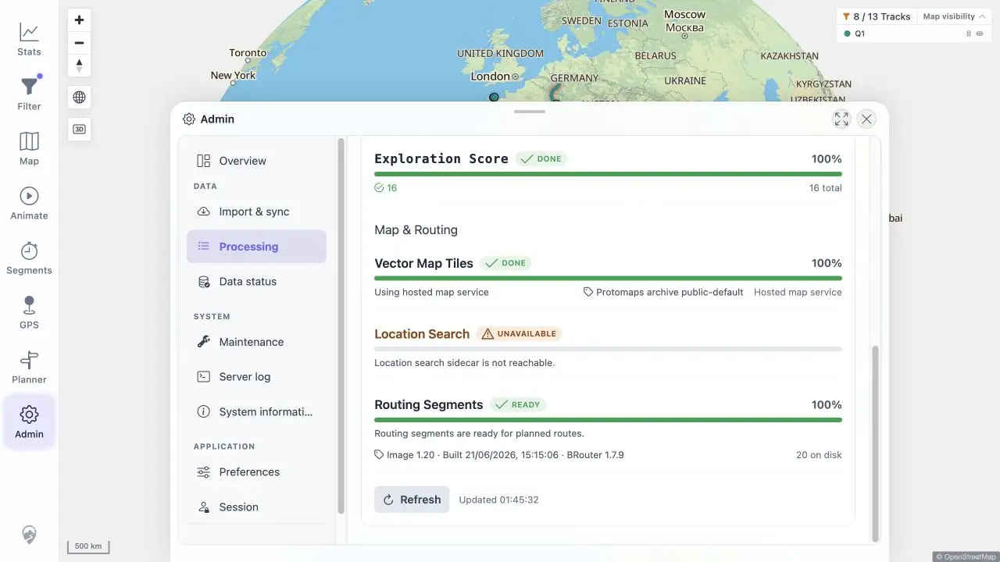
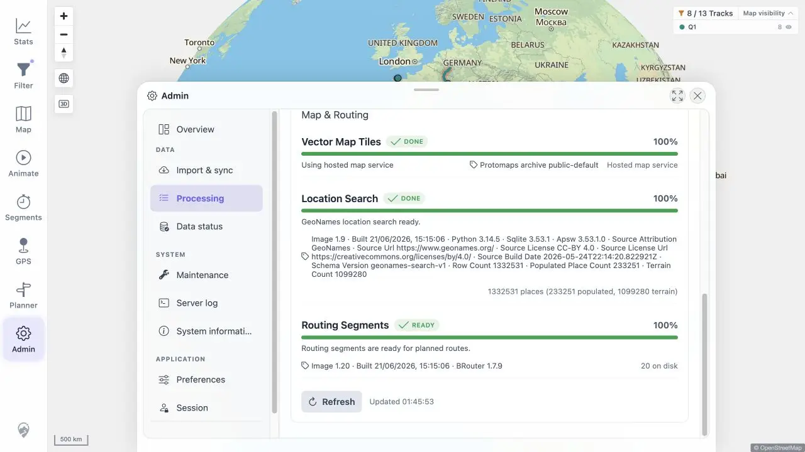

# Packet: ADM_06

## Scope

- Coverage source: [coverage-plan.md](../coverage-plan.md).
- Coverage ID or run packet: ADM_06.
- In scope: vector map, location-search, and routing operational states and details.

## Prerequisites

- Required previous coverage IDs or run packets: ADM_05; PLN_09 for the routing download sequence.
- Required app/data state: all quick-install services healthy; location-search may be stopped and restored.
- Required browser context: Admin Processing.

## Allowed Mutations

- Allowed: stop and restore the disposable location-search sidecar.
- Not allowed: leave any sidecar unhealthy.

## Actions And Results

| Coverage ID | Action | Expected result | Actual result | Status | Evidence |
|---|---|---|---|---|---|
| ADM_06 | Inspected all operational cards, stopped and restored location search, and reused the completed missing-routing-segment sequence. | Ready/downloading/unavailable/disabled states have useful detail. | Hosted vector maps, detailed GeoNames readiness, detailed BRouter readiness, routing download/unavailable feedback, and explicit location-search unavailability all rendered. Location search returned to DONE after restoration. Disabled was conditional and did not apply because every quick-install service was configured. | PASS | [unavailable](../assets/ADM_06-unavailable.webp), [ready](../assets/ADM_06-ready.webp), [states](../assets/ADM_06-services.txt), [routing packet](PLN_09.md) |

## Issues

No issue found.

## Evidence Files

| File | Purpose |
|---|---|
| [assets/ADM_06-unavailable.webp](../assets/ADM_06-unavailable.webp) | Location-search unreachable state. |
| [assets/ADM_06-ready.webp](../assets/ADM_06-ready.webp) | All services restored with technical detail. |
| [assets/ADM_06-services.txt](../assets/ADM_06-services.txt) | State matrix and conditional branch. |

## Screenshot Evidence

## Timings

| Step | Timing |
|---|---:|
| Unavailable-state refresh | < 0.4 s |
| Sidecar health recovery | < 1 s |

## Handoff Notes

- Completed: ADM_06 is terminal `PASS`.
- Remaining unfinished coverage: ADM_07 onward.
- Blocked or not applicable: disabled branch not applicable in the fully configured quick install.
- State left for the next packet: all operational sidecars healthy; Processing open.

