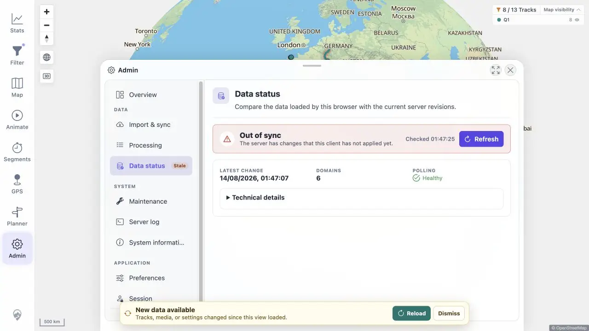
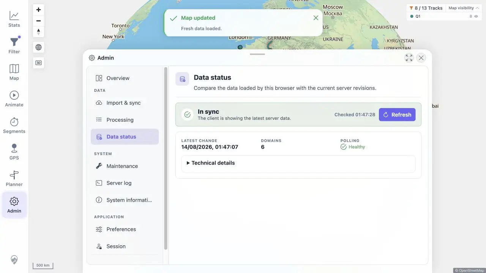

# Packet: ADM_07

## Scope

- Coverage source: [coverage-plan.md](../coverage-plan.md).
- Coverage ID or run packet: ADM_07.
- In scope: latest-change/check timestamps and freshness reload.

## Prerequisites

- Required previous coverage IDs or run packets: ADM_06.
- Required app/data state: disposable failed GPX from ADM_03 may be removed.
- Required browser context: Admin Data status.

## Allowed Mutations

- Allowed: remove the exact disposable invalid GPX and reload browser data.
- Not allowed: remove valid regression sources.

## Actions And Results

| Coverage ID | Action | Expected result | Actual result | Status | Evidence |
|---|---|---|---|---|---|
| ADM_07 | Recorded the in-sync timestamps, removed the exact failed synthetic source, refreshed Data status, and used freshness Reload. | Last-update timestamp is shown and Reload applies server changes. | Latest Change advanced from 01:43:28 to 01:47:07 and status changed to Out of sync. Reload showed `Fresh data loaded`, returned to In sync, and kept the new timestamp. | PASS | [stale](../assets/ADM_07-stale.webp), [fresh](../assets/ADM_07-fresh.webp), [sequence](../assets/ADM_07-freshness.txt) |

## Issues

No issue found.

## Evidence Files

| File | Purpose |
|---|---|
| [assets/ADM_07-stale.webp](../assets/ADM_07-stale.webp) | Out-of-sync timestamp and banner. |
| [assets/ADM_07-fresh.webp](../assets/ADM_07-fresh.webp) | In-sync state after Reload. |
| [assets/ADM_07-freshness.txt](../assets/ADM_07-freshness.txt) | Exact timestamp sequence. |

## Screenshot Evidence

## Timings

| Step | Timing |
|---|---:|
| Watcher delete processing | 8.1 s |
| Freshness Reload | < 1.2 s |

## Handoff Notes

- Completed: ADM_07 is terminal `PASS`.
- Remaining unfinished coverage: ADM_08 onward.
- Blocked or not applicable: none in this packet.
- State left for the next packet: Data status in sync; valid synthetic ADM_02 upload remains.

