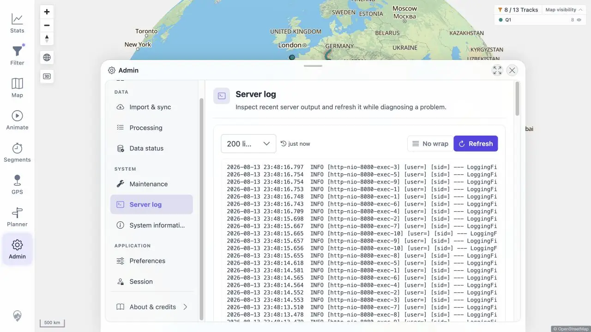

# Packet: ADM_08

## Scope

- Coverage source: [coverage-plan.md](../coverage-plan.md).
- Coverage ID or run packet: ADM_08.
- In scope: recent server log loading and manual refresh.

## Prerequisites

- Required previous coverage IDs or run packets: ADM_07.
- Required app/data state: healthy server producing logs.
- Required browser context: Admin Server log.

## Allowed Mutations

- Allowed: refresh the log view.
- Not allowed: edit server logs.

## Actions And Results

| Coverage ID | Action | Expected result | Actual result | Status | Evidence |
|---|---|---|---|---|---|
| ADM_08 | Opened Server log, counted displayed entries, recorded the newest timestamp, waited, and selected Refresh. | Log lines load and refresh. | The view loaded 200 structured lines; Refresh advanced the newest timestamp from 23:48:00.591 to 23:48:16.797 and retained 200 lines. | PASS | [screenshot](../assets/ADM_08-log.webp), [values](../assets/ADM_08-log.txt) |

## Issues

No issue found.

## Evidence Files

| File | Purpose |
|---|---|
| [assets/ADM_08-log.webp](../assets/ADM_08-log.webp) | Refreshed Server log UI. |
| [assets/ADM_08-log.txt](../assets/ADM_08-log.txt) | Count and timestamp comparison. |

## Screenshot Evidence

## Timings

| Step | Timing |
|---|---:|
| Refresh | < 0.3 s |

## Handoff Notes

- Completed: ADM_08 is terminal `PASS`.
- Remaining unfinished coverage: ADM_09 onward.
- Blocked or not applicable: none in this packet.
- State left for the next packet: Server log open.

