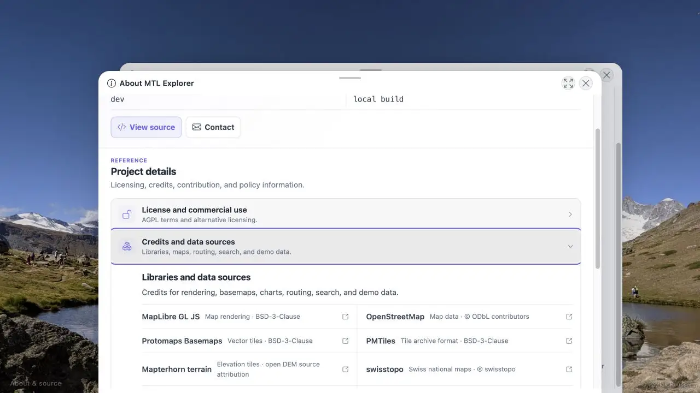

# Packet: ADM_09

## Scope

- Coverage source: [coverage-plan.md](../coverage-plan.md).
- Coverage ID or run packet: ADM_09.
- In scope: public/signed-in About credits and return routing.

## Prerequisites

- Required previous coverage IDs or run packets: ADM_08.
- Required app/data state: valid local credentials.
- Required browser context: Admin, login, and map.

## Allowed Mutations

- Allowed: credentials-only sign-out and sign-in.
- Not allowed: open external credit destinations.

## Actions And Results

| Coverage ID | Action | Expected result | Actual result | Status | Evidence |
|---|---|---|---|---|---|
| ADM_09 | Expanded Credits and data sources while signed in, used Back to Server log, signed out, opened Full details publicly, expanded the same credits, closed to login, and signed in again. | Expected map/library/data sources appear before and after login; Back returns to prior Admin or fallback. | All 12 expected sources appeared in both contexts. Back restored `/mtl/admin/logs`; public Close restored `/mtl/login`; valid sign-in restored the map. | PASS | [public credits](../assets/ADM_09-public.webp), [sequence](../assets/ADM_09-about.txt) |

## Issues

No issue found.

## Evidence Files

| File | Purpose |
|---|---|
| [assets/ADM_09-public.webp](../assets/ADM_09-public.webp) | Public full About credits. |
| [assets/ADM_09-about.txt](../assets/ADM_09-about.txt) | Source list and route sequence. |

## Screenshot Evidence

## Timings

| Step | Timing |
|---|---:|
| Open/expand About | < 0.7 s |
| Sign-in restore | < 1.5 s |

## Handoff Notes

- Completed: ADM_09 is terminal `PASS`.
- Remaining unfinished coverage: ADM_10 onward.
- Blocked or not applicable: none in this packet.
- State left for the next packet: signed-in 13-track map.

