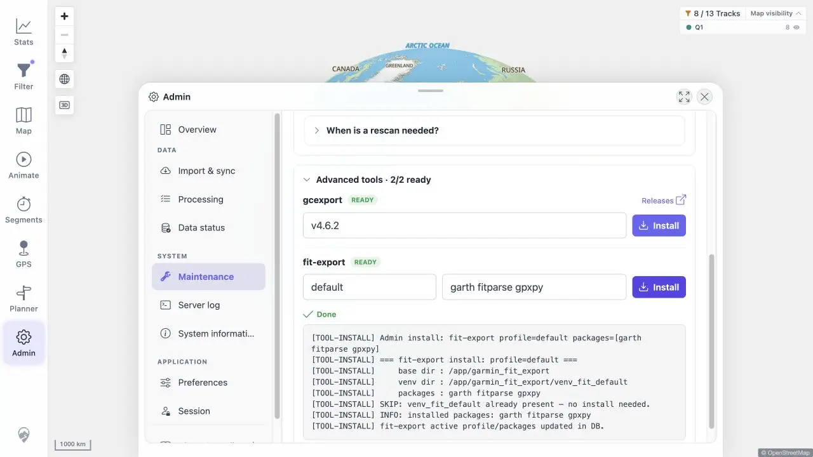

# Packet: ADM_10

## Scope

- Coverage source: [coverage-plan.md](../coverage-plan.md).
- Coverage ID or run packet: ADM_10.
- In scope: installed Garmin export helpers and install/update feedback.

## Prerequisites

- Required previous coverage IDs or run packets: ADM_09.
- Required app/data state: quick-install helper environments.
- Required browser context: Admin Maintenance advanced tools.

## Allowed Mutations

- Allowed: run the supported helper Install actions.
- Not allowed: alter helper package selections.

## Actions And Results

| Coverage ID | Action | Expected result | Actual result | Status | Evidence |
|---|---|---|---|---|---|
| ADM_10 | Expanded Advanced tools, recorded both statuses, and ran Install for `gcexport` and `fit-export`. | Installed exporters are identified; install/update reports success or error. | Both helpers were READY. Each Install ended with `Done`, reported that its existing environment was current, and updated the active version/profile in the database. Status remained 2/2 ready. | PASS | [screenshot](../assets/ADM_10-tools.webp), [results](../assets/ADM_10-tools.txt) |

## Issues

No issue found.

## Evidence Files

| File | Purpose |
|---|---|
| [assets/ADM_10-tools.webp](../assets/ADM_10-tools.webp) | FIT helper successful action log. |
| [assets/ADM_10-tools.txt](../assets/ADM_10-tools.txt) | Both helper statuses and action results. |

## Screenshot Evidence

## Timings

| Step | Timing |
|---|---:|
| gcexport action | < 0.4 s |
| fit-export action | < 0.5 s |

## Handoff Notes

- Completed: ADM_10 is terminal `PASS`.
- Remaining unfinished coverage: ADM_11 onward.
- Blocked or not applicable: none in this packet.
- State left for the next packet: Maintenance open with successful fit-export action log.

