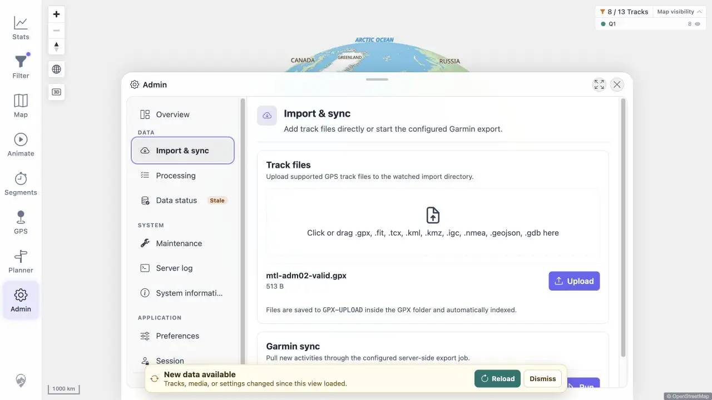

# Packet: ADM_11

## Scope

- Coverage source: [coverage-plan.md](../coverage-plan.md).
- Coverage ID or run packet: ADM_11.
- In scope: state retention when Admin closes and reopens mid-action.

## Prerequisites

- Required previous coverage IDs or run packets: ADM_10.
- Required app/data state: synthetic local GPX available for selection.
- Required browser context: Admin Import & sync.

## Allowed Mutations

- Allowed: select but do not upload the synthetic file.
- Not allowed: perform a duplicate upload.

## Actions And Results

| Coverage ID | Action | Expected result | Actual result | Status | Evidence |
|---|---|---|---|---|---|
| ADM_11 | Selected the synthetic GPX, closed Admin before Upload, reopened Admin, and returned to Import & sync. | Closing and reopening the dialog does not lose state mid-action. | The filename, 513 B size, and pending Upload action remained after the close/reopen cycle. | PASS | [retained state](../assets/ADM_11-retained.webp), [sequence](../assets/ADM_11-state.txt) |

## Issues

No issue found.

## Evidence Files

| File | Purpose |
|---|---|
| [assets/ADM_11-retained.webp](../assets/ADM_11-retained.webp) | Pending selected file after reopening Admin. |
| [assets/ADM_11-state.txt](../assets/ADM_11-state.txt) | Close/reopen route and state sequence. |

## Screenshot Evidence

## Timings

| Step | Timing |
|---|---:|
| Close/reopen cycle | < 0.8 s |

## Handoff Notes

- Completed: ADM_11 is terminal `PASS`.
- Remaining unfinished coverage: ADM_12 onward.
- Blocked or not applicable: none in this packet.
- State left for the next packet: Import & sync open with pending synthetic selection.

