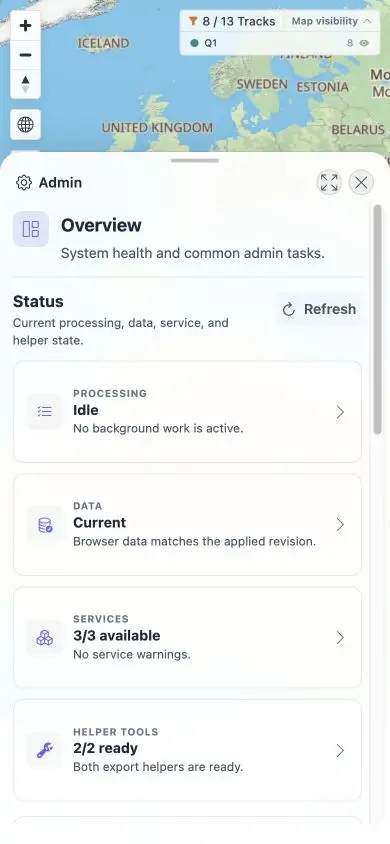

# Packet: ADM_12

## Scope

- Coverage source: [coverage-plan.md](../coverage-plan.md).
- Coverage ID or run packet: ADM_12.
- In scope: direct Admin URLs, browser history, mobile Back, and Close route sync.

## Prerequisites

- Required previous coverage IDs or run packets: ADM_11.
- Required app/data state: signed-in application.
- Required browser context: desktop and 390 x 844 mobile viewport.

## Allowed Mutations

- Allowed: navigate Admin routes.
- Not allowed: run Admin mutations.

## Actions And Results

| Coverage ID | Action | Expected result | Actual result | Status | Evidence |
|---|---|---|---|---|---|
| ADM_12 | Opened Server log by direct URL, switched to Processing, used browser Back/Forward, used mobile Back to overview, and closed Admin. | Section, map, and browser routes remain synchronized. | Every route restored the matching visible section; mobile Back returned to `/mtl/admin`, and Close returned to `/mtl/` with the dialog removed. | PASS | [mobile overview](../assets/ADM_12-mobile.webp), [route sequence](../assets/ADM_12-routing.txt) |

## Issues

No issue found.

## Evidence Files

| File | Purpose |
|---|---|
| [assets/ADM_12-mobile.webp](../assets/ADM_12-mobile.webp) | Mobile Admin overview after Back. |
| [assets/ADM_12-routing.txt](../assets/ADM_12-routing.txt) | Exact route/section sequence. |

## Screenshot Evidence

## Timings

| Step | Timing |
|---|---:|
| Direct route load | < 0.8 s |
| Back/Forward transitions | < 0.3 s each |

## Handoff Notes

- Completed: ADM_12 is terminal `PASS`.
- Remaining unfinished coverage: SYN_01 onward.
- Blocked or not applicable: none in this packet.
- State left for the next packet: signed-in desktop map at `/mtl/` with 13 tracks, Q1 selected.

