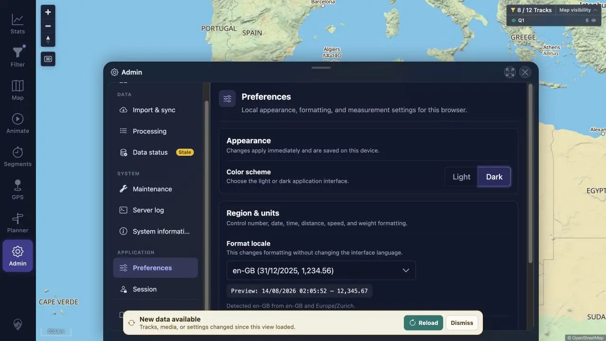
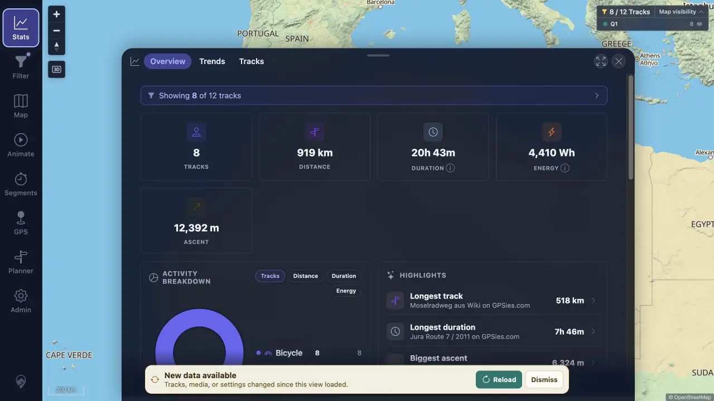
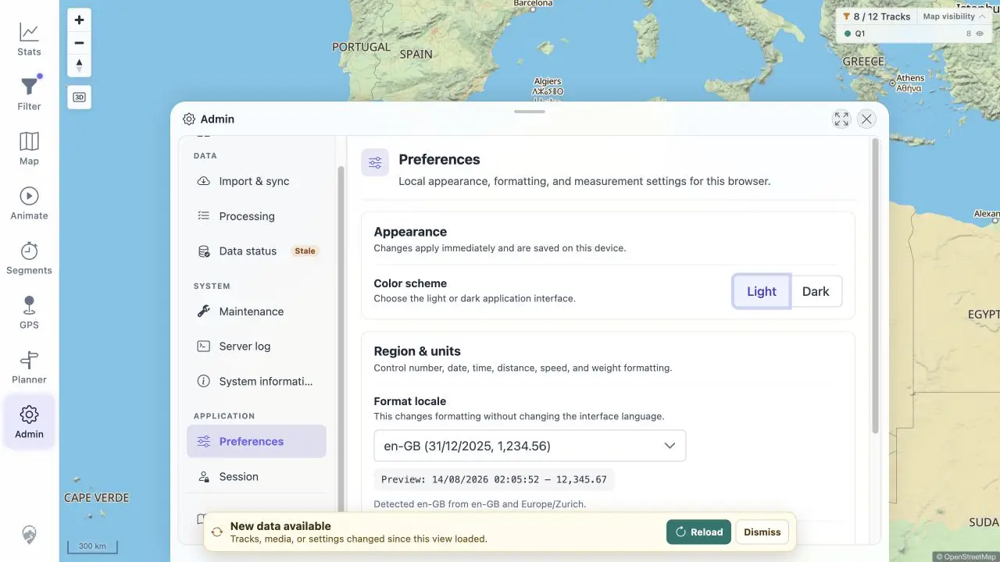

# Packet: APP_01

## Scope

- Coverage source: [coverage-plan.md](../coverage-plan.md).
- Coverage ID or run packet: APP_01.
- In scope: immediate light/dark re-theme across representative app surfaces.

## Prerequisites

- Required previous coverage IDs or run packets: SYN_07.
- Required app/data state: signed-in map and populated Statistics.
- Required browser context: Admin, Statistics, and Filter.

## Allowed Mutations

- Allowed: change local color scheme.
- Not allowed: hard reload between immediate-switch checks.

## Actions And Results

| Coverage ID | Action | Expected result | Actual result | Status | Evidence |
|---|---|---|---|---|---|
| APP_01 | Switched Light→Dark, opened Statistics and Filter, then switched Dark→Light while recording visible styles. | Whole UI re-themes immediately. | Document theme and body colors changed immediately; Admin, Filter, navigation, populated charts, text, panels, and controls all followed. Light restored the initial values without reload. | PASS | [dark Admin](../assets/APP_01-dark-admin.webp), [dark Statistics](../assets/APP_01-dark-stats.webp), [light Admin](../assets/APP_01-light-admin.webp), [styles](../assets/APP_01-theme.txt) |

## Issues

No issue found.

## Evidence Files

| File | Purpose |
|---|---|
| [assets/APP_01-dark-admin.webp](../assets/APP_01-dark-admin.webp) | Dark Admin/preferences surface. |
| [assets/APP_01-dark-stats.webp](../assets/APP_01-dark-stats.webp) | Dark populated Statistics sheet. |
| [assets/APP_01-light-admin.webp](../assets/APP_01-light-admin.webp) | Immediate return to light. |
| [assets/APP_01-theme.txt](../assets/APP_01-theme.txt) | Theme attributes and computed colors. |

## Screenshot Evidence

## Timings

| Step | Timing |
|---|---:|
| Theme application | < 0.25 s each |

## Handoff Notes

- Completed: APP_01 is terminal `PASS`.
- Remaining unfinished coverage: APP_02 onward.
- Blocked or not applicable: none in this packet.
- State left for the next packet: light Admin Preferences open; freshness banner visible from SYN_07 cleanup.

