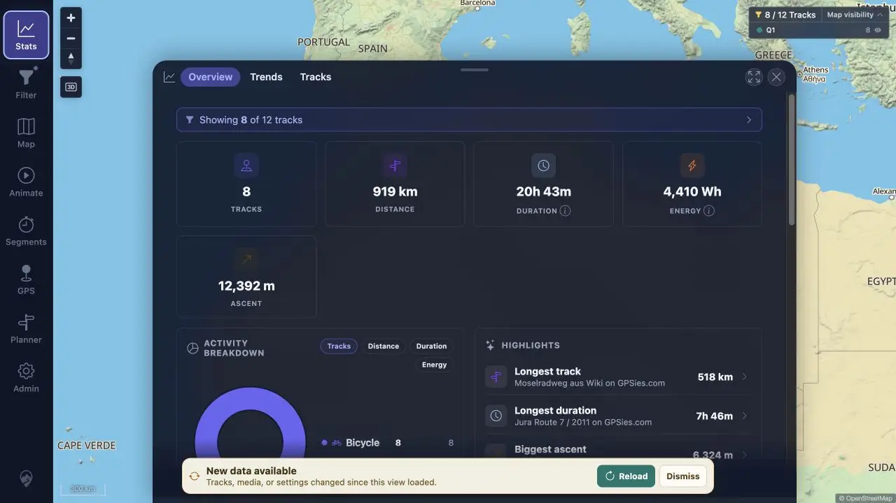
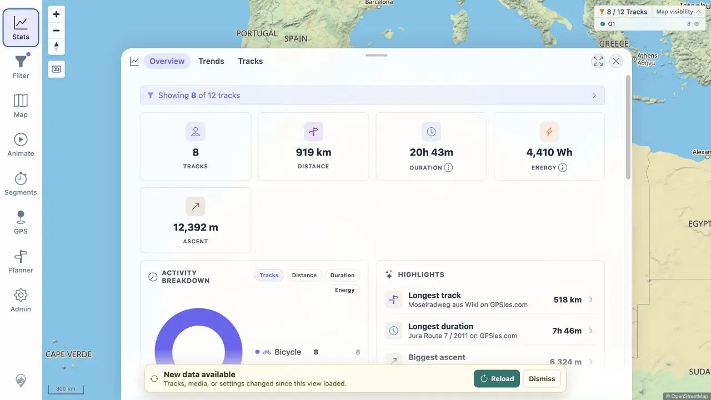

# Packet: APP_03

## Scope

- Coverage source: [coverage-plan.md](../coverage-plan.md).
- Coverage ID or run packet: APP_03.
- In scope: chart palette response to light/dark theme changes without browser reload.

## Prerequisites

- Required previous coverage IDs or run packets: APP_02.
- Required app/data state: populated Statistics with eight charts.
- Required browser context: Statistics and Admin Preferences.

## Allowed Mutations

- Allowed: switch theme and navigate back to Statistics.
- Not allowed: reload the browser.

## Actions And Results

| Coverage ID | Action | Expected result | Actual result | Status | Evidence |
|---|---|---|---|---|---|
| APP_03 | Recorded light chart palette, changed to dark, returned to Statistics, then changed back to light; no browser reload occurred. | Charts recolor on theme switch without reload. | All eight charts rendered after each switch. Dark chart grid lines changed from black 6% to white 6%; returning to light restored black 6%, with visible data and labels throughout. | PASS | [dark charts](../assets/APP_03-dark-charts.webp), [light charts](../assets/APP_03-light-charts.webp), [palette](../assets/APP_03-charts.txt) |

## Issues

No issue found.

## Evidence Files

| File | Purpose |
|---|---|
| [assets/APP_03-dark-charts.webp](../assets/APP_03-dark-charts.webp) | Populated dark Statistics charts. |
| [assets/APP_03-light-charts.webp](../assets/APP_03-light-charts.webp) | Populated light Statistics charts. |
| [assets/APP_03-charts.txt](../assets/APP_03-charts.txt) | Root counts and grid palettes. |

## Screenshot Evidence

## Timings

| Step | Timing |
|---|---:|
| Chart render after switch | < 0.35 s |

## Handoff Notes

- Completed: APP_03 is terminal `PASS`.
- Remaining unfinished coverage: APP_04 onward.
- Blocked or not applicable: none in this packet.
- State left for the next packet: light Statistics Overview open.

