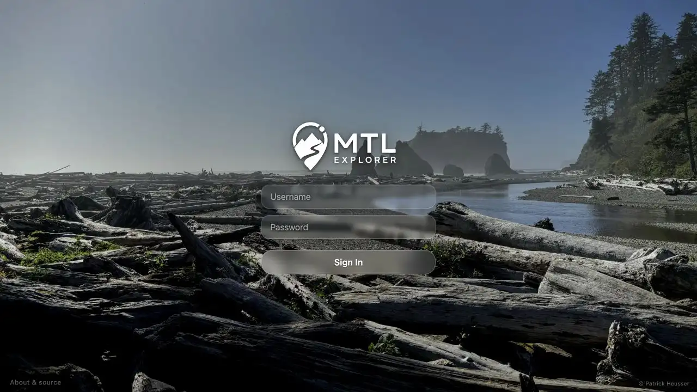

# Packet: APP_04

## Scope

- Coverage source: [coverage-plan.md](../coverage-plan.md).
- Coverage ID or run packet: APP_04.
- In scope: UI theme persistence across reload and login.

## Prerequisites

- Required previous coverage IDs or run packets: APP_03.
- Required app/data state: valid credentials and saved light baseline.
- Required browser context: desktop map, login, and Preferences.

## Allowed Mutations

- Allowed: select dark, reload, sign out, and sign in.
- Not allowed: wipe browser data.

## Actions And Results

| Coverage ID | Action | Expected result | Actual result | Status | Evidence |
|---|---|---|---|---|---|
| APP_04 | Selected Dark, reloaded, signed out, and signed in while checking the document theme and body background. | Selected theme persists across reload and login. | Dark and rgb(10,10,15) persisted after reload, on the login page, and on the restored signed-in map without re-selection. | PASS | [dark login](../assets/APP_04-dark-login.webp), [dark map](../assets/APP_04-dark-map.webp), [values](../assets/APP_04-persistence.txt) |

## Issues

No issue found.

## Evidence Files

| File | Purpose |
|---|---|
| [assets/APP_04-dark-login.webp](../assets/APP_04-dark-login.webp) | Dark login after sign-out. |
| [assets/APP_04-dark-map.webp](../assets/APP_04-dark-map.webp) | Dark map after sign-in. |
| [assets/APP_04-persistence.txt](../assets/APP_04-persistence.txt) | Theme/background sequence. |

## Screenshot Evidence

## Timings

| Step | Timing |
|---|---:|
| Reload to settled map | < 1.6 s |
| Login to settled map | < 1.5 s |

## Handoff Notes

- Completed: APP_04 is terminal `PASS`.
- Remaining unfinished coverage: APP_05 onward.
- Blocked or not applicable: none in this packet.
- State left for the next packet: dark signed-in map at `/mtl/`.

