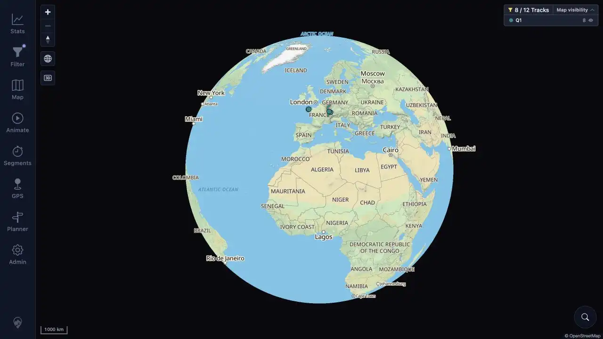

# Packet: APP_05

## Scope

- Coverage source: [coverage-plan.md](../coverage-plan.md).
- Coverage ID or run packet: APP_05.
- In scope: visible paint during a hard refresh with persisted dark theme.

## Prerequisites

- Required previous coverage IDs or run packets: APP_04.
- Required app/data state: signed-in warmed map with dark persisted.
- Required browser context: desktop map.

## Allowed Mutations

- Allowed: browser hard refresh and rapid frame capture.
- Not allowed: change theme during sampling.

## Actions And Results

| Coverage ID | Action | Expected result | Actual result | Status | Evidence |
|---|---|---|---|---|---|
| APP_05 | Triggered Meta+R and captured an in-flight frame at 5 ms plus a settled frame at 161 ms, then checked the final theme. | Dark hard refresh does not flash light first. | Both captured frames showed the dark shell; no light frame appeared. Final data-theme was dark with rgb(10,10,15) background. | PASS | [in flight](../assets/APP_05-inflight.webp), [settled](../assets/APP_05-settled.webp), [timing](../assets/APP_05-refresh.txt) |

## Issues

No issue found.

## Evidence Files

| File | Purpose |
|---|---|
| [assets/APP_05-inflight.webp](../assets/APP_05-inflight.webp) | Earliest in-flight hard-refresh frame. |
| [assets/APP_05-settled.webp](../assets/APP_05-settled.webp) | Settled post-refresh frame. |
| [assets/APP_05-refresh.txt](../assets/APP_05-refresh.txt) | Frame and request timing. |

## Screenshot Evidence

## Timings

| Step | Timing |
|---|---:|
| In-flight frame | 5 ms after refresh start |
| Settled frame | 161 ms after refresh start |

## Handoff Notes

- Completed: APP_05 is terminal `PASS`.
- Remaining unfinished coverage: APP_06 onward.
- Blocked or not applicable: none in this packet.
- State left for the next packet: dark signed-in map after hard refresh.

