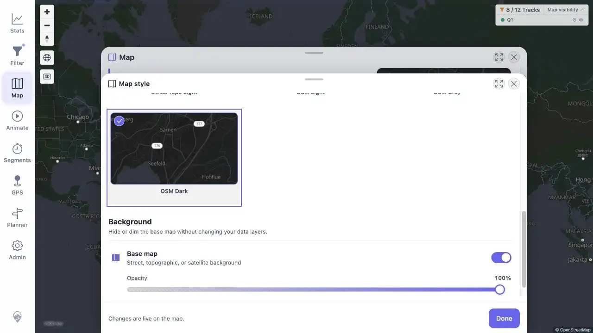

# Packet: APP_06

## Scope

- Coverage source: [coverage-plan.md](../coverage-plan.md).
- Coverage ID or run packet: APP_06.
- In scope: every available map theme under both UI themes.

## Prerequisites

- Required previous coverage IDs or run packets: APP_05.
- Required app/data state: Automatic map source with seven themes.
- Required browser context: Map style sheet and light/dark UI.

## Allowed Mutations

- Allowed: change UI theme and map theme.
- Not allowed: change map source.

## Actions And Results

| Coverage ID | Action | Expected result | Actual result | Status | Evidence |
|---|---|---|---|---|---|
| APP_06 | Selected all seven map themes once with dark UI and once with light UI, checking CURRENT MAP after every selection. | Map theme is independent of UI theme. | All 14 combinations succeeded, including light map styles under dark UI and OSM Dark under light UI. | PASS | [light UI / dark map](../assets/APP_06-light-matrix.webp), [matrix](../assets/APP_06-matrix.txt) |

## Issues

No issue found.

## Evidence Files

| File | Purpose |
|---|---|
| [assets/APP_06-light-matrix.webp](../assets/APP_06-light-matrix.webp) | Light interface with OSM Dark selected. |
| [assets/APP_06-matrix.txt](../assets/APP_06-matrix.txt) | Fourteen verified combinations. |

## Screenshot Evidence

## Timings

| Step | Timing |
|---|---:|
| Per map-style switch | < 0.18 s |

## Handoff Notes

- Completed: APP_06 is terminal `PASS`.
- Remaining unfinished coverage: APP_07 onward.
- Blocked or not applicable: none in this packet.
- State left for the next packet: light UI, Automatic source, OSM Dark selected, Map style sheet open.

