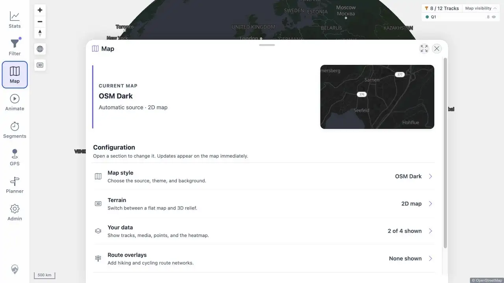

# Packet: APP_07

## Scope

- Coverage source: [coverage-plan.md](../coverage-plan.md).
- Coverage ID or run packet: APP_07.
- In scope: selected map-style persistence across reload.

## Prerequisites

- Required previous coverage IDs or run packets: APP_06.
- Required app/data state: Automatic source with OSM Dark selected under light UI.
- Required browser context: desktop map and Map settings.

## Allowed Mutations

- Allowed: close settings and reload browser.
- Not allowed: re-select the style after reload.

## Actions And Results

| Coverage ID | Action | Expected result | Actual result | Status | Evidence |
|---|---|---|---|---|---|
| APP_07 | Closed the OSM Dark Map settings, reloaded, and reopened Map settings. | Selected map style persists across reload. | CURRENT MAP remained OSM Dark under Automatic source without re-selection. | PASS | [persisted UI](../assets/APP_07-persisted.webp), [sequence](../assets/APP_07-persistence.txt) |

## Issues

No issue found.

## Evidence Files

| File | Purpose |
|---|---|
| [assets/APP_07-persisted.webp](../assets/APP_07-persisted.webp) | OSM Dark shown as current after reload. |
| [assets/APP_07-persistence.txt](../assets/APP_07-persistence.txt) | Reload sequence. |

## Screenshot Evidence

## Timings

| Step | Timing |
|---|---:|
| Reload to settled map | < 1.4 s |

## Handoff Notes

- Completed: APP_07 is terminal `PASS`.
- Remaining unfinished coverage: APP_08 onward.
- Blocked or not applicable: none in this packet.
- State left for the next packet: light UI, OSM Dark, Map settings open.

