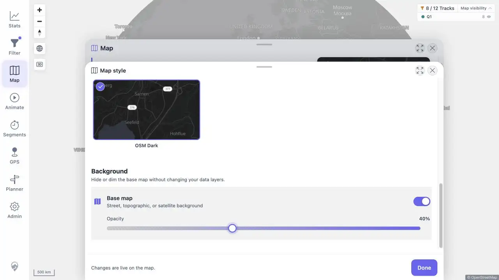
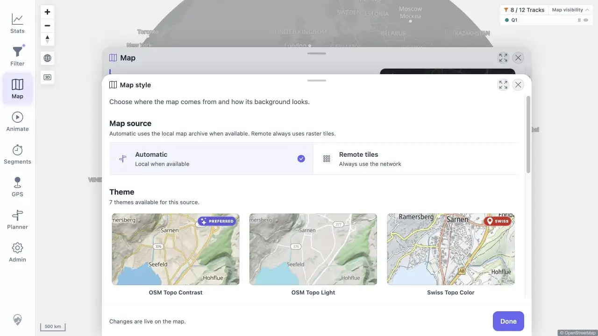
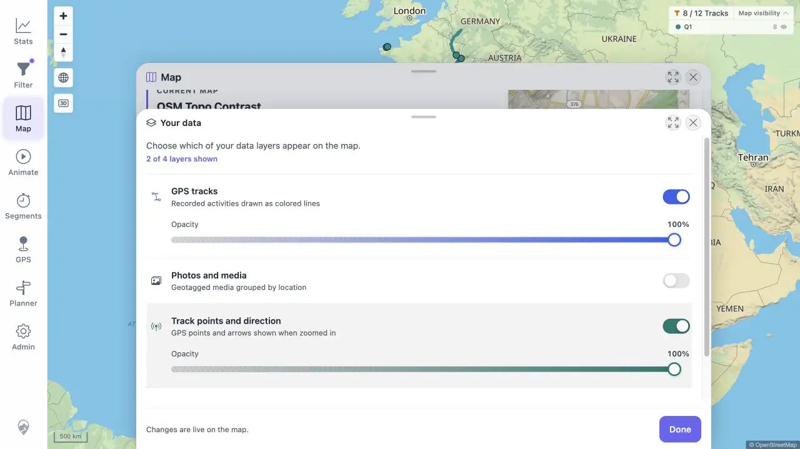

# Packet: APP_08

## Scope

- Coverage source: [coverage-plan.md](../coverage-plan.md).
- Coverage ID or run packet: APP_08.
- In scope: layer opacity, basemap dimming, persistence, and reset defaults.

## Prerequisites

- Required previous coverage IDs or run packets: APP_07 and HMO_01.
- Required app/data state: OSM Dark, base/track 100%, heatmap 40%.
- Required browser context: Map settings.

## Allowed Mutations

- Allowed: change opacity, reload, and reset map settings.
- Not allowed: change track data.

## Actions And Results

| Coverage ID | Action | Expected result | Actual result | Status | Evidence |
|---|---|---|---|---|---|
| APP_08 | Set base to 40% and tracks to 65%, reloaded, verified all opacity values, then selected Reset map settings and inspected defaults. | Sliders and dimming work, persist, and reset to defaults. | Changes were live and survived reload (base 40, tracks 65, heatmap 40). Reset restored OSM Topo Contrast, base/tracks 100, and the default 100% points layer. | PASS | [dimmed](../assets/APP_08-dimmed.webp), [persisted](../assets/APP_08-persisted.webp), [reset](../assets/APP_08-reset.webp), [values](../assets/APP_08-opacity.txt) |

## Issues

No issue found.

## Evidence Files

| File | Purpose |
|---|---|
| [assets/APP_08-dimmed.webp](../assets/APP_08-dimmed.webp) | Live 40% base-map state. |
| [assets/APP_08-persisted.webp](../assets/APP_08-persisted.webp) | 40% base after browser reload. |
| [assets/APP_08-reset.webp](../assets/APP_08-reset.webp) | Default data-layer values after reset. |
| [assets/APP_08-opacity.txt](../assets/APP_08-opacity.txt) | Before/reload/reset value sequence. |

## Screenshot Evidence

## Timings

| Step | Timing |
|---|---:|
| Per slider key update | < 0.02 s |
| Reset to defaults | < 0.15 s |

## Handoff Notes

- Completed: APP_08 is terminal `PASS`.
- Remaining unfinished coverage: LOC_01 onward.
- Blocked or not applicable: none in this packet.
- State left for the next packet: light UI; reset Automatic/OSM Topo Contrast/2D/100% defaults; Your data sheet open.

