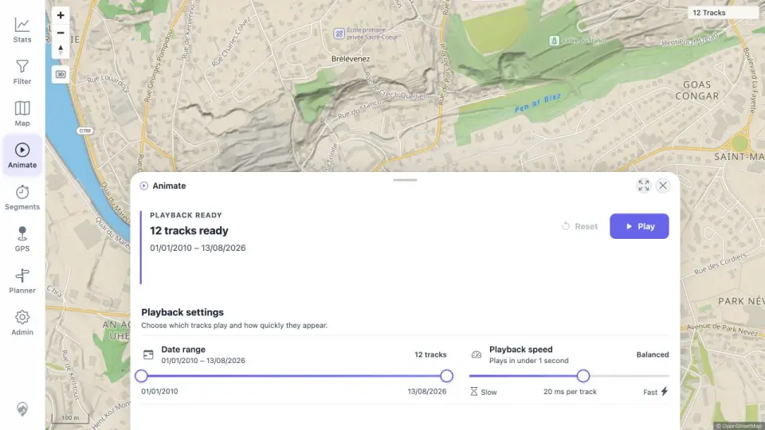
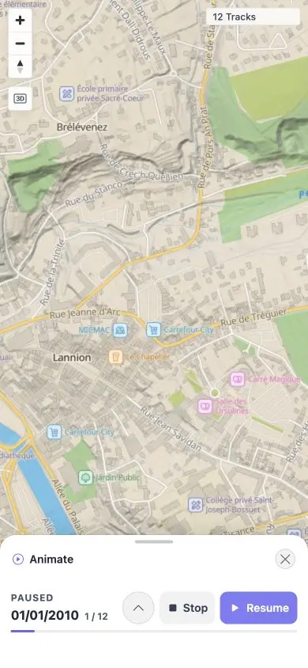

# Packet: AVR_01

## Scope

- Coverage source: [coverage-plan.md](../coverage-plan.md).
- Coverage ID or run packet: AVR_01.
- In scope: animation visibility, transport, settings, completion, and responsive behavior.
- Out of scope: virtual race movement, covered next.

## Prerequisites

- Required previous coverage IDs or run packets: MCT_06.
- Required app/data state: twelve visible tracks and full date range.
- Required browser context: desktop and 390×844 responsive viewport.

## Allowed Mutations

- Allowed: adjust temporary animation range/speed and exercise playback.
- Not allowed: alter stored tracks.

## Actions And Results

| Coverage ID | Action | Expected result | Actual result | Status | Evidence |
|---|---|---|---|---|---|
| AVR_01 | Opened Animate on desktop/mobile; changed range and speed; played, paused, resumed, stopped, expanded, reset, completed, and replayed. | Existing tracks remain until playback; map-first transport and all controls work on desktop/mobile. | The 12-track map stayed present before Play. Range changed 12→7, speed changed 20→759 ms/track, all transport states and finished state worked, and mobile exposed the same compact controls without loss. | PASS | [desktop](../assets/AVR_01-desktop.webp), [mobile](../assets/AVR_01-mobile.webp), [sequence](../assets/AVR_01-controls.txt) |

## Issues

No issue found.

## Evidence Files

| File | Purpose |
|---|---|
| [assets/AVR_01-desktop.webp](../assets/AVR_01-desktop.webp) | Desktop playback setup and map context. |
| [assets/AVR_01-mobile.webp](../assets/AVR_01-mobile.webp) | Mobile paused map-first transport. |
| [assets/AVR_01-controls.txt](../assets/AVR_01-controls.txt) | Exact range, speed, and transport transitions. |

## Screenshot Evidence

## Timings

| Step | Timing |
|---|---:|
| Fast 12-track playback | < 1 s |
| Very-slow configured playback | about 10 s |
| Transport changes | < 0.4 s each |

## Handoff Notes

- Completed: AVR_01 is terminal `PASS`.
- Remaining unfinished coverage: AVR_02 onward.
- Blocked or not applicable: none in this packet.
- State left for the next packet: desktop restored; Animate ready with twelve tracks and Very slow speed.
