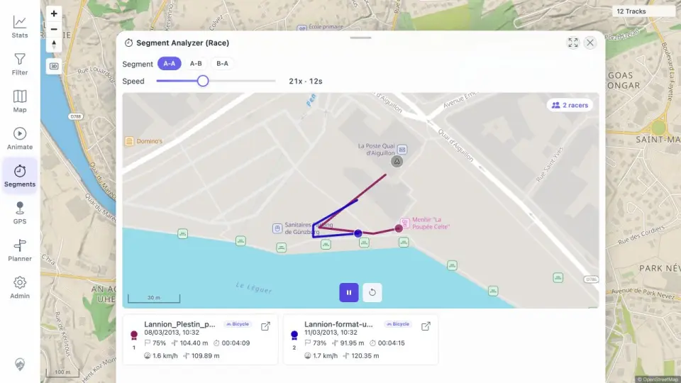

# Packet: AVR_02

## Scope

- Coverage source: [coverage-plan.md](../coverage-plan.md).
- Coverage ID or run packet: AVR_02.
- In scope: concurrent racer movement and live cards/ranking.
- Out of scope: post-race tool cleanup and global geometry.

## Prerequisites

- Required previous coverage IDs or run packets: AVR_01.
- Required app/data state: A-A measured segment with source GPX and NMEA selected.
- Required browser context: desktop Segment Analyzer Race.

## Allowed Mutations

- Allowed: change temporary racer selection and start/reset race.
- Not allowed: change source tracks.

## Actions And Results

| Coverage ID | Action | Expected result | Actual result | Status | Evidence |
|---|---|---|---|---|---|
| AVR_02 | Selected two different-duration racers, opened A-A Race, and sampled ready, early, later, and 75% progress. | Multiple racers move together; ranking and cards update in real time. | Both markers moved concurrently; rank cards stayed ordered 1/2 and advanced from 0% through 75%/73% with distinct live distances. | PASS | [race](../assets/AVR_02-race.webp), [samples](../assets/AVR_02-race.txt) |

## Issues

No issue found.

## Evidence Files

| File | Purpose |
|---|---|
| [assets/AVR_02-race.webp](../assets/AVR_02-race.webp) | Concurrent racer markers and live ranked cards. |
| [assets/AVR_02-race.txt](../assets/AVR_02-race.txt) | Exact progress and distance samples over time. |

## Screenshot Evidence

## Timings

| Step | Timing |
|---|---:|
| Race duration setting | 12 s at 21× |
| Live samples | 0.3–2.0 s intervals |

## Handoff Notes

- Completed: AVR_02 is terminal `PASS`.
- Remaining unfinished coverage: AVR_03 onward.
- Blocked or not applicable: none in this packet.
- State left for the next packet: two-racer A-A race near completion.
