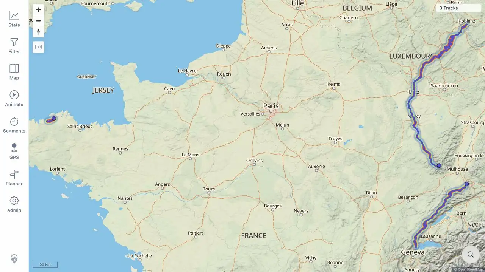
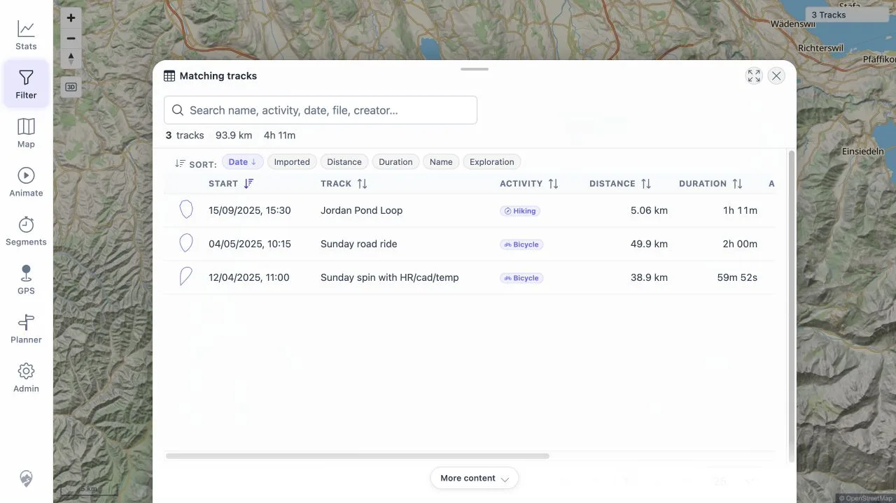

# Packet: DEL_03

> **FIX FOLLOW-UP — 2026-08-14: FIXED AND VERIFIED.** The original beta failure below is retained as run history. See [follow-up evidence](../fix-verification.md#resolution-matrix).

## Scope

- Coverage source: [coverage-plan.md](../coverage-plan.md).
- Coverage ID or run packet: DEL_03.
- In scope: verify deleted tracks disappear from map, Track Browser, Filter, selection lists, heatmap, Related, and statistics totals.
- Out of scope: remaining-track detail correctness, covered by DEL_04.

## Prerequisites

- Required previous coverage IDs or run packets: DEL_02.
- Required app/data state: server deletion complete for IDs 100001 and 100003; browser showing freshness notice.
- Required browser context: signed-in desktop browser.

## Allowed Mutations

- Allowed: use freshness Reload, search Track Browser, inspect Filter/Related, toggle heatmap, and use a normal browser reload to characterize recovery.
- Not allowed: delete more data or reimport deleted files.

## Actions And Results

| Coverage ID | Action | Expected result | Actual result | Status | Evidence |
|---|---|---|---|---|---|
| DEL_03 | Used freshness Reload; checked map, Statistics/Track Browser and deleted-name searches, Filter/Review tracks, former overlap selection, Mosel Related, and heatmap; then used a normal browser reload to characterize recovery. | Both deleted records disappear from every named user-visible surface after the supported freshness reload. | Map and Statistics changed to 3 tracks, 817 km, 15h 50m, 3,621 Wh, and Track Browser searches found neither deleted record. Filter incorrectly stayed at 5 tracks and still listed both deleted records. A normal browser reload recovered Filter to 3; thereafter map, Filter, former overlap selection, Related, and heatmap contained only the three remaining records. | FAIL | [assets/DEL_03-cross-surface.txt](../assets/DEL_03-cross-surface.txt); [assets/DEL_03-stale-filter.webp](../assets/DEL_03-stale-filter.webp); [assets/DEL_03-map.webp](../assets/DEL_03-map.webp); [assets/DEL_03-filter-recovered.webp](../assets/DEL_03-filter-recovered.webp); [assets/DEL_03-heatmap.webp](../assets/DEL_03-heatmap.webp) |

## Issues

| ID | Severity | Summary | Reproduction | Expected | Actual | Evidence | Release impact |
|---|---|---|---|---|---|---|---|
| DEL-03-P1 | P1 | Freshness Reload leaves deleted records in Filter after a 5→3 delete; same cross-surface invalidation defect as IMP-05-P1. | From a synchronized five-track state, delete Vitry and VoieVerte, wait for watcher completion and New data available, click Reload, then open Filter and Review tracks. | Filter shows 3 and excludes both deleted records, matching map and Statistics. | Map and Statistics show 3; Filter still shows 5, old totals, and both deleted rows until a normal browser reload. | [assets/DEL_03-stale-filter.webp](../assets/DEL_03-stale-filter.webp); [assets/DEL_03-cross-surface.txt](../assets/DEL_03-cross-surface.txt) | Users can act on deleted, stale Filter rows after the supported data-refresh action. |

## Evidence Files

| File | Purpose |
|---|---|
| [assets/DEL_03-cross-surface.txt](../assets/DEL_03-cross-surface.txt) | Exact pre/post reload results across all required surfaces. |
| [assets/DEL_03-stale-filter.webp](../assets/DEL_03-stale-filter.webp) | Map count 3 behind Filter Review tracks still showing 5 and both deleted rows. |
| [assets/DEL_03-map.webp](../assets/DEL_03-map.webp) | Three remaining main-map geometries. |
| [assets/DEL_03-filter-recovered.webp](../assets/DEL_03-filter-recovered.webp) | Filter recovered to the three remaining rows after browser reload. |
| [assets/DEL_03-heatmap.webp](../assets/DEL_03-heatmap.webp) | Three-track post-delete heatmap with deleted paths absent. |

## Screenshot Evidence

## Timings

| Step | Timing |
|---|---:|
| Freshness reload and discrepancy check | 3 min |
| Browser-reload recovery and all-surface verification | 5 min |

## Handoff Notes

- Completed: all required deletion-disappearance surfaces checked; helper defect recorded and normal-reload recovery characterized.
- Remaining unfinished coverage: DEL_04 onward; DAT_03 still needs the FIT imported mapping.
- Blocked or not applicable: none.
- State left for the next packet: synchronized three-track state after normal browser reload; heatmap restored off.

## Fix Verification — 2026-08-13

- Result: **FIXED locally** using a production image built from the corrected source.
- Repeated the 5→3 deletion with five public regression fixtures in a disposable Compose stack while keeping the browser session and five-row Filter review cached.
- After the supported freshness Reload, map, Filter, Review tracks, and Statistics all showed the same three remaining tracks without a normal browser reload.
- Deleted rows `Santorini → Folegandros` and `Day 3 — Col du Tricot` were absent from Review tracks.
- Automated checks: type-check passed; 102 frontend test files and 512 tests passed; lint had only two pre-existing unused-variable warnings; the production image build passed.
- Evidence: [assets/DEL_03-fix-verification.txt](../assets/DEL_03-fix-verification.txt); [assets/DEL_03-fixed-filter.webp](../assets/DEL_03-fixed-filter.webp).

