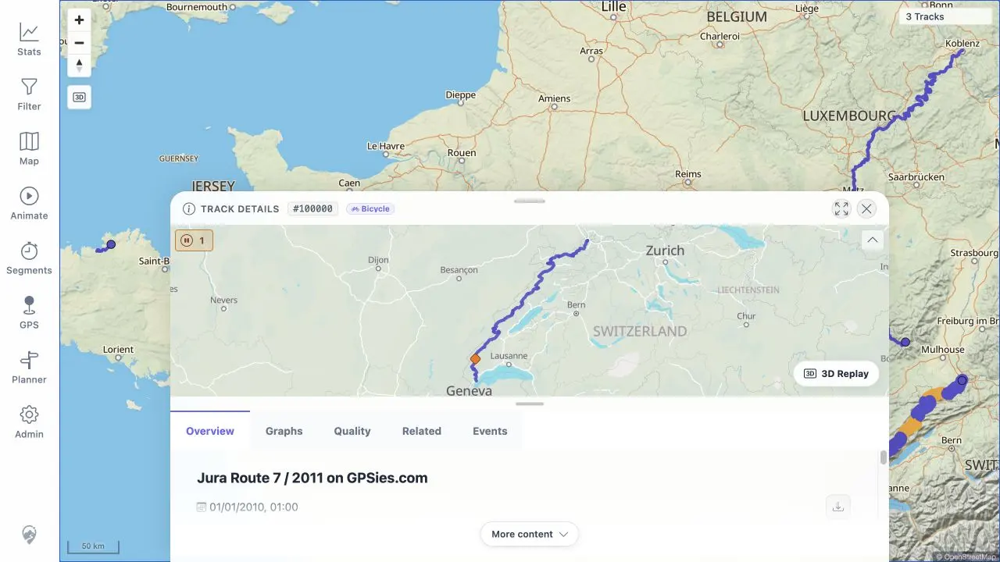

# Packet: DEL_04

## Scope

- Coverage source: [coverage-plan.md](../coverage-plan.md).
- Coverage ID or run packet: DEL_04.
- In scope: verify all remaining imported tracks still display and open correctly.
- Out of scope: stale deleted-track probes and later FIT import.

## Prerequisites

- Required previous coverage IDs or run packets: DEL_03.
- Required app/data state: synchronized three-track state after normal browser reload.
- Required browser context: signed-in desktop main map.

## Allowed Mutations

- Allowed: click remaining main-map geometries and open/close Track Details.
- Not allowed: edit, delete, or import tracks.

## Actions And Results

| Coverage ID | Action | Expected result | Actual result | Status | Evidence |
|---|---|---|---|---|---|
| DEL_04 | Reviewed the fitted three-track map and clicked the Lannion, Jura, and Mosel geometries after deletion. | Every remaining imported route stays visible and opens the matching healthy detail. | The map contains exactly three continuous routes. Lannion opened #100004, Jura opened #100000, and the prior overlap location opened Mosel #100002 directly. Each detail showed the matching name and populated overview/mini-map. | PASS | [assets/DEL_03-map.webp](../assets/DEL_03-map.webp); [assets/DEL_04-jura-detail.webp](../assets/DEL_04-jura-detail.webp); [assets/DEL_03-cross-surface.txt](../assets/DEL_03-cross-surface.txt) |

## Issues

| ID | Severity | Summary | Reproduction | Expected | Actual | Evidence | Release impact |
|---|---|---|---|---|---|---|---|

## Evidence Files

| File | Purpose |
|---|---|
| [assets/DEL_03-map.webp](../assets/DEL_03-map.webp) | All three remaining geometries. |
| [assets/DEL_04-jura-detail.webp](../assets/DEL_04-jura-detail.webp) | Representative remaining-track detail and fitted route. |
| [assets/DEL_03-cross-surface.txt](../assets/DEL_03-cross-surface.txt) | Per-ID remaining-map open results, including Mosel at the old overlap. |

## Screenshot Evidence

## Timings

| Step | Timing |
|---|---:|
| Three remaining-track open checks | 2 min |

## Handoff Notes

- Completed: all three remaining imports display and open correctly.
- Remaining unfinished coverage: DEL_05 onward; DAT_03 still needs the FIT imported mapping.
- Blocked or not applicable: none.
- State left for the next packet: synchronized three-track main map; no sheet open; heatmap off.
