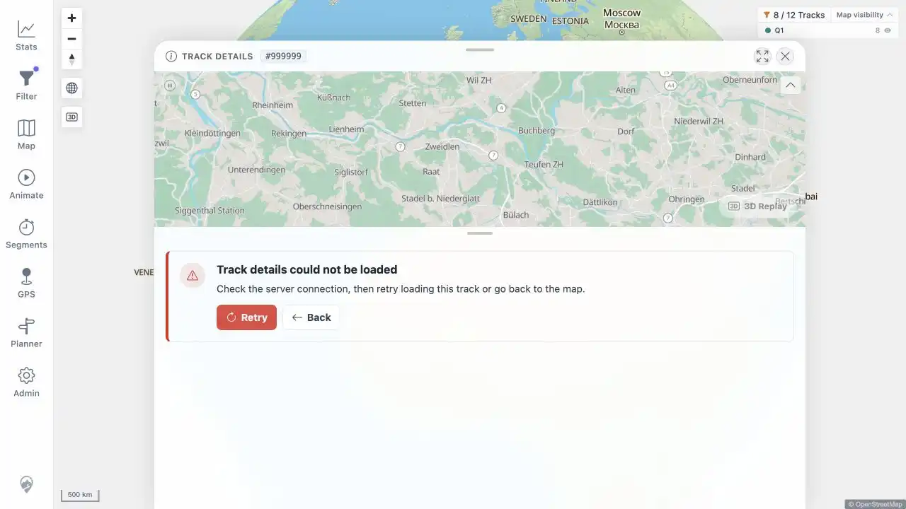
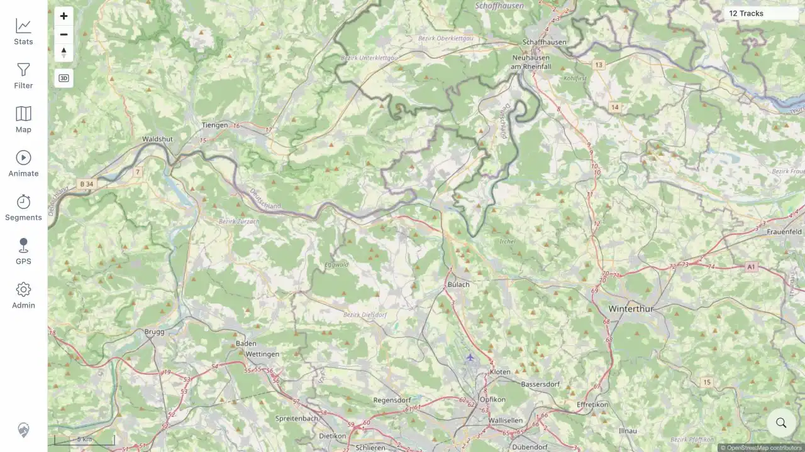

# Packet: ERR_01

> **FIX FOLLOW-UP — 2026-08-14: FIXED AND VERIFIED.** The original beta failure below is retained as run history. See [follow-up evidence](../fix-verification.md#resolution-matrix).

## Scope

- Coverage source: [coverage-plan.md](../coverage-plan.md).
- Coverage ID or run packet: ERR_01.
- In scope: failed track load, map config, media, planner route, and expired-session recovery surfaces.

## Prerequisites

- Required previous coverage IDs or run packets: NET_04, MED_05, PLN_09, NET_03.
- Required app/data state: healthy 12-track baseline and recoverable disposable failure controls.
- Required browser context: warmed desktop session plus one fresh same-host fault-injection origin for map config.

## Allowed Mutations

- Allowed: open an absent synthetic track ID; run a temporary same-server reverse proxy that returns 503 only for map config; reuse same-run media, planner, and session evidence.
- Not allowed: alter the required image, permanent data, or leave a fault listener running.

## Actions And Results

| Coverage ID | Action | Expected result | Actual result | Status | Evidence |
|---|---|---|---|---|---|
| ERR_01 | Opened absent track 999999, retried and backed out; injected five map-config 503s on a fresh origin; reviewed direct same-run failed-media, failed-route, and unauthorized-session paths. | Every failure shows an actionable retry, re-login, or dismiss message instead of freezing or going blank. | Track, media, planner, and session failures were actionable and recoverable. Map-config failure logged three warnings and rendered a usable 12-track OSM fallback, but showed no failure message or Retry, Dismiss, Reload, Try again, or Sign In action. | FAIL | [track failure](../assets/ERR_01-track-load.webp), [silent map fallback](../assets/ERR_01-map-config.webp), [matrix](../assets/ERR_01-recovery-matrix.txt), [media recovery](../assets/MED_05-recovery.txt), [planner recovery](../assets/PLN_09-routing-data-state.txt), [session recovery](../assets/NET_03-auth-flow.txt) |

## Issues

| ID | Severity | Summary | Reproduction | Expected | Actual | Evidence | Release impact |
|---|---|---|---|---|---|---|---|
| ERR-01-P2 | P2 | Map-config failure silently falls back without an actionable end-user message. | On a fresh same-host origin, return 503 only for `GET /mtl/api/map/config`, sign in, and wait for the map. | A visible failure/fallback message provides Retry, Dismiss, or equivalent recovery action. | Five config requests returned 503 and three browser warnings confirmed fallback; the map stayed usable, but the DOM exposed no failure message or recovery action. | [matrix](../assets/ERR_01-recovery-matrix.txt), [fallback](../assets/ERR_01-map-config.webp) | Users cannot tell that map configuration failed or explicitly retry it; the built-in remote fallback limits impact. |

## Evidence Files

| File | Purpose |
|---|---|
| [assets/ERR_01-track-load.webp](../assets/ERR_01-track-load.webp) | Actionable Track Details error with Retry and Back. |
| [assets/ERR_01-map-config.webp](../assets/ERR_01-map-config.webp) | Rendered fallback map with no visible failure/recovery action. |
| [assets/ERR_01-recovery-matrix.txt](../assets/ERR_01-recovery-matrix.txt) | Five-path result matrix, diagnostics, and fault-proxy cleanup. |
| [assets/MED_05-recovery.txt](../assets/MED_05-recovery.txt) | Same-run media remove/restore/retry sequence. |
| [assets/PLN_09-routing-data-state.txt](../assets/PLN_09-routing-data-state.txt) | Same-run planner downloading, auto-retry, unavailable, and recovery sequence. |
| [assets/NET_03-auth-flow.txt](../assets/NET_03-auth-flow.txt) | Same-run 401, login redirect, and sign-in recovery sequence. |

## Screenshot Evidence

## Timings

| Step | Timing |
|---|---:|
| Absent-track Retry | 0.906 s |
| Back to populated map | 1.2 s |
| Map-config fault sign-in to fallback map | 3.781 s |
| Media error / recovered Retry | 0.8 s / 0.7 s |
| Planner downloading / auto-retry | < 1 s / 8 s |
| Unauthorized redirect | < 1.0 s |

## Handoff Notes

- Completed: ERR_01 is terminal `FAIL`; issue `ERR-01-P2` is open.
- Remaining unfinished coverage: ERR_02 onward.
- Blocked or not applicable: none; all five failure paths were directly executed during this run.
- State left for the next packet: required port-18080 origin restored, 12-track map usable, temporary fault listener stopped and removed.
