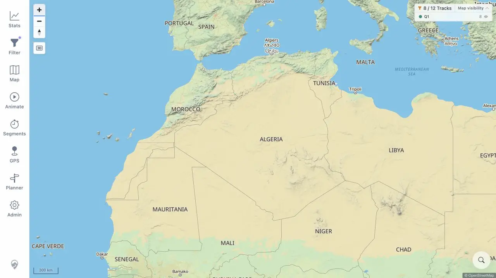

# Packet: ERR_02

## Scope

- Coverage source: [coverage-plan.md](../coverage-plan.md).
- Coverage ID or run packet: ERR_02.
- In scope: stale markers, listeners, cursors, and tool surfaces after rapid switching.

## Prerequisites

- Required previous coverage IDs or run packets: ERR_01.
- Required app/data state: restored required origin, Q1 filter, no baseline DOM map markers.
- Required browser context: warmed desktop map.

## Allowed Mutations

- Allowed: place one disposable Segment Analyzer zone, switch tools, close the final sheet, click and zoom the map.
- Not allowed: persist a plan, filter change, GPS watch, or segment result.

## Actions And Results

| Coverage ID | Action | Expected result | Actual result | Status | Evidence |
|---|---|---|---|---|---|
| ERR_02 | Primed one segment zone, then requested Planner→Filter→Animate→Segments→Map with 50 ms extra spacing, closed the final sheet, clicked the map, and zoomed. | Rapid switching leaves no markers, listeners, cursors, or prior tool surfaces. | The final Map surface contained no prior tool or zone/alert state. After close, a neutral click did not create a segment zone, marker count stayed zero, the map canvas had no cursor override, and Zoom In changed 500→300 km. | PASS | [clean map](../assets/ERR_02-clean.webp), [switch flow](../assets/ERR_02-switch-flow.txt) |

## Issues

No issue found.

## Evidence Files

| File | Purpose |
|---|---|
| [assets/ERR_02-clean.webp](../assets/ERR_02-clean.webp) | Clean usable map after the switch sequence and post-switch zoom. |
| [assets/ERR_02-switch-flow.txt](../assets/ERR_02-switch-flow.txt) | Primed state, switch order, cleanup probes, marker/cursor checks, and zoom result. |

## Screenshot Evidence

## Timings

| Step | Timing |
|---|---:|
| Extra delay requested between tool selections | 50 ms |
| Browser-controller click settlement | 3.028–3.035 s each |
| Post-switch Zoom In check | 0.586 s including 0.3 s observation |

## Handoff Notes

- Completed: ERR_02 is terminal `PASS`.
- Remaining unfinished coverage: UXP_01 and RUN_CLEANUP.
- Blocked or not applicable: none in this packet.
- State left for the next packet: clean warmed desktop map, Q1 filter, 8/12 visible, no tool marker/listener/cursor residue.

