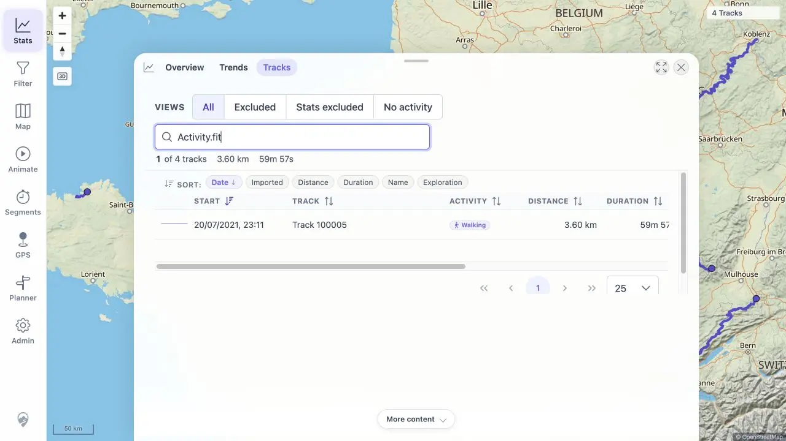
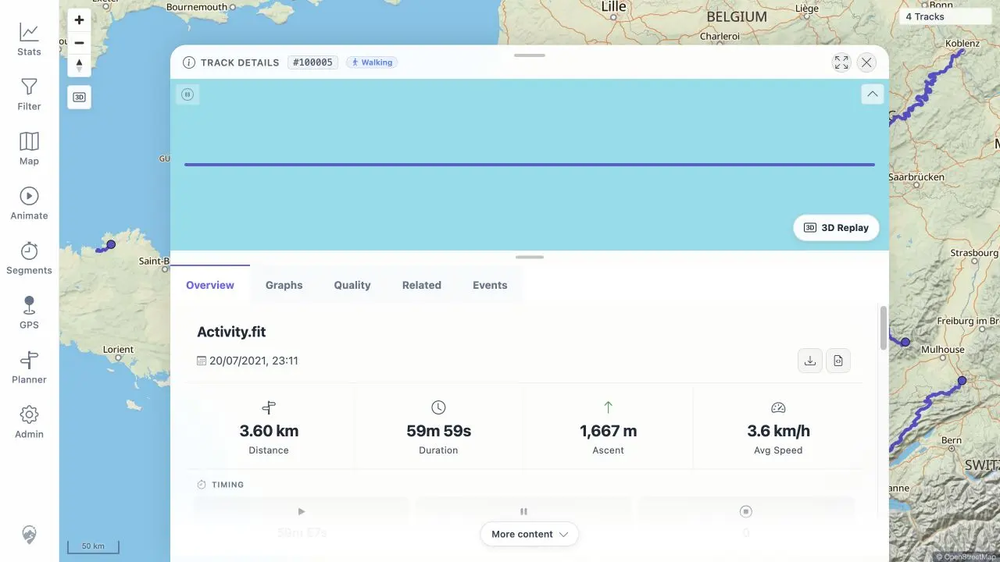

# Packet: FIT_02

## Scope

- Coverage source: [coverage-plan.md](../coverage-plan.md).
- Coverage ID or run packet: FIT_02.
- In scope: verify FIT acceptance, successful indexing, map display, Track Browser search, and Statistics inclusion.
- Out of scope: detailed tabs/popups and downloads, covered by FIT_03-FIT_05.

## Prerequisites

- Required previous coverage IDs or run packets: FIT_01.
- Required app/data state: Activity.fit present in the watched folder; three-track synchronized baseline.
- Required browser context: signed-in desktop browser.

## Allowed Mutations

- Allowed: wait for live processing, use freshness Reload, search Track Browser, and open FIT details.
- Not allowed: rescan unless necessary, edit the FIT record, or download files yet.

## Actions And Results

| Coverage ID | Action | Expected result | Actual result | Status | Evidence |
|---|---|---|---|---|---|
| FIT_02 | Observed watcher/converter/indexer/jobs; used freshness Reload; checked map count, Statistics/Track Browser totals, exact source search, and opened the result. | GPS-bearing FIT is accepted and indexed successfully, appears on map, is searchable, and contributes to Statistics. | GPSBabel converted Activity.fit and ingest completed SUCCESS as #100005 in 12.679 s without rescan. Map count changed 3→4. `Activity.fit` search returned one record; it opened a populated Activity.fit detail. Statistics/Browser changed to 4 tracks, 821 km, 16h 50m. | PASS | [assets/FIT_02-processing.txt](../assets/FIT_02-processing.txt); [assets/FIT_02-map.webp](../assets/FIT_02-map.webp); [assets/FIT_02-search.webp](../assets/FIT_02-search.webp); [assets/FIT_02-detail.webp](../assets/FIT_02-detail.webp) |

## Issues

| ID | Severity | Summary | Reproduction | Expected | Actual | Evidence | Release impact |
|---|---|---|---|---|---|---|---|

## Evidence Files

| File | Purpose |
|---|---|
| [assets/FIT_02-processing.txt](../assets/FIT_02-processing.txt) | Conversion/index/job timing and UI observations. |
| [assets/FIT_02-map.webp](../assets/FIT_02-map.webp) | Four-track map state after freshness reload. |
| [assets/FIT_02-search.webp](../assets/FIT_02-search.webp) | Exact Activity.fit search and one matching row. |
| [assets/FIT_02-detail.webp](../assets/FIT_02-detail.webp) | FIT-backed Track Details with route line and metrics. |

## Screenshot Evidence

## Timings

| Step | Timing |
|---|---:|
| Copy to ingest success | 12.679 s |
| Converter/indexer processing | 2.67 s |
| Background enrichment jobs | 11.342 s after ingest |

## Handoff Notes

- Completed: FIT accepted, converted, indexed, mapped, searchable, and included in Statistics; DAT_03 mapping is now complete.
- Remaining unfinished coverage: FIT_03 onward.
- Blocked or not applicable: none.
- State left for the next packet: FIT #100005 Track Details Overview is open; four-track synchronized map/Statistics state.
