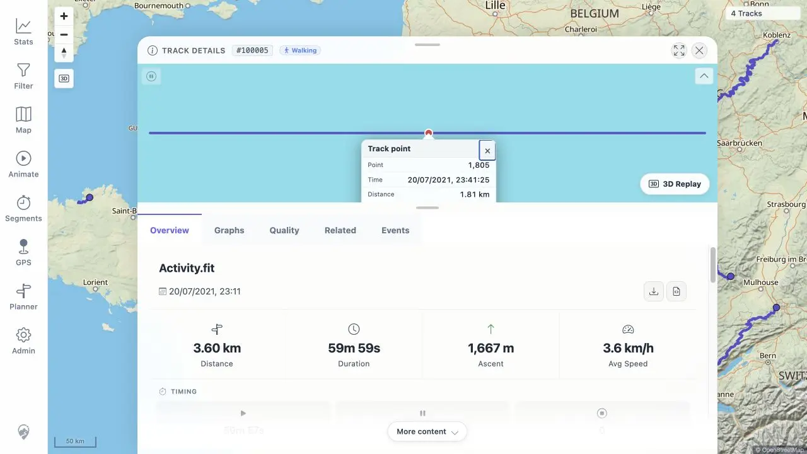
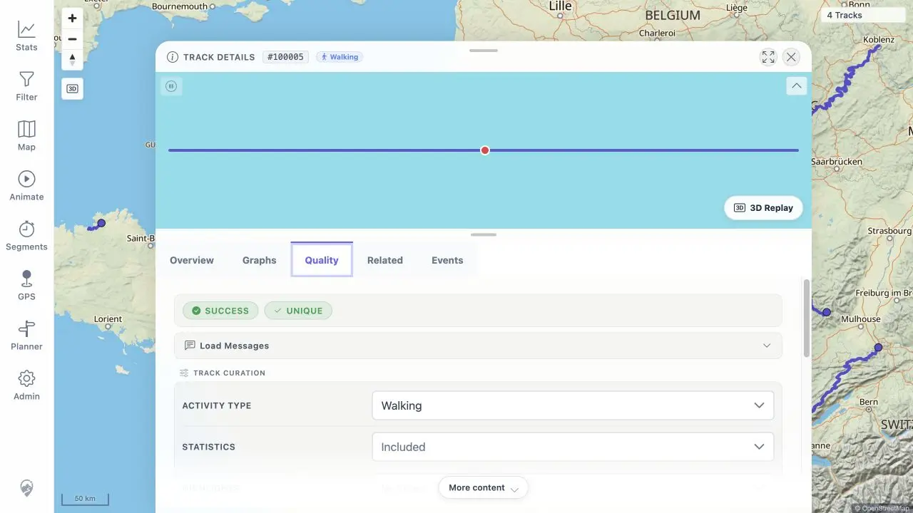
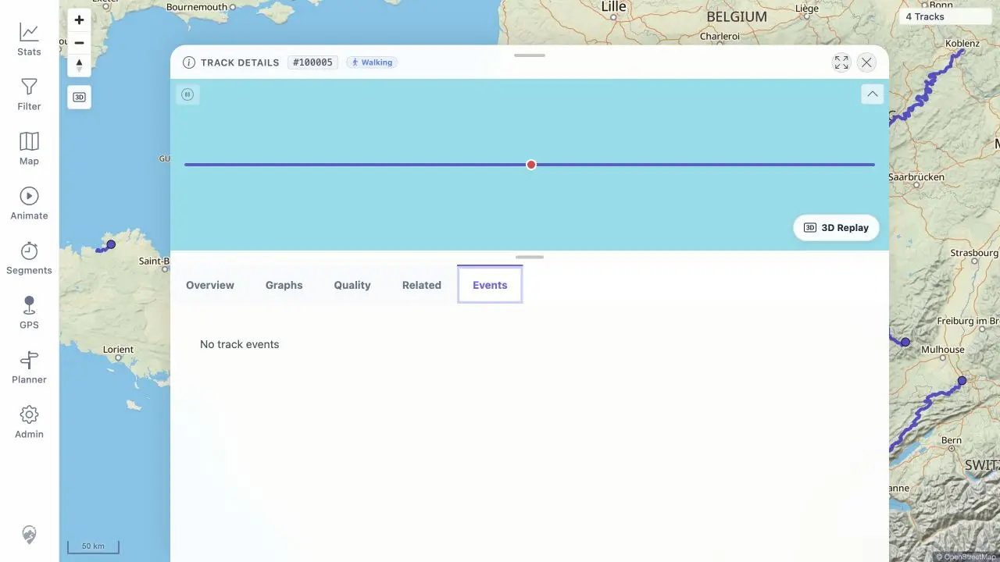

# Packet: FIT_03

## Scope

- Coverage source: [coverage-plan.md](../coverage-plan.md).
- Coverage ID or run packet: FIT_03.
- In scope: FIT-backed Overview, Graphs, Quality, Events, Related, mini-map, and point-popup rendering.
- Out of scope: original and GPX file download integrity, covered by FIT_04-FIT_05.

## Prerequisites

- Required previous coverage IDs or run packets: FIT_02.
- Required app/data state: indexed Activity.fit record #100005.
- Required browser context: FIT-backed Track Details open in a signed-in desktop browser.

## Allowed Mutations

- Allowed: switch tabs and click the visible mini-map route.
- Not allowed: change curation values or download files.

## Actions And Results

| Coverage ID | Action | Expected result | Actual result | Status | Evidence |
|---|---|---|---|---|---|
| FIT_03 | Checked the populated Overview/mini-map, clicked the FIT route for a point popup, and opened Graphs, Quality, Related, and Events. | FIT-backed details render with the same complete behavior and valid empty states as GPX-backed details. | Overview and mini-map populated. Point 1,805 showed complete time/distance/elevation/speed/elapsed data. Six named graph groups rendered. Quality showed SUCCESS/UNIQUE and 3,600 points. Related listed the three older records. Events rendered the valid `No track events` state with its map toggle disabled. | PASS | [assets/FIT_03-tabs.txt](../assets/FIT_03-tabs.txt); [assets/FIT_03-point.webp](../assets/FIT_03-point.webp); [assets/FIT_03-graphs.webp](../assets/FIT_03-graphs.webp); [assets/FIT_03-quality.webp](../assets/FIT_03-quality.webp); [assets/FIT_03-events.webp](../assets/FIT_03-events.webp) |

## Issues

| ID | Severity | Summary | Reproduction | Expected | Actual | Evidence | Release impact |
|---|---|---|---|---|---|---|---|

## Evidence Files

| File | Purpose |
|---|---|
| [assets/FIT_03-tabs.txt](../assets/FIT_03-tabs.txt) | Exact tab, mini-map, popup, and valid-empty observations. |
| [assets/FIT_03-point.webp](../assets/FIT_03-point.webp) | FIT mini-map point popup. |
| [assets/FIT_03-graphs.webp](../assets/FIT_03-graphs.webp) | Populated FIT graph view. |
| [assets/FIT_03-quality.webp](../assets/FIT_03-quality.webp) | FIT quality and classification view. |
| [assets/FIT_03-events.webp](../assets/FIT_03-events.webp) | FIT valid empty event state. |

## Screenshot Evidence

## Timings

| Step | Timing |
|---|---:|
| Overview, mini-map, and point popup | 1 min |
| Four remaining detail tabs | 3 min |

## Handoff Notes

- Completed: all required FIT-backed detail tabs, mini-map, and point popup.
- Remaining unfinished coverage: FIT_04 onward.
- Blocked or not applicable: none.
- State left for the next packet: FIT Details Events tab is open; download actions are available from Overview.
