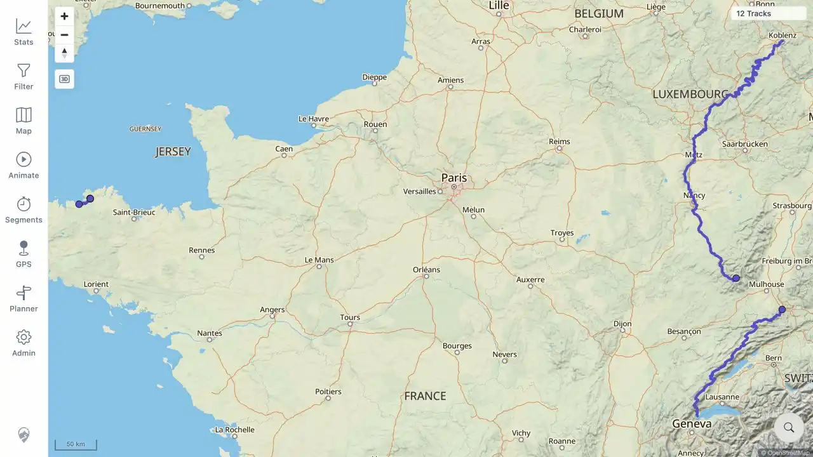
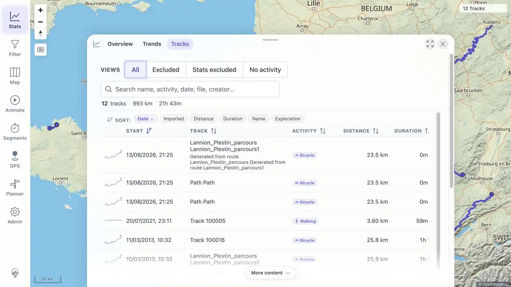

# Packet: FMT_01

## Scope

- Coverage source: [coverage-plan.md](../coverage-plan.md).
- Coverage ID or run packet: FMT_01.
- In scope: verify server acceptance of one GPS-bearing sample for GPX, FIT, TCX, KML, KMZ, IGC, NMEA, GeoJSON, and GDB.
- Out of scope: per-format details and download validation, covered by FMT_02.

## Prerequisites

- Required previous coverage IDs or run packets: DAT_01-DAT_06 and FIT_01-FIT_05.
- Required app/data state: four accepted baseline tracks, public-derived format samples staged outside the watched folder.
- Required browser context: signed-in desktop browser with the paused filter showing all tracks.

## Allowed Mutations

- Allowed: derive additional public-source encodings with installed GPSBabel, copy them into the disposable watched folder, and refresh the UI.
- Not allowed: use private GPX data or replace the frozen coverage queue.

## Actions And Results

| Coverage ID | Action | Expected result | Actual result | Status | Evidence |
|---|---|---|---|---|---|
| FMT_01 | Added one GPS-bearing sample for each listed format; inspected watcher/conversion logs; refreshed the map; opened Statistics > Tracks > All. | Every format is accepted and represented by a successful imported track. | GPX and FIT remained accepted; GPSBabel converted all seven added formats and ingest completed successfully. TCX, KML, KMZ, NMEA, GeoJSON, and GDB each produced one record; the IGC source legitimately split at a temporal gap into two. Map and browser both showed the expected 12 visible tracks. | PASS | [assets/FMT_01-format-acceptance.txt](../assets/FMT_01-format-acceptance.txt); [assets/FMT_01-map-12-tracks.webp](../assets/FMT_01-map-12-tracks.webp); [assets/FMT_01-stats-12-tracks.webp](../assets/FMT_01-stats-12-tracks.webp) |

## Issues

| ID | Severity | Summary | Reproduction | Expected | Actual | Evidence | Release impact |
|---|---|---|---|---|---|---|---|

## Evidence Files

| File | Purpose |
|---|---|
| [assets/FMT_01-format-acceptance.txt](../assets/FMT_01-format-acceptance.txt) | Format, checksum, conversion, record ID, and visible-count matrix. |
| [assets/FMT_01-map-12-tracks.webp](../assets/FMT_01-map-12-tracks.webp) | Main map after the accepted format imports. |
| [assets/FMT_01-stats-12-tracks.webp](../assets/FMT_01-stats-12-tracks.webp) | Track Browser All view with the 12 visible records. |

## Screenshot Evidence

## Timings

| Step | Timing |
|---|---:|
| Seven-format copy, live indexing, conversion, and ingest | 11.3 s |
| UI freshness refresh and visible-count check | < 1 min |

## Handoff Notes

- Completed: every frozen accepted-format child was exercised with GPS-bearing data.
- Remaining unfinished coverage: FMT_02 onward.
- Blocked or not applicable: none.
- State left for the next packet: 12 visible records; Statistics > Tracks > All is open; all source files remain in the disposable watched folder.
