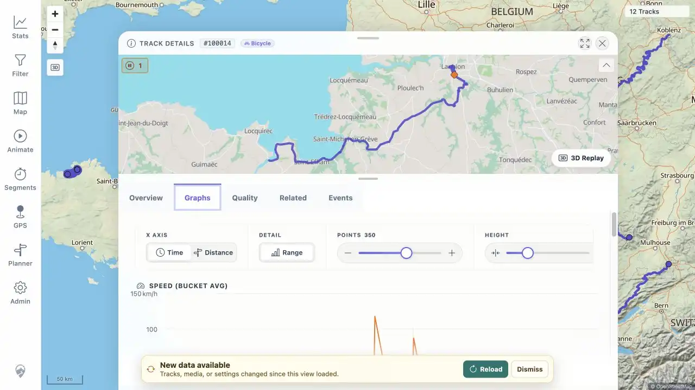
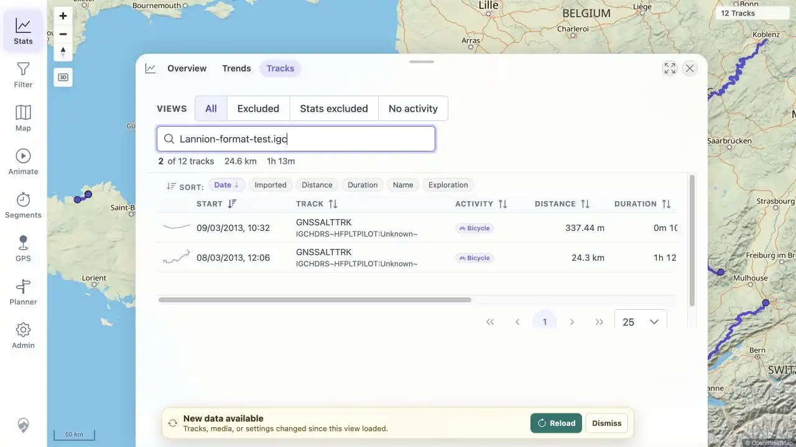

# Packet: FMT_02

## Scope

- Coverage source: [coverage-plan.md](../coverage-plan.md).
- Coverage ID or run packet: FMT_02.
- In scope: for every tested non-GPX format, verify acceptance, conversion, map display, details/charts, statistics inclusion, original download, and GPX download.
- Out of scope: GPX-as-input checks already covered by the import packets.

## Prerequisites

- Required previous coverage IDs or run packets: FIT_01-FIT_05 and FMT_01.
- Required app/data state: accepted FIT, TCX, KML, KMZ, IGC, NMEA, GeoJSON, and GDB sources visible in Statistics > Tracks > All.
- Required browser context: signed-in desktop browser with downloads enabled.

## Allowed Mutations

- Allowed: exact-source Track Browser searches, opening read-only details/graphs, and user download actions.
- Not allowed: mutate track metadata or source files during the matrix.

## Actions And Results

| Coverage ID | Action | Expected result | Actual result | Status | Evidence |
|---|---|---|---|---|---|
| FMT_02 | Searched each non-GPX source, opened every resulting record, inspected its mini-map and charts, then used Download original and Download GPX; validated the downloaded bytes. | Each format has successful conversion, map/details/charts/statistics representation, a byte-identical original download, and a valid GPX download. | FIT, TCX, KML, KMZ, IGC, NMEA, GeoJSON, and GDB all completed the end-user flow. Timed sources populated time charts; untimed KML/KMZ/GeoJSON populated distance-axis elevation/energy charts. All eight originals match their sources, and every GPX parses with trackpoints. Both IGC split records opened with populated charts. | PASS | [assets/FMT_01-format-acceptance.txt](../assets/FMT_01-format-acceptance.txt); [assets/FMT_02-format-matrix.txt](../assets/FMT_02-format-matrix.txt); [assets/FMT_02-gdb-graphs.webp](../assets/FMT_02-gdb-graphs.webp); [assets/FMT_02-igc-two-records.webp](../assets/FMT_02-igc-two-records.webp) |

## Issues

| ID | Severity | Summary | Reproduction | Expected | Actual | Evidence | Release impact |
|---|---|---|---|---|---|---|---|

## Evidence Files

| File | Purpose |
|---|---|
| [assets/FMT_01-format-acceptance.txt](../assets/FMT_01-format-acceptance.txt) | Watcher and GPSBabel acceptance evidence. |
| [assets/FMT_02-format-matrix.txt](../assets/FMT_02-format-matrix.txt) | Per-format record, chart, original, GPX, hash, and point-count matrix. |
| [assets/FMT_02-gdb-graphs.webp](../assets/FMT_02-gdb-graphs.webp) | Representative populated timed-source Graphs tab. |
| [assets/FMT_02-igc-two-records.webp](../assets/FMT_02-igc-two-records.webp) | Exact IGC source search showing its two legitimate split records. |

## Screenshot Evidence

## Timings

| Step | Timing |
|---|---:|
| Seven new-format UI and download matrix | 8 min |
| Download integrity and GPX validation | < 1 min |

## Handoff Notes

- Completed: all tested non-GPX formats passed acceptance through both download paths.
- Remaining unfinished coverage: SGN_01 onward.
- Blocked or not applicable: none.
- State left for the next packet: GeoJSON details/graphs are open; test download artifacts are tracked for exact cleanup.
