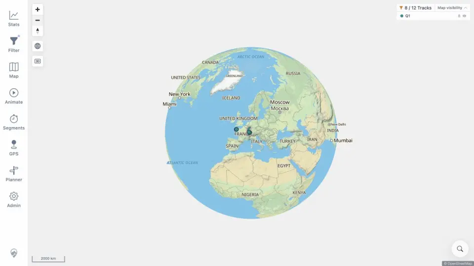

# Packet: GLB_01

## Scope

- Coverage source: [coverage-plan.md](../coverage-plan.md).
- Coverage ID or run packet: GLB_01.
- In scope: automatic low-zoom globe activation.
- Out of scope: exit, manual disable, and edge limits.

## Prerequisites

- Required previous coverage IDs or run packets: SRC_04.
- Required app/data state: flat Zürich map.
- Required browser context: desktop map.

## Allowed Mutations

- Allowed: use Zoom out repeatedly.
- Not allowed: click the globe toggle before activation.

## Actions And Results

| Coverage ID | Action | Expected result | Actual result | Status | Evidence |
|---|---|---|---|---|---|
| GLB_01 | Zoomed out from 100 m through the low-zoom threshold. | Globe engages automatically. | Projection changed automatically to a fitted 2,000 km globe with curvature and a visible globe control. | PASS | [globe](../assets/GLB_01-globe.webp), [transition](../assets/GLB_01-globe.txt) |

## Issues

No issue found.

## Evidence Files

| File | Purpose |
|---|---|
| [assets/GLB_01-globe.webp](../assets/GLB_01-globe.webp) | Automatic globe projection. |
| [assets/GLB_01-globe.txt](../assets/GLB_01-globe.txt) | Start/threshold/end state. |

## Screenshot Evidence

## Timings

| Step | Timing |
|---|---:|
| Threshold settle | < 0.9 s after final zoom |

## Handoff Notes

- Completed: GLB_01 is terminal `PASS`.
- Remaining unfinished coverage: GLB_02 onward.
- Blocked or not applicable: none in this packet.
- State left for the next packet: fitted globe at 2,000 km scale.
