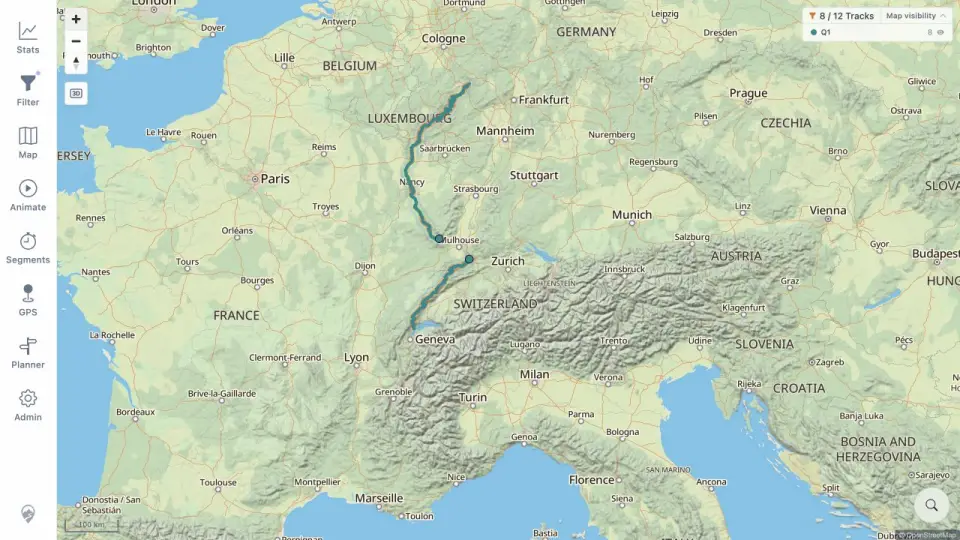

# Packet: GLB_02

## Scope

- Coverage source: [coverage-plan.md](../coverage-plan.md).
- Coverage ID or run packet: GLB_02.
- In scope: automatic globe exit on zoom in.
- Out of scope: manual globe override.

## Prerequisites

- Required previous coverage IDs or run packets: GLB_01.
- Required app/data state: active fitted globe.
- Required browser context: desktop map.

## Allowed Mutations

- Allowed: use Zoom in.
- Not allowed: click globe toggle.

## Actions And Results

| Coverage ID | Action | Expected result | Actual result | Status | Evidence |
|---|---|---|---|---|---|
| GLB_02 | Zoomed in four steps from the fitted globe. | Map returns to flat view. | At 100 km the map was rectangular/flat with normal labels and the globe toggle no longer visible. | PASS | [flat map](../assets/GLB_02-flat.webp), [transition](../assets/GLB_02-flat.txt) |

## Issues

No issue found.

## Evidence Files

| File | Purpose |
|---|---|
| [assets/GLB_02-flat.webp](../assets/GLB_02-flat.webp) | Flat Europe map after globe exit. |
| [assets/GLB_02-flat.txt](../assets/GLB_02-flat.txt) | Zoom and control transition. |

## Screenshot Evidence

## Timings

| Step | Timing |
|---|---:|
| Globe-to-flat settle | < 0.8 s |

## Handoff Notes

- Completed: GLB_02 is terminal `PASS`.
- Remaining unfinished coverage: GLB_03 onward.
- Blocked or not applicable: none in this packet.
- State left for the next packet: flat Europe map at 100 km scale.
