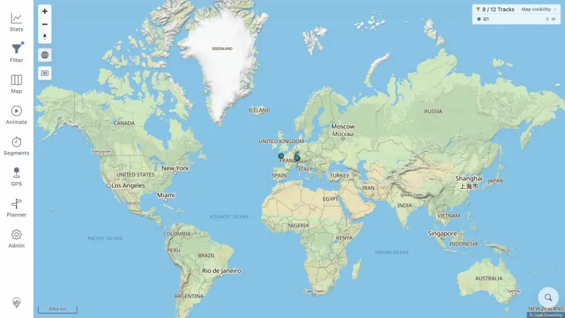
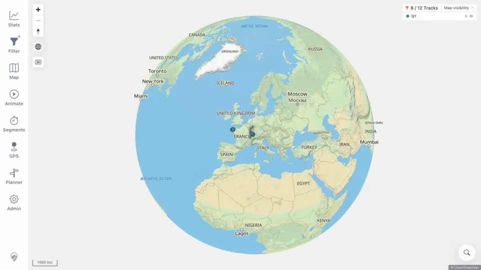

# Packet: GLB_03

## Scope

- Coverage source: [coverage-plan.md](../coverage-plan.md).
- Coverage ID or run packet: GLB_03.
- In scope: persistent manual globe disable and explicit re-enable.
- Out of scope: edge-limit trapping.

## Prerequisites

- Required previous coverage IDs or run packets: GLB_02.
- Required app/data state: flat map, ability to re-enter low-zoom globe.
- Required browser context: desktop map.

## Allowed Mutations

- Allowed: use zoom and globe toggle.
- Not allowed: reload between override checks.

## Actions And Results

| Coverage ID | Action | Expected result | Actual result | Status | Evidence |
|---|---|---|---|---|---|
| GLB_03 | Disabled globe manually, cycled zoom inside the globe zone, then explicitly re-enabled it. | Manual disable prevents auto re-enable until user enables globe again. | Flat world persisted through the zoom cycle with inactive control; a second toggle restored the active fitted globe. | PASS | [disabled](../assets/GLB_03-disabled.webp), [re-enabled](../assets/GLB_03-reenabled.webp), [sequence](../assets/GLB_03-override.txt) |

## Issues

No issue found.

## Evidence Files

| File | Purpose |
|---|---|
| [assets/GLB_03-disabled.webp](../assets/GLB_03-disabled.webp) | Flat world at low zoom after manual disable. |
| [assets/GLB_03-reenabled.webp](../assets/GLB_03-reenabled.webp) | Explicitly restored globe. |
| [assets/GLB_03-override.txt](../assets/GLB_03-override.txt) | Control classes and zoom-cycle sequence. |

## Screenshot Evidence

## Timings

| Step | Timing |
|---|---:|
| Toggle projection | < 0.7 s each |

## Handoff Notes

- Completed: GLB_03 is terminal `PASS`.
- Remaining unfinished coverage: GLB_04 onward.
- Blocked or not applicable: none in this packet.
- State left for the next packet: active fitted globe at 1,000 km scale.
