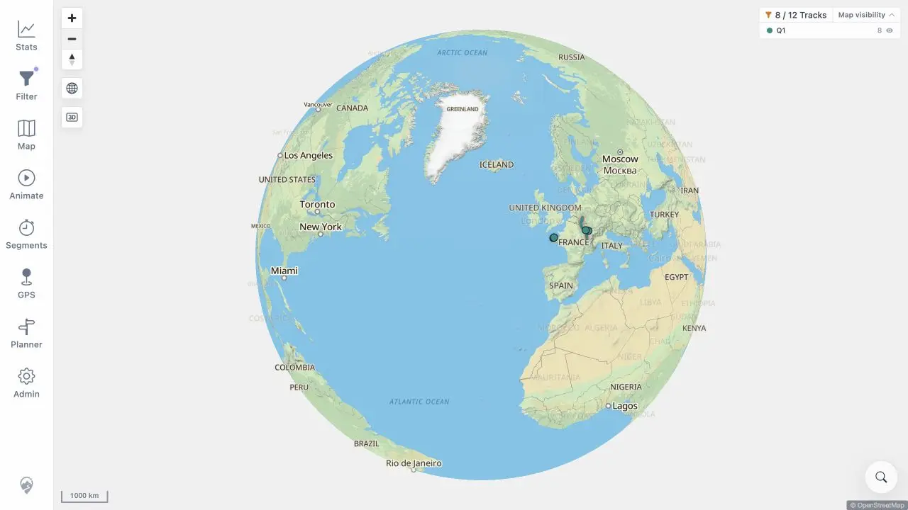

# Packet: GLB_04

## Scope

- Coverage source: [coverage-plan.md](../coverage-plan.md).
- Coverage ID or run packet: GLB_04.
- In scope: globe zoom and pan behavior at outer limits.
- Out of scope: manual projection persistence covered by GLB_03.

## Prerequisites

- Required previous coverage IDs or run packets: GLB_03.
- Required app/data state: active automatic globe.
- Required browser context: desktop map.

## Allowed Mutations

- Allowed: pan and zoom the disposable map view.
- Not allowed: change track data.

## Actions And Results

| Coverage ID | Action | Expected result | Actual result | Status | Evidence |
|---|---|---|---|---|---|
| GLB_04 | Exercised horizontal drag and zoom controls at the fitted globe's outer boundary, then returned through the available scales. | Zoom limits do not trap the map at an edge. | The globe rotated at the outer limit, Zoom In escaped to 500 km, and Zoom Out returned through 1,000 km to 2,000 km while the map stayed interactive. | PASS | [screenshot](../assets/GLB_04-limits.webp), [sequence](../assets/GLB_04-limits.txt) |

## Issues

No issue found.

## Evidence Files

| File | Purpose |
|---|---|
| [assets/GLB_04-limits.webp](../assets/GLB_04-limits.webp) | Fitted globe after exercising its outer zoom boundary. |
| [assets/GLB_04-limits.txt](../assets/GLB_04-limits.txt) | Pan and zoom sequence. |

## Screenshot Evidence

## Timings

| Step | Timing |
|---|---:|
| Boundary pan and zoom cycle | < 3 s |

## Handoff Notes

- Completed: GLB_04 is terminal `PASS`.
- Remaining unfinished coverage: ADM_01 onward.
- Blocked or not applicable: none in this packet.
- State left for the next packet: signed-in map in globe view.

