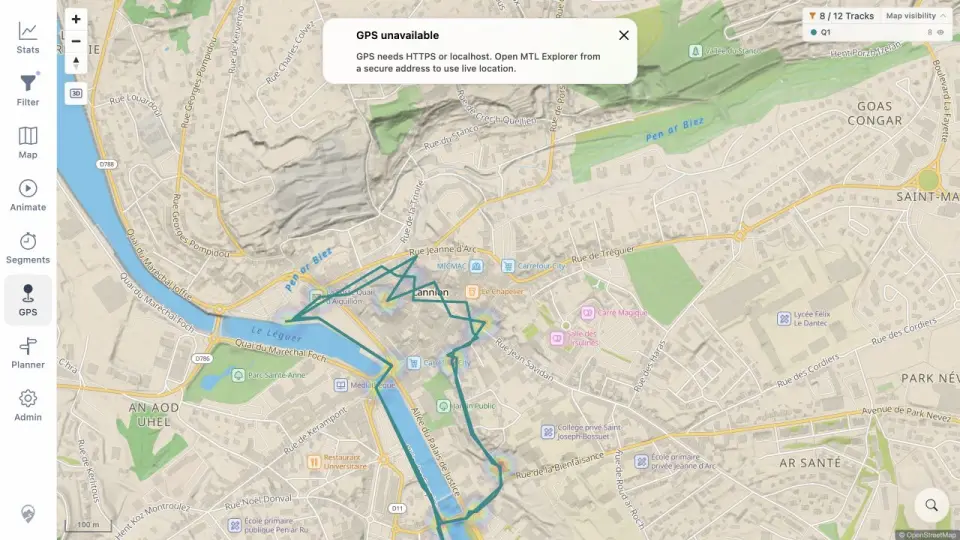

# Packet: GPS_04

## Scope

- Coverage source: [coverage-plan.md](../coverage-plan.md).
- Coverage ID or run packet: GPS_04.
- In scope: clear denied/disabled GPS feedback.
- Out of scope: live secure-origin permission denial.

## Prerequisites

- Required previous coverage IDs or run packets: GPS_03.
- Required app/data state: remote plain-HTTP origin with GPS unavailable.
- Required browser context: signed-in desktop map.

## Allowed Mutations

- Allowed: invoke GPS disabled state.
- Not allowed: override browser security.

## Actions And Results

| Coverage ID | Action | Expected result | Actual result | Status | Evidence |
|---|---|---|---|---|---|
| GPS_04 | Clicked GPS on the configured insecure origin. | Permission-denied or disabled state shows a clear message. | A dismissible `GPS unavailable` notice explicitly required HTTPS or localhost while leaving the map usable. | PASS | [notice](../assets/GPS_04-disabled.webp), [copy](../assets/GPS_04-disabled.txt) |

## Issues

No issue found.

## Evidence Files

| File | Purpose |
|---|---|
| [assets/GPS_04-disabled.webp](../assets/GPS_04-disabled.webp) | Clear disabled-state notice over a usable map. |
| [assets/GPS_04-disabled.txt](../assets/GPS_04-disabled.txt) | Exact notice text and recovery control. |

## Screenshot Evidence

## Timings

| Step | Timing |
|---|---:|
| Disabled notice | < 0.4 s |

## Handoff Notes

- Completed: GPS_04 is terminal `PASS`.
- Remaining unfinished coverage: GPS_05 onward.
- Blocked or not applicable: live permission denial was not applicable, but the disabled state was directly verified.
- State left for the next packet: dismissible GPS unavailable notice visible; no marker/watch exists.
