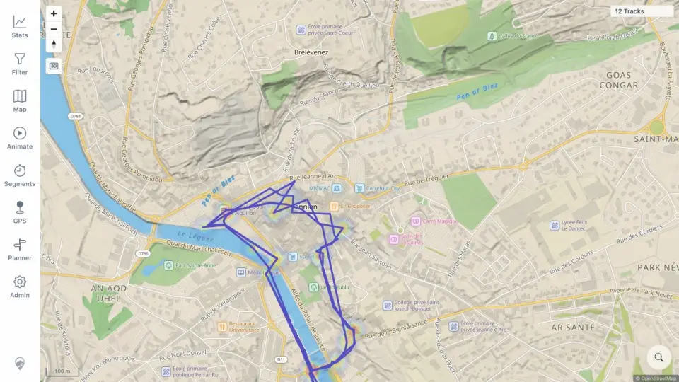

# Packet: HMO_01

## Scope

- Coverage source: [coverage-plan.md](../coverage-plan.md).
- Coverage ID or run packet: HMO_01.
- In scope: heatmap rendering, track coexistence, and opacity.
- Out of scope: route-overlay independence and filter updates.

## Prerequisites

- Required previous coverage IDs or run packets: MED_05.
- Required app/data state: twelve-track Lannion view, heatmap initially off.
- Required browser context: signed-in desktop map.

## Allowed Mutations

- Allowed: enable heatmap and change only its opacity.
- Not allowed: hide tracks.

## Actions And Results

| Coverage ID | Action | Expected result | Actual result | Status | Evidence |
|---|---|---|---|---|---|
| HMO_01 | Enabled Heatmap at 100%, then changed its opacity to 40% while retaining 100% tracks. | Heatmap draws without hiding tracks and respects opacity. | Density hotspots appeared beneath readable blue tracks; changing 100→40 visibly reduced heat strength without changing track geometry. | PASS | [heatmap](../assets/HMO_01-heatmap.webp), [opacity](../assets/HMO_01-heatmap.txt) |

## Issues

No issue found.

## Evidence Files

| File | Purpose |
|---|---|
| [assets/HMO_01-heatmap.webp](../assets/HMO_01-heatmap.webp) | 40% heatmap with intact track lines. |
| [assets/HMO_01-heatmap.txt](../assets/HMO_01-heatmap.txt) | Exact layer and opacity transitions. |

## Screenshot Evidence

## Timings

| Step | Timing |
|---|---:|
| Enable/render | 0.75 s |
| Opacity update | 0.4 s |

## Handoff Notes

- Completed: HMO_01 is terminal `PASS`.
- Remaining unfinished coverage: HMO_02 onward.
- Blocked or not applicable: none in this packet.
- State left for the next packet: Lannion map, tracks 100%, heatmap 40%, media/track-points off.
